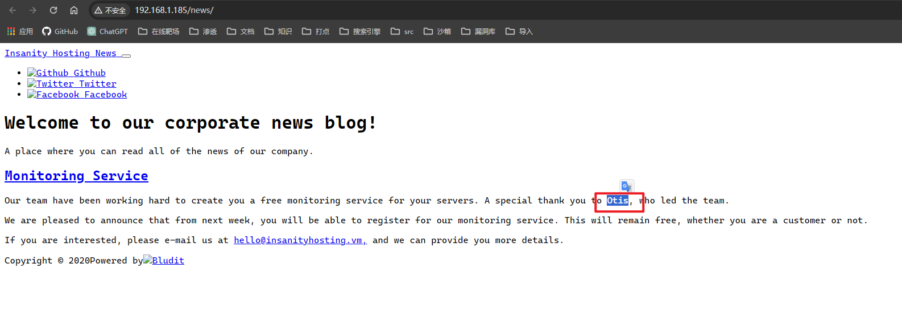
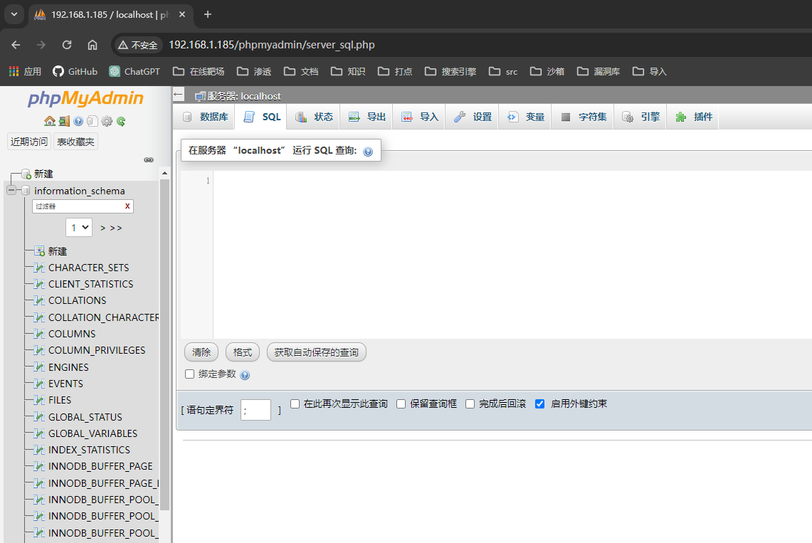
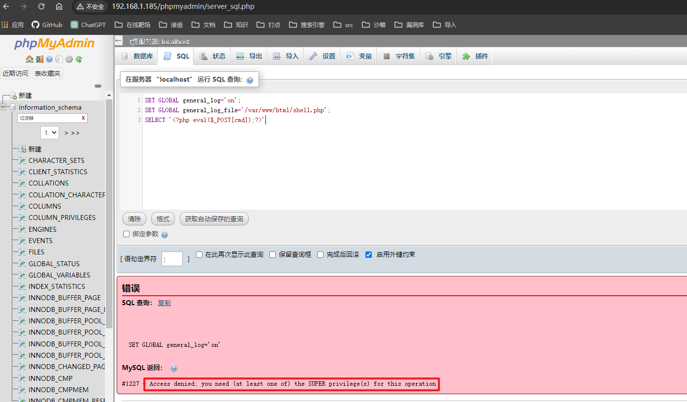
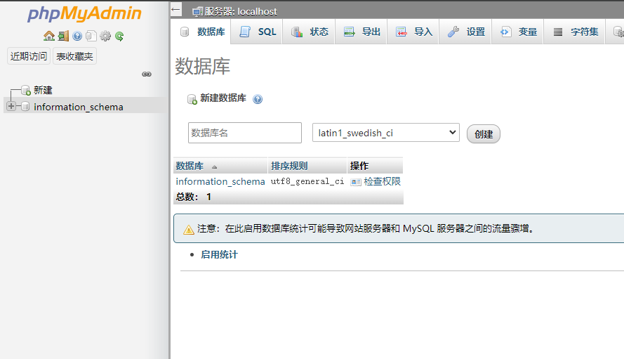
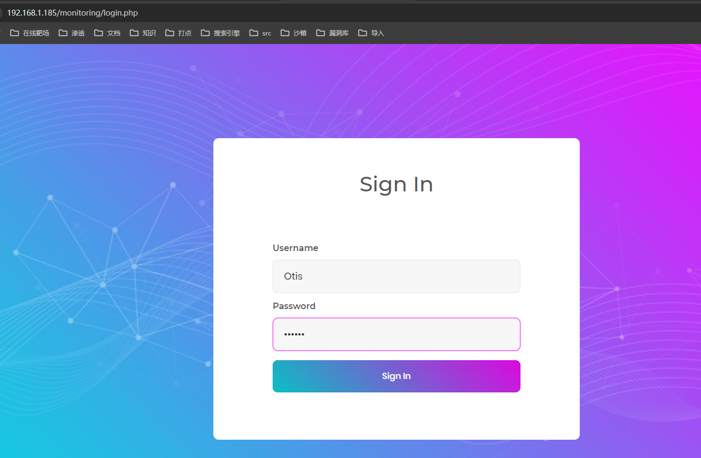
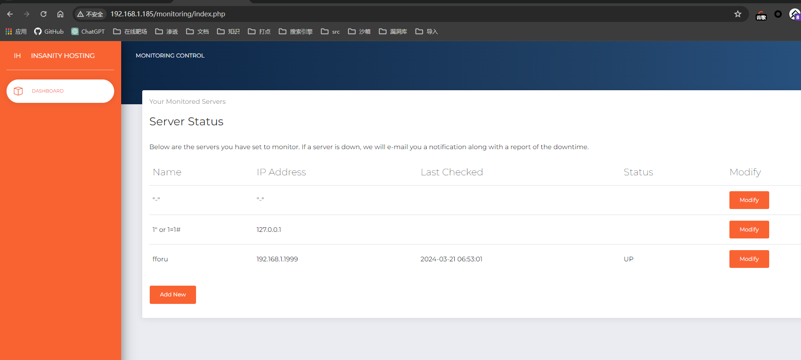
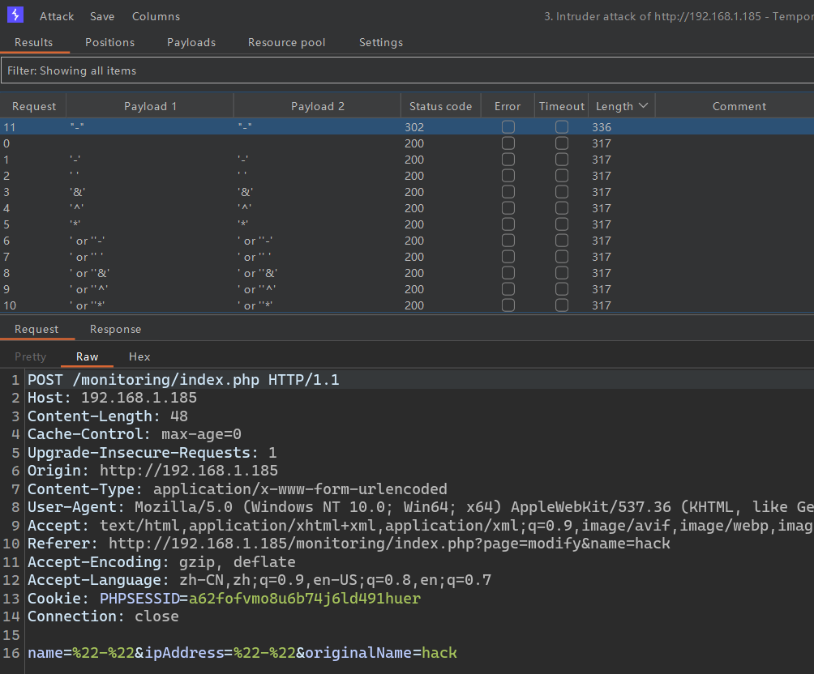
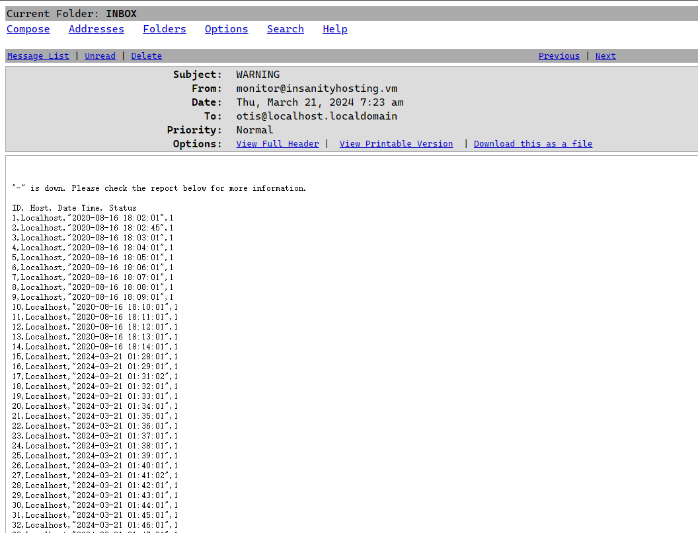

## 端口扫描

```bash

┌──(fforu㉿fforu)-[~/workspace]
└─$ sudo nmap -sT -sCV -O -p 21,22,80,473,780,828,1078,1103,1388,1489,1863,1931,2079,2503,3109,3135,3330,3336,3660,3827,4054,4060,4927,5428,5503,5612,5753,5769,5775,5841,6238,6299,6303,6484,6586,6603,6692,6758,7341,7375,7566,7672,8066,8323,8457,8491,8650,8803,8921,8962,9277,9374,9477,10113,10322,10326,10413,11081,11539,11632,11641,11684,11718,11934,11976,12061,12330,12356,12790,12792,13016,13069,13610,13630,13656,14201,14281,14520,14543,14578,15076,15536,15598,15808,16178,16417,17008,17184,17577,17846,17902,18182,18283,18342,18415,18477,18974,19097,19634,19790,19833,20011,20129,20896,20980,21231,21324,22026,22537,22766,22937,22959,23449,23793,25237,25704,25909,25936,26005,26644,27128,27598,27804,28042,28119,29127,29187,29362,30230,30354,30731,30906,30970,31012,31044,31138,31805,32780,33353,33486,33763,33791,34399,34929,35629,37204,37282,37461,38080,38085,38170,39070,39292,39644,39684,39925,40293,41625,41991,42581,42681,43254,43339,43603,44545,45076,45088,45218,45275,45708,47321,48014,48786,48880,48995,49092,49247,49983,50611,50662,50741,51190,51787,51821,52021,52213,52812,53619,53624,53991,54111,54134,54553,55093,55317,56841,57545,58233,58253,58597,59042,59507,60028,60162,60417,60869,60896,61186,61239,62898,63150,63197,63378,63468,64213,64340,64426,64563,64677,64914,65523 192.168.1.185
[sudo] password for fforu:
Starting Nmap 7.94SVN ( https://nmap.org ) at 2024-03-21 10:57 CST
Nmap scan report for 192.168.1.185
Host is up (0.39s latency).
Not shown: 189 filtered tcp ports (no-response), 29 filtered tcp ports (host-unreach)
PORT   STATE SERVICE VERSION
21/tcp open  ftp     vsftpd 3.0.2
| ftp-syst:
|   STAT:
| FTP server status:
|      Connected to ::ffff:192.168.1.105
|      Logged in as ftp
|      TYPE: ASCII
|      No session bandwidth limit
|      Session timeout in seconds is 300
|      Control connection is plain text
|      Data connections will be plain text
|      At session startup, client count was 2
|      vsFTPd 3.0.2 - secure, fast, stable
|_End of status
| ftp-anon: Anonymous FTP login allowed (FTP code 230)
|_Can't get directory listing: ERROR
22/tcp open  ssh     OpenSSH 7.4 (protocol 2.0)
| ssh-hostkey:
|   2048 85:46:41:06:da:83:04:01:b0:e4:1f:9b:7e:8b:31:9f (RSA)
|   256 e4:9c:b1:f2:44:f1:f0:4b:c3:80:93:a9:5d:96:98:d3 (ECDSA)
|_  256 65:cf:b4:af:ad:86:56:ef:ae:8b:bf:f2:f0:d9:be:10 (ED25519)
80/tcp open  http    Apache httpd 2.4.6 ((CentOS) PHP/7.2.33)
|_http-server-header: Apache/2.4.6 (CentOS) PHP/7.2.33
| http-methods:
|_  Potentially risky methods: TRACE
|_http-title: Insanity - UK and European Servers
MAC Address: 08:00:27:23:C3:F6 (Oracle VirtualBox virtual NIC)
Warning: OSScan results may be unreliable because we could not find at least 1 open and 1 closed port
Device type: WAP|phone|firewall
Running (JUST GUESSING): Linux 2.4.X|2.6.X (93%), Sony Ericsson embedded (92%), Fortinet embedded (85%)
OS CPE: cpe:/o:linux:linux_kernel:2.4.20 cpe:/o:linux:linux_kernel:2.6.22 cpe:/h:sonyericsson:u8i_vivaz cpe:/h:fortinet:fortigate_100d
Aggressive OS guesses: Tomato 1.28 (Linux 2.4.20) (93%), Tomato firmware (Linux 2.6.22) (93%), Sony Ericsson U8i Vivaz mobile phone (92%), Fortinet FortiGate 100D firewall (85%), Fortinet FortiGate 1500D firewall (85%)
No exact OS matches for host (test conditions non-ideal).
Network Distance: 1 hop
Service Info: OS: Unix

OS and Service detection performed. Please report any incorrect results at https://nmap.org/submit/ .
Nmap done: 1 IP address (1 host up) scanned in 73.41 seconds


┌──(fforu㉿fforu)-[~/workspace]
└─$ sudo nmap -sT --script vuln -p 21,22,80 192.168.1.185
Starting Nmap 7.94SVN ( https://nmap.org ) at 2024-03-21 11:00 CST
Pre-scan script results:
| broadcast-avahi-dos:
|   Discovered hosts:
|     224.0.0.251
|   After NULL UDP avahi packet DoS (CVE-2011-1002).
|_  Hosts are all up (not vulnerable).
Nmap scan report for 192.168.1.185
Host is up (0.00061s latency).

PORT   STATE SERVICE
21/tcp open  ftp
22/tcp open  ssh
80/tcp open  http
|_http-trace: TRACE is enabled
|_http-vuln-cve2017-1001000: ERROR: Script execution failed (use -d to debug)
|_http-dombased-xss: Couldn't find any DOM based XSS.
|_http-csrf: Couldn't find any CSRF vulnerabilities.
| http-sql-injection:
|   Possible sqli for queries:
|     http://192.168.1.185:80/js/?C=S%3BO%3DA%27%20OR%20sqlspider
|     http://192.168.1.185:80/js/?C=D%3BO%3DA%27%20OR%20sqlspider
|     http://192.168.1.185:80/js/?C=N%3BO%3DD%27%20OR%20sqlspider
|_    http://192.168.1.185:80/js/?C=M%3BO%3DA%27%20OR%20sqlspider
|_http-stored-xss: Couldn't find any stored XSS vulnerabilities.
| http-enum:
|   /phpinfo.php: Possible information file
|   /phpmyadmin/: phpMyAdmin
|   /webmail/src/login.php: squirrelmail version 1.4.22
|   /webmail/images/sm_logo.png: SquirrelMail
|   /css/: Potentially interesting folder w/ directory listing
|   /data/: Potentially interesting folder w/ directory listing
|   /icons/: Potentially interesting folder w/ directory listing
|   /img/: Potentially interesting folder w/ directory listing
|   /js/: Potentially interesting folder w/ directory listing
|_  /news/: Potentially interesting folder
MAC Address: 08:00:27:23:C3:F6 (Oracle VirtualBox virtual NIC)
```

## web渗透

```bash
┌──(fforu㉿fforu)-[~/workspace]
└─$ ftp 192.168.1.185
Connected to 192.168.1.185.
220 (vsFTPd 3.0.2)
Name (192.168.1.185:fforu): anonymous
331 Please specify the password.
Password:
230 Login successful.
Remote system type is UNIX.
Using binary mode to transfer files.
ftp> ?
Commands may be abbreviated.  Commands are:

!               close           fget            lpage           modtime         pdir            rcvbuf          sendport        type
$               cr              form            lpwd            more            pls             recv            set             umask
account         debug           ftp             ls              mput            pmlsd           reget           site            unset
append          delete          gate            macdef          mreget          preserve        remopts         size            usage
ascii           dir             get             mdelete         msend           progress        rename          sndbuf          user
bell            disconnect      glob            mdir            newer           prompt          reset           status          verbose
binary          edit            hash            mget            nlist           proxy           restart         struct          xferbuf
bye             epsv            help            mkdir           nmap            put             rhelp           sunique         ?
case            epsv4           idle            mls             ntrans          pwd             rmdir           system
cd              epsv6           image           mlsd            open            quit            rstatus         tenex
cdup            exit            lcd             mlst            page            quote           runique         throttle
chmod           features        less            mode            passive         rate            send            trace
ftp> binary
200 Switching to Binary mode.
ftp> ls -la
229 Entering Extended Passive Mode (|||7535|).
ftp: Can't connect to `192.168.1.185:7535': No route to host
200 EPRT command successful. Consider using EPSV.
150 Here comes the directory listing.
drwxr-xr-x    3 0        0              17 Aug 16  2020 .
drwxr-xr-x    3 0        0              17 Aug 16  2020 ..
drwxr-xr-x    2 0        0               6 Apr 01  2020 pub
226 Directory send OK.
ftp> cd pub
250 Directory successfully changed.
ftp> ls -la
200 EPRT command successful. Consider using EPSV.
150 Here comes the directory listing.
drwxr-xr-x    2 0        0               6 Apr 01  2020 .
drwxr-xr-x    3 0        0              17 Aug 16  2020 ..
```
ftp没有任何信息
 

那就看80端口了
### 目录爆破
```bash
┌──(fforu㉿fforu)-[~/workspace]
└─$ gobuster dir -w /usr/share/wordlists/dirbuster/directory-list-2.3-medium.txt -u 192.168.1.185
===============================================================
Gobuster v3.6
by OJ Reeves (@TheColonial) & Christian Mehlmauer (@firefart)
===============================================================
[+] Url:                     http://192.168.1.185
[+] Method:                  GET
[+] Threads:                 10
[+] Wordlist:                /usr/share/wordlists/dirbuster/directory-list-2.3-medium.txt
[+] Negative Status codes:   404
[+] User Agent:              gobuster/3.6
[+] Timeout:                 10s
===============================================================
Starting gobuster in directory enumeration mode
===============================================================
/news                 (Status: 301) [Size: 234] [--> http://192.168.1.185/news/]
/img                  (Status: 301) [Size: 233] [--> http://192.168.1.185/img/]
/data                 (Status: 301) [Size: 234] [--> http://192.168.1.185/data/]
/css                  (Status: 301) [Size: 233] [--> http://192.168.1.185/css/]
/js                   (Status: 301) [Size: 232] [--> http://192.168.1.185/js/]
/webmail              (Status: 301) [Size: 237] [--> http://192.168.1.185/webmail/]
/fonts                (Status: 301) [Size: 235] [--> http://192.168.1.185/fonts/]
/monitoring           (Status: 301) [Size: 240] [--> http://192.168.1.185/monitoring/]
/licence              (Status: 200) [Size: 57]
/phpmyadmin           (Status: 301) [Size: 240] [--> http://192.168.1.185/phpmyadmin/]
```

找到一个用户名

信息收集了一会儿，发现phpadmin直接admin/ 就能进

那就试下日志写马

没有权限，那看信息把

只有一个默认的数据库，我看集贸啊


然后来到monitoring页面
Otis/123456

进到这个后台

这是一个探测主机存活的后台
这是通过ping监测的主机存活，改主机ip地址后，试了下能不能执行命令
但是status过了一会儿直接down了
应该是不行了
这里上面的信息意为，当状态发生改变时，会发个邮件
那就先把邮箱登陆上


一顿sql注入后

一个"-"把数据都跑出来了
应该是存在sql注入了
