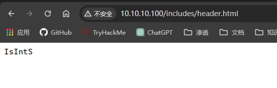

## 端口扫描

```bash
┌──(kali㉿kali)-[~]
└─$ sudo nmap  -sT --min-rate 9999 -p- 10.10.10.100
Starting Nmap 7.94SVN ( https://nmap.org ) at 2024-02-27 19:17 CST
Nmap scan report for 10.10.10.100
Host is up (0.0017s latency).
Not shown: 65533 closed tcp ports (conn-refused)
PORT   STATE SERVICE
22/tcp open  ssh
80/tcp open  http
MAC Address: 00:0C:29:2F:89:21 (VMware)

Nmap done: 1 IP address (1 host up) scanned in 11.70 seconds

┌──(kali㉿kali)-[~/workspace]
└─$ sudo nmap -sT -sCV -O -P 22,80 10.10.10.100    
PORT   STATE SERVICE VERSION
22/tcp open  ssh     OpenSSH 5.8p1 Debian 1ubuntu3 (Ubuntu Linux; protocol 2.0)
| ssh-hostkey: 
|   1024 85:d3:2b:01:09:42:7b:20:4e:30:03:6d:d1:8f:95:ff (DSA)
|   2048 30:7a:31:9a:1b:b8:17:e7:15:df:89:92:0e:cd:58:28 (RSA)
|_  256 10:12:64:4b:7d:ff:6a:87:37:26:38:b1:44:9f:cf:5e (ECDSA)
80/tcp open  http    Apache httpd 2.2.17 ((Ubuntu))
|_http-server-header: Apache/2.2.17 (Ubuntu)
| http-cookie-flags: 
|   /: 
|     PHPSESSID: 
|_      httponly flag not set
|_http-title: Welcome to this Site!
MAC Address: 00:0C:29:2F:89:21 (VMware)
Device type: general purpose
Running: Linux 2.6.X
OS CPE: cpe:/o:linux:linux_kernel:2.6
OS details: Linux 2.6.32 - 2.6.39
Network Distance: 1 hop
Service Info: OS: Linux; CPE: cpe:/o:linux:linux_kernel

OS and Service detection performed. Please report any incorrect results at https://nmap.org/submit/ .
Nmap done: 1 IP address (1 host up) scanned in 11.84 seconds

┌──(kali㉿kali)-[~/workspace]
└─$ sudo nmap -sT --script=vuln -P 22,80 10.10.10.100
Starting Nmap 7.94SVN ( https://nmap.org ) at 2024-02-27 19:43 CST
Pre-scan script results:
| broadcast-avahi-dos: 
|   Discovered hosts:
|     224.0.0.251
|   After NULL UDP avahi packet DoS (CVE-2011-1002).
|_  Hosts are all up (not vulnerable).
Failed to resolve "22,80".
Nmap scan report for 10.10.10.100
Host is up (0.0013s latency).
Not shown: 998 closed tcp ports (conn-refused)
PORT   STATE SERVICE
22/tcp open  ssh
80/tcp open  http
| http-cookie-flags: 
|   /: 
|     PHPSESSID: 
|       httponly flag not set
|   /login.php: 
|     PHPSESSID: 
|       httponly flag not set
|   /login/: 
|     PHPSESSID: 
|       httponly flag not set
|   /index/: 
|     PHPSESSID: 
|       httponly flag not set
|   /register/: 
|     PHPSESSID: 
|_      httponly flag not set
| http-csrf: 
| Spidering limited to: maxdepth=3; maxpagecount=20; withinhost=10.10.10.100
|   Found the following possible CSRF vulnerabilities: 
|     
|     Path: http://10.10.10.100:80/register.php
|     Form id: 
|     Form action: register.php
|     
|     Path: http://10.10.10.100:80/login.php
|     Form id: 
|_    Form action: login.php
|_http-stored-xss: Couldn't find any stored XSS vulnerabilities.
|_http-dombased-xss: Couldn't find any DOM based XSS.
|_http-vuln-cve2017-1001000: ERROR: Script execution failed (use -d to debug)
| http-enum: 
|   /blog/: Blog
|   /login.php: Possible admin folder
|   /login/: Login page
|   /info.php: Possible information file
|   /icons/: Potentially interesting folder w/ directory listing
|   /includes/: Potentially interesting directory w/ listing on 'apache/2.2.17 (ubuntu)'
|   /index/: Potentially interesting folder
|   /info/: Potentially interesting folder
|_  /register/: Potentially interesting folder
MAC Address: 00:0C:29:2F:89:21 (VMware)

```

## 目录爆破

```bash
┌──(kali㉿kali)-[~/workspace]
└─$ sudo gobuster dir -w /usr/share/wordlists/dirbuster/directory-list-2.3-medium.txt -u 10.10.10.100 -t 100 -x php,txt,html
===============================================================
Gobuster v3.6
by OJ Reeves (@TheColonial) & Christian Mehlmauer (@firefart)
===============================================================
[+] Url:                     http://10.10.10.100
[+] Method:                  GET
[+] Threads:                 100
[+] Wordlist:                /usr/share/wordlists/dirbuster/directory-list-2.3-medium.txt
[+] Negative Status codes:   404
[+] User Agent:              gobuster/3.6
[+] Extensions:              html,php,txt
[+] Timeout:                 10s
===============================================================
Starting gobuster in directory enumeration mode
===============================================================
/blog                 (Status: 301) [Size: 311] [--> http://10.10.10.100/blog/]
/index                (Status: 200) [Size: 854]
/index.php            (Status: 200) [Size: 854]
/login.php            (Status: 200) [Size: 1174]
/login                (Status: 200) [Size: 1174]
/.html                (Status: 403) [Size: 285]
/info.php             (Status: 200) [Size: 49881]
/register             (Status: 200) [Size: 1562]
/register.php         (Status: 200) [Size: 1562]
/info                 (Status: 200) [Size: 49869]
/includes             (Status: 301) [Size: 315] [--> http://10.10.10.100/includes/]
/activate             (Status: 302) [Size: 0] [--> http://10.10.10.100/index.php]
/activate.php         (Status: 302) [Size: 0] [--> http://10.10.10.100/index.php]
/.html                (Status: 403) [Size: 285]
/server-status        (Status: 403) [Size: 293]
Progress: 882240 / 882244 (100.00%)
===============================================================
Finished
=====================================================

┌──(kali㉿kali)-[~/workspace]
└─$ sudo dirb http://10.10.10.100/blog                                                                                      

-----------------
DIRB v2.22    
By The Dark Raver
-----------------

START_TIME: Tue Feb 27 19:58:14 2024
URL_BASE: http://10.10.10.100/blog/
WORDLIST_FILES: /usr/share/dirb/wordlists/common.txt

-----------------

GENERATED WORDS: 4612                                                          

---- Scanning URL: http://10.10.10.100/blog/ ----
+ http://10.10.10.100/blog/add (CODE:302|SIZE:0)                                                                                                                                          
+ http://10.10.10.100/blog/atom (CODE:200|SIZE:1062)                                                                                                                                      
+ http://10.10.10.100/blog/categories (CODE:302|SIZE:0)                                                                                                                                   
+ http://10.10.10.100/blog/comments (CODE:302|SIZE:0)                                                                                                                                     
==> DIRECTORY: http://10.10.10.100/blog/config/                                                                                                                                           
+ http://10.10.10.100/blog/contact (CODE:200|SIZE:5912)                                                                                                                                   
==> DIRECTORY: http://10.10.10.100/blog/content/                                                                                                                                          
+ http://10.10.10.100/blog/delete (CODE:302|SIZE:0)                                                                                                                                       
==> DIRECTORY: http://10.10.10.100/blog/docs/                                                                                                                                             
==> DIRECTORY: http://10.10.10.100/blog/flash/                                                                                                                                            
==> DIRECTORY: http://10.10.10.100/blog/images/                                                                                                                                           
+ http://10.10.10.100/blog/index (CODE:200|SIZE:8092)                                                                                                                                     
+ http://10.10.10.100/blog/index.php (CODE:200|SIZE:8094)                                                                                                                                 
+ http://10.10.10.100/blog/info (CODE:302|SIZE:0)                                                                                                                                         
+ http://10.10.10.100/blog/info.php (CODE:302|SIZE:0)                                                                                                                                     
==> DIRECTORY: http://10.10.10.100/blog/interface/                                                                                                                                        
==> DIRECTORY: http://10.10.10.100/blog/languages/                                                                                                                                        
+ http://10.10.10.100/blog/login (CODE:200|SIZE:5661)                                                                                                                                     
+ http://10.10.10.100/blog/logout (CODE:302|SIZE:0)                                                                                                                                       
+ http://10.10.10.100/blog/options (CODE:302|SIZE:0)                                                                                                                                      
+ http://10.10.10.100/blog/rdf (CODE:200|SIZE:1411)                                                                                                                                       
+ http://10.10.10.100/blog/rss (CODE:200|SIZE:1237)                                                                                                                                       
==> DIRECTORY: http://10.10.10.100/blog/scripts/                                                                                                                                          
+ http://10.10.10.100/blog/search (CODE:200|SIZE:4945)                                                                                                                                    
+ http://10.10.10.100/blog/setup (CODE:302|SIZE:0)                                                                                                                                        
+ http://10.10.10.100/blog/static (CODE:302|SIZE:0)                                                                                                                                       
+ http://10.10.10.100/blog/stats (CODE:200|SIZE:5303)                                                                                                                                     
==> DIRECTORY: http://10.10.10.100/blog/themes/                                                                                                                                           
+ http://10.10.10.100/blog/trackback (CODE:302|SIZE:0)                                                                                                                                    
+ http://10.10.10.100/blog/upgrade (CODE:302|SIZE:0)                                                                                                                                      
                                                                                                                                                                                          
---- Entering directory: http://10.10.10.100/blog/config/ ----
(!) WARNING: Directory IS LISTABLE. No need to scan it.                        
    (Use mode '-w' if you want to scan it anyway)
                                                                                                                                                                                          
---- Entering directory: http://10.10.10.100/blog/content/ ----
(!) WARNING: Directory IS LISTABLE. No need to scan it.                        
    (Use mode '-w' if you want to scan it anyway)
                                                                                                                                                                                          
---- Entering directory: http://10.10.10.100/blog/docs/ ----
(!) WARNING: Directory IS LISTABLE. No need to scan it.                        
    (Use mode '-w' if you want to scan it anyway)
                                                                                                                                                                                          
---- Entering directory: http://10.10.10.100/blog/flash/ ----
(!) WARNING: Directory IS LISTABLE. No need to scan it.                        
    (Use mode '-w' if you want to scan it anyway)
                                                                                                                                                                                          
---- Entering directory: http://10.10.10.100/blog/images/ ----
(!) WARNING: Directory IS LISTABLE. No need to scan it.                        
    (Use mode '-w' if you want to scan it anyway)
                                                                                                                                                                                          
---- Entering directory: http://10.10.10.100/blog/interface/ ----
(!) WARNING: Directory IS LISTABLE. No need to scan it.                        
    (Use mode '-w' if you want to scan it anyway)
                                                                                                                                                                                          
---- Entering directory: http://10.10.10.100/blog/languages/ ----
(!) WARNING: Directory IS LISTABLE. No need to scan it.                        
    (Use mode '-w' if you want to scan it anyway)
                                                                                                                                                                                          
---- Entering directory: http://10.10.10.100/blog/scripts/ ----
(!) WARNING: Directory IS LISTABLE. No need to scan it.                        
    (Use mode '-w' if you want to scan it anyway)
                                                                                                                                                                                          
---- Entering directory: http://10.10.10.100/blog/themes/ ----
(!) WARNING: Directory IS LISTABLE. No need to scan it.                        
    (Use mode '-w' if you want to scan it anyway)
                                                                               
-----------------
END_TIME: Tue Feb 27 19:58:22 2024
DOWNLOADED: 4612 - FOUND: 21
```
得到这些目录，先去`http://10.10.10.100/includes/` 目录下找到了一个用户名信息：IsIntS

接下来肯定是看配置信息`http://10.10.10.100/blog/config/`
得到如下两个文件
```bash
┌──(kali㉿kali)-[~/workspace]
└─$ ls       
config.txt  password.txt
                                                                                                                                                                                           
┌──(kali㉿kali)-[~/workspace]
└─$ cat config.txt    
No Title|No Author|No Footer|english|new_to_old|new_to_old|1|5|1|b,i,strong,em,url|email@myblog.com||||||1||                                                                                                                                                                                           
┌──(kali㉿kali)-[~/workspace]
└─$ cat password.txt 
$1$weWj5iAZ$NU4CkeZ9jNtcP/qrPC69a/ 
```
一个可能是邮箱账号信息，一个是密码
揭秘密码
