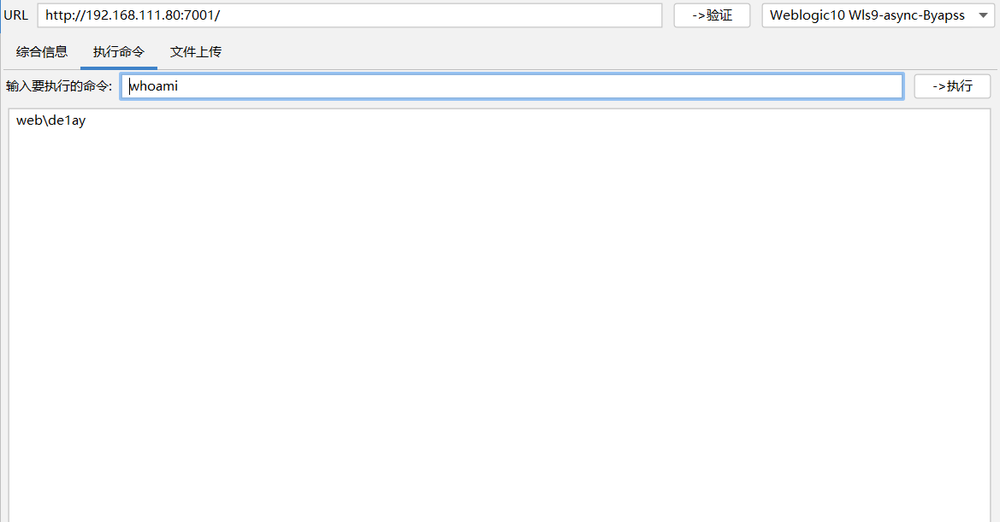

## 环境

```bash
靶机：
DC
IP：10.10.10.10
WEB
IP：10.10.10.80，192.168.111.80
PC
IP：10.10.10.201，192.168.111.201

攻击机：
win10：192.168.111.1
kali：192.168.111.128(cs服务端)
```

## 外围打点

### 端口扫描
```bash
┌──(kali㉿kali)-[~]
└─$ sudo nmap --min-rate 9999 -p- 192.168.111.80
Starting Nmap 7.94SVN ( https://nmap.org ) at 2024-07-14 08:49 EDT
Nmap scan report for 192.168.111.80
Host is up (0.00068s latency).
Not shown: 65522 filtered tcp ports (no-response)
PORT      STATE SERVICE
80/tcp    open  http
135/tcp   open  msrpc
139/tcp   open  netbios-ssn
445/tcp   open  microsoft-ds
1433/tcp  open  ms-sql-s
3389/tcp  open  ms-wbt-server
7001/tcp  open  afs3-callback
49152/tcp open  unknown
49153/tcp open  unknown
49154/tcp open  unknown
49155/tcp open  unknown
49187/tcp open  unknown
60966/tcp open  unknown
MAC Address: 00:0C:29:68:D3:5F (VMware)
```

```bash
┌──(kali㉿kali)-[~]
└─$ sudo nmap --min-rate 9999 192.168.111.201
Starting Nmap 7.94SVN ( https://nmap.org ) at 2024-07-14 08:50 EDT
Nmap scan report for 192.168.111.201
Host is up (0.00055s latency).
Not shown: 992 filtered tcp ports (no-response)
PORT      STATE SERVICE
135/tcp   open  msrpc
139/tcp   open  netbios-ssn
445/tcp   open  microsoft-ds
3389/tcp  open  ms-wbt-server
49152/tcp open  unknown
49153/tcp open  unknown
49154/tcp open  unknown
49155/tcp open  unknown
MAC Address: 00:0C:29:9E:7B:70 (VMware)
```


web端开启了较多端口
PC好像攻击面不大了，都是个人电脑的端口

继续进一步扫描看指纹

```bash
┌──(kali㉿kali)-[~/workspace/de1ay]
└─$ sudo nmap -sT -sCV -O -p 80,135,139,445,1433,3389,7001,49152,49153,49154,49155,49187,60966 192.168.111.80
Starting Nmap 7.94SVN ( https://nmap.org ) at 2024-07-14 08:52 EDT
Nmap scan report for 192.168.111.80
Host is up (0.00077s latency).

PORT      STATE SERVICE        VERSION
80/tcp    open  http           Microsoft IIS httpd 7.5
| http-methods:
|_  Potentially risky methods: TRACE
|_http-title: Site doesn't have a title.
|_http-server-header: Microsoft-IIS/7.5
135/tcp   open  msrpc          Microsoft Windows RPC
139/tcp   open  netbios-ssn    Microsoft Windows netbios-ssn
445/tcp   open  microsoft-ds   Windows Server 2008 R2 Standard 7601 Service Pack 1 microsoft-ds
1433/tcp  open  ms-sql-s       Microsoft SQL Server 2008 R2 10.50.4000.00; SP2
| ms-sql-ntlm-info:
|   192.168.111.80:1433:
|     Target_Name: DE1AY
|     NetBIOS_Domain_Name: DE1AY
|     NetBIOS_Computer_Name: WEB
|     DNS_Domain_Name: de1ay.com
|     DNS_Computer_Name: WEB.de1ay.com
|     DNS_Tree_Name: de1ay.com
|_    Product_Version: 6.1.7601
| ms-sql-info:
|   192.168.111.80:1433:
|     Version:
|       name: Microsoft SQL Server 2008 R2 SP2
|       number: 10.50.4000.00
|       Product: Microsoft SQL Server 2008 R2
|       Service pack level: SP2
|       Post-SP patches applied: false
|_    TCP port: 1433
| ssl-cert: Subject: commonName=SSL_Self_Signed_Fallback
| Not valid before: 2024-07-14T07:41:12
|_Not valid after:  2054-07-14T07:41:12
|_ssl-date: 2024-07-14T12:54:56+00:00; 0s from scanner time.
3389/tcp  open  ms-wbt-server?
| rdp-ntlm-info:
|   Target_Name: DE1AY
|   NetBIOS_Domain_Name: DE1AY
|   NetBIOS_Computer_Name: WEB
|   DNS_Domain_Name: de1ay.com
|   DNS_Computer_Name: WEB.de1ay.com
|   DNS_Tree_Name: de1ay.com
|   Product_Version: 6.1.7601
|_  System_Time: 2024-07-14T12:54:16+00:00
| ssl-cert: Subject: commonName=WEB.de1ay.com
| Not valid before: 2024-07-13T07:31:31
|_Not valid after:  2025-01-12T07:31:31
|_ssl-date: 2024-07-14T12:54:56+00:00; 0s from scanner time.
7001/tcp  open  http           Oracle WebLogic Server 10.3.6.0 (Servlet 2.5; JSP 2.1; T3 enabled)
|_http-title: Error 404--Not Found
|_weblogic-t3-info: T3 protocol in use (WebLogic version: 10.3.6.0)
49152/tcp open  msrpc          Microsoft Windows RPC
49153/tcp open  msrpc          Microsoft Windows RPC
49154/tcp open  msrpc          Microsoft Windows RPC
49155/tcp open  msrpc          Microsoft Windows RPC
49187/tcp open  msrpc          Microsoft Windows RPC
60966/tcp open  ms-sql-s       Microsoft SQL Server 2008 R2 10.50.4000.00; SP2
| ms-sql-ntlm-info:
|   192.168.111.80:60966:
|     Target_Name: DE1AY
|     NetBIOS_Domain_Name: DE1AY
|     NetBIOS_Computer_Name: WEB
|     DNS_Domain_Name: de1ay.com
|     DNS_Computer_Name: WEB.de1ay.com
|     DNS_Tree_Name: de1ay.com
|_    Product_Version: 6.1.7601
| ssl-cert: Subject: commonName=SSL_Self_Signed_Fallback
| Not valid before: 2024-07-14T07:41:12
|_Not valid after:  2054-07-14T07:41:12
| ms-sql-info:
|   192.168.111.80:60966:
|     Version:
|       name: Microsoft SQL Server 2008 R2 SP2
|       number: 10.50.4000.00
|       Product: Microsoft SQL Server 2008 R2
|       Service pack level: SP2
|       Post-SP patches applied: false
|_    TCP port: 60966
|_ssl-date: 2024-07-14T12:54:56+00:00; 0s from scanner time.
1 service unrecognized despite returning data. If you know the service/version, please submit the following fingerprint at https://nmap.org/cgi-bin/submit.cgi?new-service :
SF-Port3389-TCP:V=7.94SVN%I=7%D=7/14%Time=6693CA2D%P=x86_64-pc-linux-gnu%r
SF:(TerminalServerCookie,13,"\x03\0\0\x13\x0e\xd0\0\0\x124\0\x02\x01\x08\0
SF:\x02\0\0\0");
MAC Address: 00:0C:29:68:D3:5F (VMware)
Warning: OSScan results may be unreliable because we could not find at least 1 open and 1 closed port
Device type: general purpose|phone|specialized
Running (JUST GUESSING): Microsoft Windows 8.1|Phone|7|2008|Vista (94%)
OS CPE: cpe:/o:microsoft:windows_8.1:r1 cpe:/o:microsoft:windows cpe:/o:microsoft:windows_7 cpe:/o:microsoft:windows_server_2008::beta3 cpe:/o:microsoft:windows_server_2008 cpe:/o:microsoft:windows_8 cpe:/o:microsoft:windows_vista::- cpe:/o:microsoft:windows_vista::sp1
Aggressive OS guesses: Microsoft Windows 8.1 R1 (94%), Microsoft Windows Phone 7.5 or 8.0 (94%), Microsoft Windows Embedded Standard 7 (93%), Microsoft Windows 7 (92%), Microsoft Windows Server 2008 or 2008 Beta 3 (90%), Microsoft Windows Server 2008 R2 or Windows 8.1 (90%), Microsoft Windows 7 Professional or Windows 8 (90%), Microsoft Windows Vista SP0 or SP1, Windows Server 2008 SP1, or Windows 7 (90%), Microsoft Windows Vista SP2, Windows 7 SP1, or Windows Server 2008 (90%), Microsoft Windows Server 2008 SP1 (87%)
No exact OS matches for host (test conditions non-ideal).
Network Distance: 1 hop
Service Info: OSs: Windows, Windows Server 2008 R2 - 2012; CPE: cpe:/o:microsoft:windows

Host script results:
| smb-security-mode:
|   account_used: <blank>
|   authentication_level: user
|   challenge_response: supported
|_  message_signing: disabled (dangerous, but default)
|_clock-skew: mean: -53m19s, deviation: 2h39m59s, median: 0s
| smb2-security-mode:
|   2:1:0:
|_    Message signing enabled but not required
| smb2-time:
|   date: 2024-07-14T12:54:17
|_  start_date: 2024-07-14T07:41:38
| smb-os-discovery:
|   OS: Windows Server 2008 R2 Standard 7601 Service Pack 1 (Windows Server 2008 R2 Standard 6.1)
|   OS CPE: cpe:/o:microsoft:windows_server_2008::sp1
|   Computer name: WEB
|   NetBIOS computer name: WEB\x00
|   Domain name: de1ay.com
|   Forest name: de1ay.com
|   FQDN: WEB.de1ay.com
|_  System time: 2024-07-14T20:54:19+08:00

OS and Service detection performed. Please report any incorrect results at https://nmap.org/submit/ .
Nmap done: 1 IP address (1 host up) scanned in 140.65 seconds
```
### 漏洞利用
到这里就发现了Oracle WebLogic Server

打开果然是weblogic
直接上工具


找到一个rce,还有个文件上传

传了一个哥斯拉的马上去


### getshell
成功传上去，连一下看看

这个时候可以进一步打内网
先传个cs的马

选择payload生成exe
然后传到web服务器运行即可成功上传

## 内网渗透 

上了cs先给它权限提升一下

得到system
开启下3389，mimikatz抓取密码，即可远程桌面访问

关闭防火墙
```bash
shell netsh advfirewall show all state  		  //查看防火墙状态
shell netsh advfirewall set allprofile state off  //关闭防火墙
```
